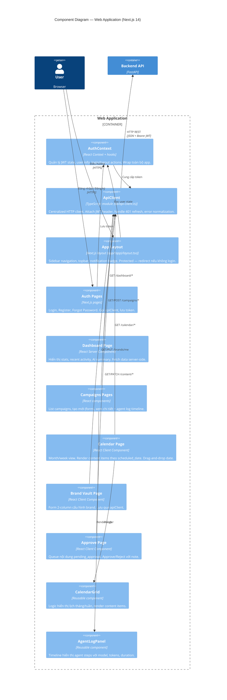
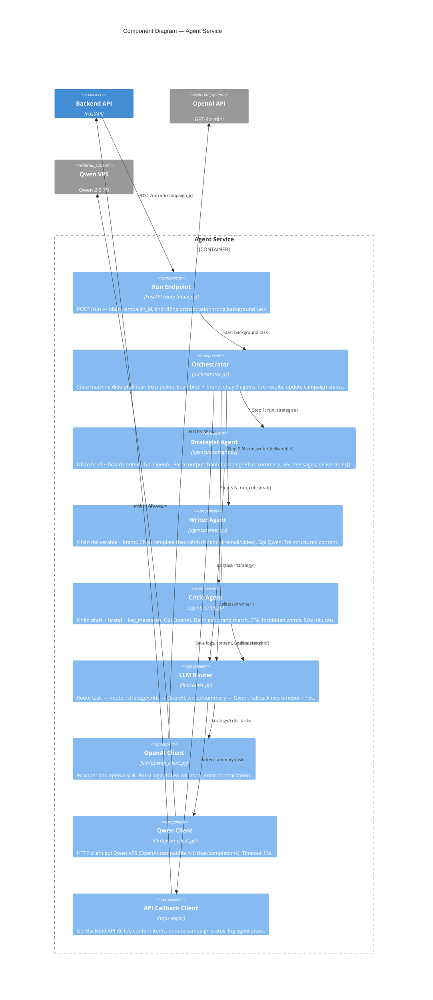

# C4 Model — Level 3: Component

**AIMAP — AI-Powered Marketing Automation Platform**

---

## Mô tả

C4 Level 3 (Component) phóng to vào bên trong từng container, cho thấy **các component (modules, classes, layers)** và cách chúng tương tác với nhau. Tài liệu này bao gồm 3 component diagrams cho: Web Application, Backend API, và Agent Service.

---

## 3.1 Web Application — Next.js



**Luồng dữ liệu chính trong Web:**

```
User action → Page Component
    → ApiClient (attach JWT, serialize request)
    → Backend API (HTTP)
    → Response JSON
    → Page Component (update state / re-render)
```

---

## 3.2 Backend API — FastAPI

```mermaid
C4Component
    title Component Diagram — Backend API (FastAPI)

    Container(web, "Web Application", "Next.js", "")
    Container(agent, "Agent Service", "FastAPI", "")
    ContainerDb(db, "Database", "PostgreSQL", "")

    Container_Boundary(api, "Backend API") {
        Component(authRouter, "Auth Router", "FastAPI router (routers/auth.py)", "POST /register, /login, /refresh, GET /me, PUT /me/profile, POST /forgot-password, /reset-password")
        Component(brandsRouter, "Brands Router", "FastAPI router (routers/brands.py)", "GET/PUT /brands/me, GET /brands/me/assets")
        Component(campaignsRouter, "Campaigns Router", "FastAPI router (routers/campaigns.py)", "GET/POST /campaigns, GET/DELETE /campaigns/{id}, POST /campaigns/{id}/run")
        Component(contentRouter, "Content Router", "FastAPI router (routers/content.py)", "GET /content, PATCH /content/{id}/approve, PATCH /content/{id}/reject, PUT /content/{id}")
        Component(calendarRouter, "Calendar Router", "FastAPI router (routers/calendar.py)", "GET /calendar?month=&year=, PATCH /content/{id}/schedule-date")
        Component(dashboardRouter, "Dashboard Router", "FastAPI router (routers/dashboard.py)", "GET /dashboard/stats, GET /dashboard/ai-summary")
        Component(workflowRouter, "Workflow Router", "FastAPI router (routers/workflow.py)", "GET/POST /workflow/schedules, GET /workflow/jobs")
        Component(internalRouter, "Internal Router", "FastAPI router (routers/internal.py)", "POST /internal/content, PATCH /internal/campaigns/{id}, GET /internal/campaigns/{id}/detail")
        Component(security, "Security Module", "core/security.py", "JWT create/decode, bcrypt hash/verify, get_current_user dependency")
        Component(database, "Database Module", "core/database.py", "Async engine, SessionLocal, get_db dependency")
        Component(agentDispatcher, "AgentDispatcher", "services/agent_dispatcher.py", "POST http://agent:8001/run với campaign_id. Fire-and-forget async call.")
        Component(dashboardService, "DashboardService", "services/dashboard_service.py", "Aggregate stats queries, gọi Qwen để tạo AI summary text")
        Component(models, "ORM Models", "models/*.py", "SQLAlchemy models: User, Brand, Campaign, ContentItem, AgentRunLog, WorkflowJob...")
        Component(schemas, "Pydantic Schemas", "schemas/*.py", "Request/Response validation: UserCreate, CampaignCreate, ContentItemOut...")
    }

    Rel(web, authRouter, "Auth requests")
    Rel(web, brandsRouter, "Brand Vault requests")
    Rel(web, campaignsRouter, "Campaign requests")
    Rel(web, contentRouter, "Content approval requests")
    Rel(web, calendarRouter, "Calendar requests")
    Rel(web, dashboardRouter, "Dashboard requests")
    Rel(web, workflowRouter, "Workflow requests")
    Rel(agent, internalRouter, "Callback: lưu kết quả AI")
    Rel(authRouter, security, "Verify/create tokens")
    Rel(authRouter, models, "CRUD users")
    Rel(campaignsRouter, agentDispatcher, "Dispatch sau khi tạo campaign")
    Rel(dashboardRouter, dashboardService, "Get aggregated stats")
    Rel(agentDispatcher, agent, "POST /run")
    Rel(authRouter, database, "DB session")
    Rel(brandsRouter, database, "DB session")
    Rel(campaignsRouter, database, "DB session")
    Rel(contentRouter, database, "DB session")
    Rel(models, db, "SQL queries via asyncpg")
```



**Dependency Injection Flow:**

```
Request → Router → Depends(get_current_user)
    → security.decode_jwt(token)
    → db.get_user_by_id(user_id)
    → inject user object vào route handler
```

---

## 3.3 Agent Service — Python AI Pipeline



**State Machine trong Orchestrator:**

```
START
├── load_campaign_detail(campaign_id)     → fetch brief + brand via API
├── update_campaign_status("running")
├── run_strategist(brief, brand)          → CampaignPlan
│     └── save_agent_log(strategist, step=1)
├── for each deliverable in plan:
│     ├── run_writer(deliverable, brand)  → DraftContent
│     │     └── save_agent_log(writer, step=n)
│     └── run_critic(draft, brand)        → FinalContent
│           └── save_agent_log(critic, step=n+1)
│           └── save_content_item(final_content)
└── update_campaign_status("pending_approval")
    [on any exception]
    └── update_campaign_status("failed", error_message)
```

---

## Cross-Container Component Interactions

### Luồng Campaign Orchestration (end-to-end)

```
Web (campaignsPage)
  → ApiClient.post("/campaigns", brief)
  → API (campaignsRouter)
      → DB: INSERT campaigns
      → AgentDispatcher.dispatch(campaign_id)
          → Agent (runEndpoint): POST /run
              → Orchestrator (background)
                  → API Internal: GET /internal/campaigns/{id}/detail
                  → strategistAgent → OpenAI
                  → API Internal: POST /internal/agent-logs
                  → writerAgent → Qwen VPS
                  → criticAgent → OpenAI
                  → API Internal: POST /internal/content (per channel)
                  → API Internal: PATCH /internal/campaigns/{id} status=pending_approval
  → Web: Poll GET /campaigns/{id} → hiển thị content khi xong
```

---

## Bo sung component cho Admin

### API components (de xay dung)
- `adminUsersComponent`: lock/unlock user, tim kiem user.
- `adminUsageComponent`: tong hop token usage theo model/provider.
- `adminWorkflowOpsComponent`: xem failed jobs, retry.
- `adminAuditComponent`: doc `admin_action_logs`.

### Web components (de xay dung)
- `adminDashboardPage`
- `adminUsersPage`
- `adminUsagePage`
- `adminWorkflowOpsPage`
- `adminAuditLogsPage`

## Bo sung component cho Insight A2A (2026-04-14)

- API:
  - `insightsA2aRouter`: endpoint deep analysis.
  - `schemaMapper`: map cot CSV ve canonical schema.
  - `a2aRunTraceService`: luu trace DeepSeek/Qwen/GPT.
- Web:
  - `insightsUploadForm`: upload 1-sheet CSV.
  - `insightsPipelineTimeline`: hien step + model dang chay.
  - `insightsResultPanel`: KPI + insights + action plan 30/60/90.
