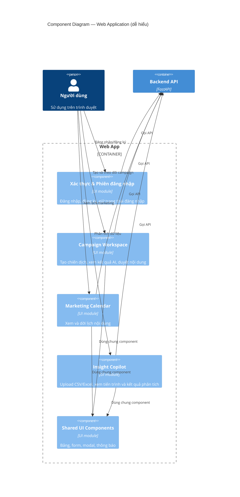
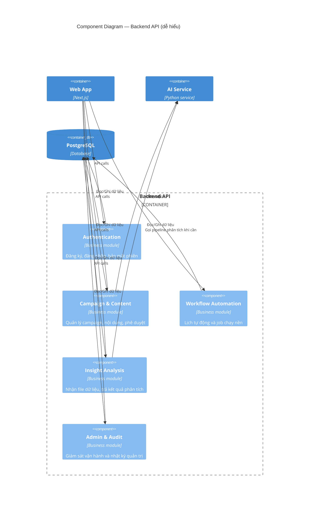
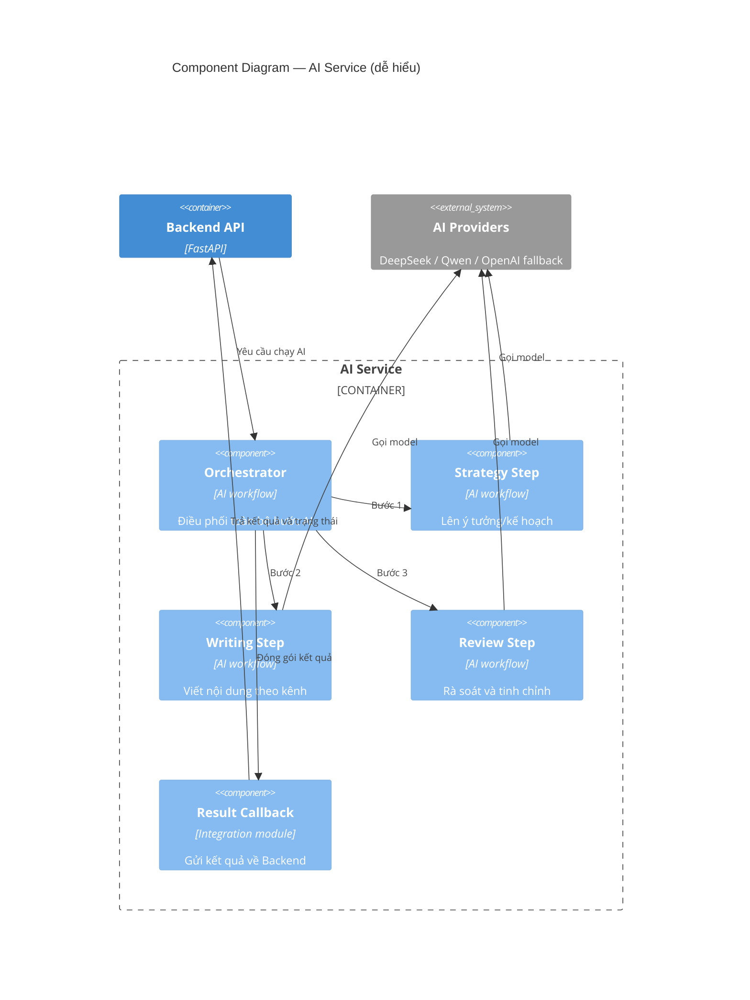

# C4 Model — Level 3: Component

**AIMAP — Nhìn theo nhóm chức năng (không đi sâu code)**

---

## Mục tiêu tài liệu

Thay vì nói theo file/class, tài liệu này mô tả hệ thống theo **nhóm chức năng dễ hiểu**:

- Nhóm giao diện người dùng
- Nhóm nghiệp vụ backend
- Nhóm AI xử lý nội dung và phân tích

---

## 3.1 Web Application — các nhóm chức năng chính

---

## 3.2 Backend API — các nhóm chức năng chính

---

## 3.3 AI Service — các nhóm xử lý

---

## Luồng end-to-end ngắn gọn

1. Người dùng tạo campaign hoặc upload file insight trên Web.
2. Web gọi Backend API để lưu yêu cầu.
3. Backend gọi AI Service khi cần xử lý AI.
4. AI Service chạy các bước, gọi model phù hợp, lấy kết quả.
5. Kết quả trả về Backend, lưu DB, sau đó hiển thị lại cho người dùng.
