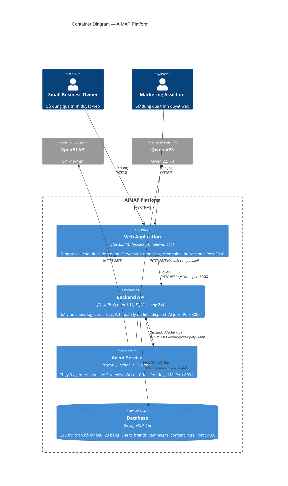

# C4 Model — Level 2: Container

**AIMAP — AI-Powered Marketing Automation Platform**

---

## Mô tả

C4 Level 2 (Container) phóng to vào bên trong AIMAP Platform, cho thấy **các container (deployable units)** cấu thành hệ thống, công nghệ mỗi container, và cách chúng giao tiếp với nhau.

---

## Diagram



---

## Mô tả Chi tiết Từng Container

### Container 1: Web Application

| Thuộc tính | Giá trị |
|---|---|
| **Công nghệ** | Next.js 14 (App Router), TypeScript, Tailwind CSS, shadcn/ui |
| **Port** | 3000 |
| **Trách nhiệm** | UI rendering, authentication state, routing, API calls |
| **Deployment** | Docker container, Node.js runtime |

**Pages chính:**
- `/login`, `/register` — Authentication
- `/(app)/dashboard` — Tổng quan thống kê
- `/(app)/campaigns` — Danh sách và tạo campaign
- `/(app)/campaigns/[id]` — Chi tiết campaign + agent logs
- `/(app)/brand-vault` — Cấu hình Brand Vault
- `/(app)/approve` — Queue phê duyệt nội dung
- `/(app)/calendar` — Marketing Calendar

**Giao tiếp:**
- Người dùng → Web: HTTPS (browser)
- Web → API: HTTP REST JSON (server-side fetch trong Server Components, client fetch trong Client Components)

---

### Container 2: Backend API

| Thuộc tính | Giá trị |
|---|---|
| **Công nghệ** | FastAPI 0.110+, Python 3.11, SQLAlchemy 2.x async, Pydantic v2 |
| **Port** | 8000 |
| **Trách nhiệm** | Authentication (JWT), CRUD data, business logic, AI job dispatch |
| **Deployment** | Docker container |

**Router groups:**
- `/auth/*` — Register, login, refresh token, profile
- `/brands/*` — Brand Vault CRUD
- `/campaigns/*` — Campaign management
- `/content/*` — Content items, approval
- `/calendar/*` — Calendar view
- `/dashboard/*` — Stats aggregation
- `/workflow/*` — Workflow jobs và schedules
- `/internal/*` — Agent callback endpoints (không public)

**Giao tiếp:**
- Web → API: Nhận request, trả JSON response
- API → DB: Queries qua SQLAlchemy async
- API → Agent: `POST http://agent:8001/run` để dispatch AI job

---

### Container 3: Agent Service

| Thuộc tính | Giá trị |
|---|---|
| **Công nghệ** | FastAPI, Python 3.11, httpx (async HTTP), LangChain patterns |
| **Port** | 8001 |
| **Trách nhiệm** | Multi-agent orchestration, LLM routing, content generation |
| **Deployment** | Docker container |

**Internal structure:**
- `orchestrator.py` — State machine điều phối 3 agents
- `agents/strategist.py` — Phân tích brief, tạo campaign plan
- `agents/writer.py` — Sinh nội dung theo kênh
- `agents/critic.py` — Kiểm duyệt và sửa nội dung
- `llm/router.py` — Routing logic: task → model selection
- `llm/openai_client.py` — OpenAI API client
- `llm/qwen_client.py` — Qwen VPS client (OpenAI-compatible)

**Giao tiếp:**
- API → Agent: Nhận `POST /run` với campaign_id
- Agent → OpenAI: HTTPS REST (Strategy, Critic)
- Agent → Qwen VPS: HTTP REST (Writer, Summary)
- Agent → API: `POST /internal/content`, `PATCH /internal/campaigns/{id}` để lưu kết quả

---

### Container 4: PostgreSQL Database

| Thuộc tính | Giá trị |
|---|---|
| **Công nghệ** | PostgreSQL 16 |
| **Port** | 5433 (mapped từ 5432 trong container) |
| **Trách nhiệm** | Persistent storage cho tất cả dữ liệu |
| **Schema** | 23 bảng, 10 domain groups |

**Domain groups:**
1. Auth & Users: `users`, `user_sessions`, `password_reset_tokens`, `email_verifications`
2. Brand: `brands`, `brand_assets`
3. Campaign: `campaigns`, `campaign_tags`, `campaign_tag_assignments`
4. Content: `content_items`, `content_templates`, `approval_history`
5. Customer: `customer_lists`, `customers`, `customer_list_members`
6. Files: `file_uploads`
7. Notifications: `notifications`, `notification_settings`
8. AI: `agent_run_logs`, `ai_usage_stats`
9. Workflow: `workflow_jobs`, `workflow_schedules`
10. Analytics: `content_analytics`

---

## Docker Compose Topology

```yaml
services:
  db:      PostgreSQL 16 — port 5433
  api:     FastAPI — port 8000, depends_on: db
  agent:   Agent Service — port 8001, depends_on: api
  web:     Next.js — port 3000, depends_on: api
```

Tất cả containers giao tiếp qua Docker internal network `aimap_network`. Chỉ `web` (3000) và `api` (8000) exposed ra host.

---

## Communication Protocols

| Source | Target | Protocol | Format | Auth |
|---|---|---|---|---|
| Browser | Web | HTTPS | HTML/JSON | Cookie (JWT) |
| Web | API | HTTP REST | JSON | Bearer JWT |
| API | Agent | HTTP | JSON | Internal (no auth) |
| Agent | API | HTTP | JSON | Internal (no auth) |
| Agent | OpenAI | HTTPS | JSON | API Key |
| Agent | Qwen VPS | HTTP | JSON (OpenAI-compat) | None |
| API | DB | TCP | SQL binary | Password |
