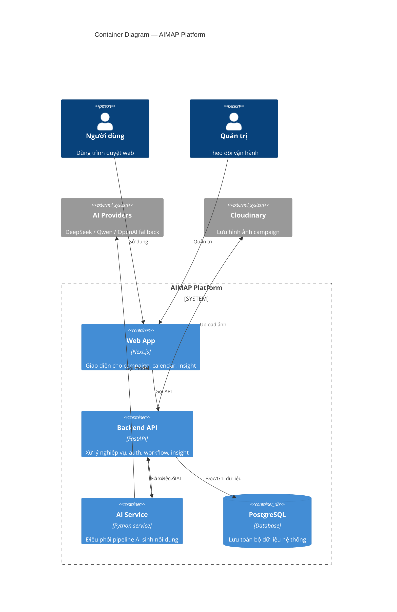

# C4 Model — Level 2: Container

**AIMAP — Nền tảng marketing có AI**

---

## Mục tiêu sơ đồ

Cho người đọc biết hệ thống có 4 khối chính nào và chúng nói chuyện với nhau ra sao.

---

## Diagram

---

## Vai trò từng container (bản dễ hiểu)

| Container | Vai trò chính | Ví dụ chức năng |
|---|---|---|
| **Web App** | Nơi người dùng thao tác | Tạo campaign, duyệt nội dung, xem dashboard/insight |
| **Backend API** | Trung tâm nghiệp vụ | Auth, lưu dữ liệu, xử lý workflow, trả kết quả cho UI |
| **AI Service** | Điều phối sinh nội dung | Lên kế hoạch nội dung, viết nháp, kiểm duyệt |
| **PostgreSQL** | Lưu trữ lâu dài | User, brand, campaign, content, logs, insight run |

---

## Luồng dữ liệu chính

1. Người dùng thao tác trên Web.
2. Web gọi Backend API.
3. Backend đọc/ghi Database.
4. Khi cần AI, Backend giao việc cho AI Service.
5. AI Service gọi model bên ngoài, nhận kết quả, gửi ngược về Backend.
6. Backend trả dữ liệu đã xử lý cho Web để hiển thị.

---

## Ghi chú đọc tài liệu

- Tài liệu này chủ đích ở mức **container**, không đi sâu file code hoặc endpoint chi tiết.
- Chi tiết bảng dữ liệu xem `database-overview.md`.
