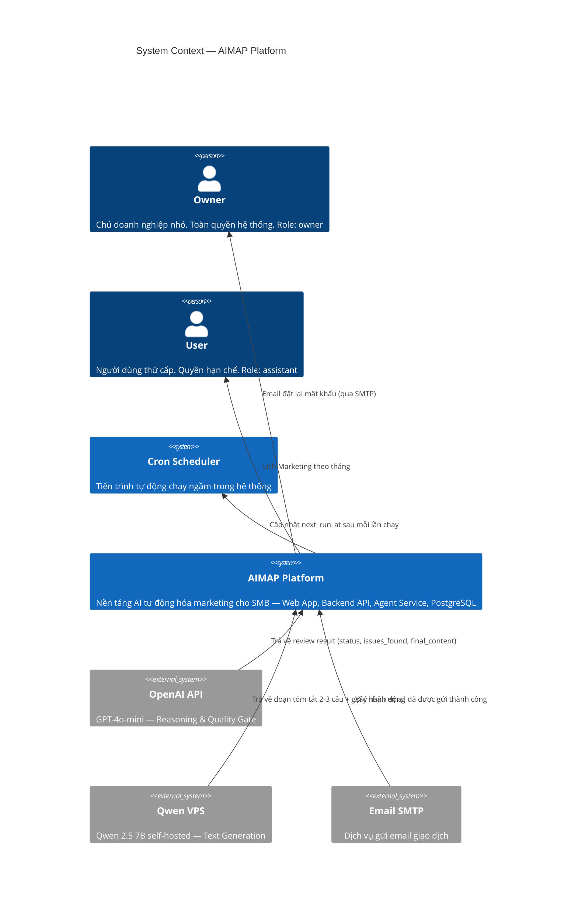

# C4 Model — Level 1: System Context

**AIMAP — AI-Powered Marketing Automation Platform**

---

## Diagram

---

## Roles thực tế trong hệ thống

| Actor trong diagram | Role trong DB | Mô tả |
|---|---|---|
| **Owner** | `owner` | Chủ doanh nghiệp — tạo tài khoản đầu tiên, toàn quyền |
| **User** | `assistant` | Người được Owner cho phép sử dụng, quyền hạn chế |
| **Cron Scheduler** | *(system)* | Tiến trình tự động, không phải người dùng |

> Không có role `admin` trong hệ thống. Owner là người dùng cao nhất. Không có tính năng quản trị hệ thống (user management, system config) trong MVP.

## Fallback Logic (Qwen ↔ OpenAI)

Nếu Qwen VPS không phản hồi trong **15 giây** → Agent Service tự động chuyển sang OpenAI.  
Áp dụng cho: Writer Agent và Dashboard AI Summary.
