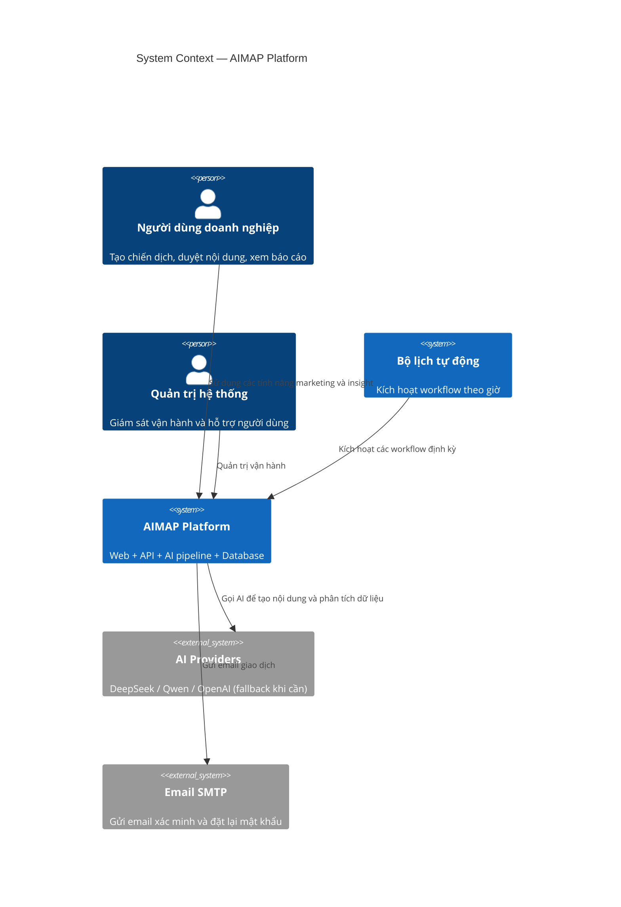

# C4 Model — Level 1: System Context

**AIMAP — Nền tảng hỗ trợ marketing có AI**

---

## Mục tiêu sơ đồ

Sơ đồ này chỉ trả lời 3 câu hỏi đơn giản:

1. Ai dùng hệ thống?
2. Hệ thống kết nối với dịch vụ nào bên ngoài?
3. Dòng giá trị chính đi qua đâu?

---

## Diagram

---

## Luồng chính cho người đọc phổ thông

- Người dùng thao tác trên web: tạo campaign, duyệt nội dung, xem dashboard/calendar/insight.
- AIMAP gọi nhóm AI Providers để tạo nội dung và diễn giải dữ liệu.
- Nếu model chính lỗi hoặc timeout, hệ thống tự chuyển model dự phòng để đảm bảo có kết quả.
- Cron Scheduler chạy nền để kích hoạt workflow tự động.
- Admin theo dõi trạng thái vận hành, không tham gia luồng sử dụng hằng ngày của user.

---

## Vai trò trong hệ thống

| Actor | Vai trò |
|---|---|
| `user` | Người dùng doanh nghiệp |
| `admin` | Quản trị vận hành hệ thống |
| `cron` | Tiến trình tự động, không phải người dùng |
