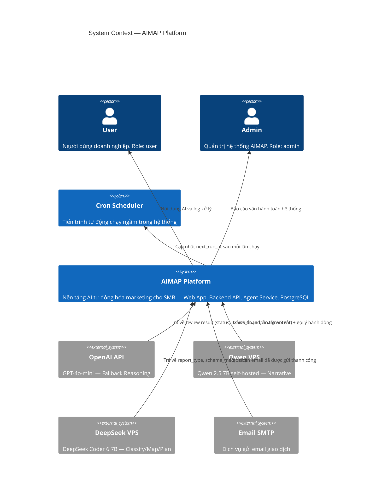

# C4 Model — Level 1: System Context

**AIMAP — AI-Powered Marketing Automation Platform**

---

## Diagram

---

## Roles thực tế trong hệ thống

| Actor trong diagram | Role trong DB | Mô tả |
|---|---|---|
| **User** | `user` | Người dùng doanh nghiệp — sử dụng toàn bộ luồng marketing |
| **Admin** | `admin` | Quản trị hệ thống AIMAP: user ops, workflow ops, audit |
| **Cron Scheduler** | *(system)* | Tiến trình tự động, không phải người dùng |

> Cap nhat: he thong da bo sung role `admin` de van hanh o muc system-level.

## Fallback Logic (Qwen ↔ OpenAI)

Nếu Qwen VPS không phản hồi trong **15 giây** → Agent Service tự động chuyển sang OpenAI.  
Áp dụng cho: Writer Agent và Dashboard AI Summary.
