# Cơ sở dữ liệu AIMAP - Danh mục đầy đủ bảng và thuộc tính

Tài liệu này liệt kê đầy đủ schema theo `docs/database-init.sql` và phần bổ sung quản trị ở cuối script.

- Nguồn chính: `docs/database-init.sql`
- Database: PostgreSQL 16
- Tổng số bảng theo tài liệu đầy đủ: **25**
- Trạng thái runtime hiện tại đã bổ sung thêm nhóm bảng cho workflow schedule và customer lists:
  - `workflow_schedules`
  - `file_uploads`
  - `customer_lists`
  - `customers`
  - `customer_analysis_snapshots`
  - `campaign_execution_logs` *(từng lần gửi email/SMS theo batch chiến dịch + token tracking mở/click — rollout bằng SQL, có thể chưa có trong `database-init.sql` gốc)*
- Bảng `brands`: runtime đã có thêm cột nullable `contact_email`, `phone`, `address` (liên hệ / địa điểm cho AI và prompt ảnh). Code backend đọc các cột này; nếu DB chưa có đủ cột, truy vấn brand có thể lỗi 500 và web báo **Failed to fetch**.

## Tóm tắt nhanh cho người không chuyên DB

Nếu chỉ cần hiểu hệ thống lưu gì ở mức nghiệp vụ, có thể đọc bảng sau trước:

| Nhóm dữ liệu | Bảng chính | Dùng để làm gì |
|---|---|---|
| Người dùng & bảo mật | `users`, `user_sessions` | Quản lý tài khoản, phiên đăng nhập |
| Hồ sơ thương hiệu | `brands`, `brand_assets` | Lưu thông tin brand để AI viết đúng giọng |
| Chiến dịch & nội dung | `campaigns`, `content_items`, `approval_history`, `campaign_execution_logs` | Vòng đời campaign: tạo → AI viết → duyệt; log gửi theo batch + tracking |
| Workflow tự động | `workflow_schedules`, `workflow_jobs` | Chạy chiến dịch theo lịch định kỳ |
| Danh sách khách hàng | `customer_lists`, `customers`, `customer_analysis_snapshots` | Import CSV khách hàng, phân tích segment, gửi email theo nhóm |
| Thống kê & dashboard | `content_analytics`, `ai_usage_stats` | Theo dõi hiệu quả nội dung và mức dùng AI |
| Insight Copilot | `insight_report_runs`, `insight_agent_traces`, `insight_result_snapshots` | Lưu lịch sử phân tích dữ liệu và kết quả |
| Quản trị hệ thống | `admin_action_logs`, `system_settings` | Nhật ký thao tác admin và cấu hình hệ thống |
| AI Campaign Assistant | `campaign_ideas` | Lưu ý tưởng và plan chi tiết được AI gợi ý + build |

> Phần dưới là tài liệu chi tiết đầy đủ cho dev/DBA (ERD + cột + index).

## 1) ERD đầy đủ (1 hình, gồm toàn bộ bảng + thuộc tính)

```mermaid
erDiagram
    users {
        uuid id PK
        varchar email
        varchar hashed_pw
        varchar full_name
        varchar phone
        varchar avatar_url
        varchar business_type
        varchar city
        varchar website
        varchar role
        boolean is_active
        boolean email_verified
        timestamptz created_at
        timestamptz updated_at
    }
    user_sessions {
        uuid id PK
        uuid user_id FK
        varchar refresh_token
        varchar device_info
        varchar ip_address
        timestamptz expires_at
        timestamptz created_at
    }
    password_reset_tokens {
        uuid id PK
        uuid user_id FK
        varchar token
        boolean used
        timestamptz expires_at
        timestamptz created_at
    }
    email_verifications {
        uuid id PK
        uuid user_id FK
        varchar token
        boolean verified
        timestamptz expires_at
        timestamptz created_at
    }
    file_uploads {
        uuid id PK
        uuid user_id FK
        varchar original_filename
        varchar stored_path
        varchar file_type
        bigint file_size_bytes
        varchar mime_type
        varchar purpose
        timestamptz created_at
    }
    brands {
        uuid id PK
        uuid user_id FK
        varchar brand_name
        varchar tagline
        text brand_description
        varchar tone_of_voice
        varchar logo_url
        varchar primary_color
        text target_audience
        text[] key_products
        text[] forbidden_words
        varchar preferred_cta
        varchar preferred_salutation
        text sample_post
        varchar contact_email
        varchar phone
        text address
        timestamptz created_at
        timestamptz updated_at
    }
    brand_assets {
        uuid id PK
        uuid brand_id FK
        varchar asset_type
        varchar file_url
        varchar file_name
        int file_size_bytes
        timestamptz created_at
    }
    campaigns {
        uuid id PK
        uuid user_id FK
        uuid brand_id FK
        varchar campaign_name
        text objective
        text product_or_service
        text target_audience
        text offer_or_hook
        date deadline
        text[] channels
        text additional_notes
        varchar status
        text error_message
        jsonb campaign_plan_json
        timestamptz created_at
        timestamptz updated_at
    }
    campaign_tags {
        uuid id PK
        uuid user_id FK
        varchar name
        varchar color
        timestamptz created_at
    }
    campaign_tag_assignments {
        uuid campaign_id PK_FK
        uuid tag_id PK_FK
    }
    agent_run_logs {
        uuid id PK
        uuid campaign_id FK
        varchar agent_name
        int step_order
        varchar channel
        varchar model_used
        varchar model_provider
        text prompt_preview
        text output_preview
        int input_tokens
        int output_tokens
        int duration_ms
        varchar status
        text error_detail
        timestamptz created_at
    }
    campaign_execution_logs {
        uuid id PK
        uuid batch_id
        uuid campaign_id FK
        uuid customer_id FK
        varchar channel
        varchar status
        varchar tracking_token
        varchar recipient_email
        varchar recipient_phone
        varchar recipient_name
        timestamptz opened_at
        timestamptz clicked_at
        timestamptz sent_at
        text error_message
        varchar ab_variant
        varchar click_target_url
        timestamptz created_at
    }
    ai_usage_stats {
        uuid id PK
        uuid user_id FK
        int year
        int month
        varchar model_provider
        varchar model_name
        int total_input_tokens
        int total_output_tokens
        int total_requests
        int failed_requests
        timestamptz updated_at
    }
    content_items {
        uuid id PK
        uuid campaign_id FK
        varchar channel
        int version
        varchar status
        jsonb content_json
        varchar source
        uuid agent_run_id FK
        text rejection_note
        date scheduled_date
        timestamptz created_at
        timestamptz updated_at
    }
    content_templates {
        uuid id PK
        uuid user_id FK
        varchar template_name
        text objective_template
        text product_template
        text audience_template
        text[] default_channels
        text notes_template
        int use_count
        timestamptz created_at
        timestamptz updated_at
    }
    approval_history {
        uuid id PK
        uuid content_item_id FK
        uuid user_id FK
        varchar action
        text note
        int content_version
        timestamptz created_at
    }
    customer_lists {
        uuid id PK
        uuid user_id FK
        varchar list_name
        text description
        varchar status
        int total_records
        int valid_records
        uuid file_upload_id FK
        timestamptz created_at
        timestamptz updated_at
    }
    customers {
        uuid id PK
        uuid customer_list_id FK
        varchar email
        varchar full_name
        varchar phone
        jsonb extra_fields
        timestamptz created_at
    }
    customer_analysis_snapshots {
        uuid id PK
        uuid customer_list_id FK
        jsonb result_json
        timestamptz created_at
    }
    customer_list_members {
        uuid customer_list_id PK_FK
        uuid customer_id PK_FK
        timestamptz added_at
    }
    notifications {
        uuid id PK
        uuid user_id FK
        varchar type
        varchar title
        text body
        jsonb payload
        boolean is_read
        timestamptz read_at
        timestamptz created_at
    }
    notification_settings {
        uuid id PK
        uuid user_id FK
        boolean campaign_completed
        boolean content_pending
        boolean workflow_triggered
        boolean weekly_summary
        timestamptz updated_at
    }
    workflow_schedules {
        uuid id PK
        uuid user_id FK
        varchar schedule_name
        varchar trigger_type
        varchar cron_expression
        boolean is_active
        jsonb default_brief_template
        timestamptz last_run_at
        timestamptz next_run_at
        timestamptz created_at
        timestamptz updated_at
    }
    workflow_jobs {
        uuid id PK
        uuid user_id FK
        varchar trigger_type
        jsonb trigger_payload
        uuid campaign_id FK
        uuid schedule_id FK
        varchar status
        text error_message
        timestamptz created_at
        timestamptz updated_at
    }
    content_analytics {
        uuid id PK
        uuid content_item_id FK
        int views
        int clicks
        int likes
        int shares
        int comments
        numeric click_through_rate
        varchar data_source
        date recorded_date
        timestamptz updated_at
    }
    admin_action_logs {
        uuid id PK
        uuid admin_user_id FK
        varchar action_type
        varchar target_type
        uuid target_id
        jsonb payload_json
        timestamptz created_at
    }
    system_settings {
        varchar key PK
        jsonb value_json
        uuid updated_by FK
        timestamptz updated_at
    }

    users ||--o{ user_sessions : has
    users ||--o{ password_reset_tokens : resets
    users ||--o{ email_verifications : verifies
    users ||--o{ file_uploads : uploads
    users ||--o{ brands : owns
    brands ||--o{ brand_assets : has

    users ||--o{ campaigns : creates
    brands ||--o{ campaigns : selected_for
    users ||--o{ campaign_tags : labels
    campaigns ||--o{ campaign_tag_assignments : tagged
    campaign_tags ||--o{ campaign_tag_assignments : mapping

    campaigns ||--o{ agent_run_logs : runs
    campaigns ||--o{ campaign_execution_logs : sends
    customers ||--o{ campaign_execution_logs : recipient
    users ||--o{ ai_usage_stats : tracks
    campaigns ||--o{ content_items : contains
    agent_run_logs ||--o{ content_items : source
    users ||--o{ content_templates : saves
    content_items ||--o{ approval_history : audited
    users ||--o{ approval_history : acts

    users ||--o{ customer_lists : owns
    file_uploads ||--o{ customer_lists : imported_from
    customer_lists ||--o{ customers : has
    customer_lists ||--o{ customer_analysis_snapshots : snapshots
    customer_lists ||--o{ customer_list_members : maps
    customers ||--o{ customer_list_members : maps

    users ||--o{ notifications : receives
    users ||--o| notification_settings : config

    users ||--o{ workflow_schedules : defines
    users ||--o{ workflow_jobs : runs
    workflow_schedules ||--o{ workflow_jobs : schedules
    campaigns ||--o{ workflow_jobs : optional_target

    content_items ||--o| content_analytics : metrics

    users ||--o{ admin_action_logs : admin_actions
    users ||--o{ system_settings : updates

    users ||--o{ campaign_ideas : creates
    brands ||--o{ campaign_ideas : selected_for
```



## 2) Danh sách bảng đầy đủ và thuộc tính

### A. Xác thực và người dùng

#### `users`
| Cột | Kiểu | Ràng buộc |
|---|---|---|
| id | UUID | PK, DEFAULT `gen_random_uuid()` |
| email | VARCHAR(255) | NOT NULL, UNIQUE (`uq_users_email`) |
| hashed_pw | VARCHAR(255) | NOT NULL |
| full_name | VARCHAR(255) | NULL |
| phone | VARCHAR(20) | NULL |
| avatar_url | VARCHAR(1024) | NULL |
| business_type | VARCHAR(100) | NULL |
| city | VARCHAR(100) | NULL |
| website | VARCHAR(512) | NULL |
| role | VARCHAR(20) | NOT NULL, DEFAULT `'user'` |
| is_active | BOOLEAN | NOT NULL, DEFAULT `TRUE` |
| email_verified | BOOLEAN | NOT NULL, DEFAULT `FALSE` |
| created_at | TIMESTAMPTZ | NOT NULL, DEFAULT `NOW()` |
| updated_at | TIMESTAMPTZ | NOT NULL, DEFAULT `NOW()` |

#### `user_sessions`
| Cột | Kiểu | Ràng buộc |
|---|---|---|
| id | UUID | PK, DEFAULT `gen_random_uuid()` |
| user_id | UUID | NOT NULL, FK -> `users.id` ON DELETE CASCADE |
| refresh_token | VARCHAR(512) | NOT NULL, UNIQUE (`uq_user_sessions_token`) |
| device_info | VARCHAR(512) | NULL |
| ip_address | VARCHAR(45) | NULL |
| expires_at | TIMESTAMPTZ | NOT NULL |
| created_at | TIMESTAMPTZ | NOT NULL, DEFAULT `NOW()` |

#### `password_reset_tokens`
| Cột | Kiểu | Ràng buộc |
|---|---|---|
| id | UUID | PK, DEFAULT `gen_random_uuid()` |
| user_id | UUID | NOT NULL, FK -> `users.id` ON DELETE CASCADE |
| token | VARCHAR(255) | NOT NULL, UNIQUE (`uq_prt_token`) |
| used | BOOLEAN | NOT NULL, DEFAULT `FALSE` |
| expires_at | TIMESTAMPTZ | NOT NULL |
| created_at | TIMESTAMPTZ | NOT NULL, DEFAULT `NOW()` |

#### `email_verifications`
| Cột | Kiểu | Ràng buộc |
|---|---|---|
| id | UUID | PK, DEFAULT `gen_random_uuid()` |
| user_id | UUID | NOT NULL, FK -> `users.id` ON DELETE CASCADE |
| token | VARCHAR(255) | NOT NULL, UNIQUE (`uq_ev_token`) |
| verified | BOOLEAN | NOT NULL, DEFAULT `FALSE` |
| expires_at | TIMESTAMPTZ | NOT NULL |
| created_at | TIMESTAMPTZ | NOT NULL, DEFAULT `NOW()` |

### B. Tệp và thương hiệu

#### `file_uploads`
| Cột | Kiểu | Ràng buộc |
|---|---|---|
| id | UUID | PK, DEFAULT `gen_random_uuid()` |
| user_id | UUID | NOT NULL, FK -> `users.id` ON DELETE CASCADE |
| original_filename | VARCHAR(255) | NOT NULL |
| stored_path | VARCHAR(1024) | NOT NULL |
| file_type | VARCHAR(50) | NOT NULL |
| file_size_bytes | BIGINT | NULL |
| mime_type | VARCHAR(100) | NULL |
| purpose | VARCHAR(50) | NULL |
| created_at | TIMESTAMPTZ | NOT NULL, DEFAULT `NOW()` |

Ghi chu:
- `file_uploads` dung cho luong upload tep workflow/customer-list.
- Campaign image khong luu trong bang nay.
- Campaign image URL duoc luu trong `campaigns.campaign_plan_json.image_url`.

#### `brands`
| Cột | Kiểu | Ràng buộc |
|---|---|---|
| id | UUID | PK, DEFAULT `gen_random_uuid()` |
| user_id | UUID | NOT NULL, FK -> `users.id` ON DELETE CASCADE, UNIQUE (`uq_brands_user_id`) |
| brand_name | VARCHAR(255) | NOT NULL |
| tagline | VARCHAR(512) | NULL |
| brand_description | TEXT | NOT NULL |
| tone_of_voice | VARCHAR(50) | NOT NULL |
| logo_url | VARCHAR(1024) | NULL |
| primary_color | VARCHAR(7) | NULL |
| target_audience | TEXT | NOT NULL |
| key_products | TEXT[] | NULL |
| forbidden_words | TEXT[] | NULL |
| preferred_cta | VARCHAR(255) | NULL |
| preferred_salutation | VARCHAR(50) | NULL |
| sample_post | TEXT | NULL |
| contact_email | VARCHAR(255) | NULL |
| phone | VARCHAR(64) | NULL |
| address | TEXT | NULL |
| created_at | TIMESTAMPTZ | NOT NULL, DEFAULT `NOW()` |
| updated_at | TIMESTAMPTZ | NOT NULL, DEFAULT `NOW()` |

Ghi chú `brands` (đồng bộ code ↔ DB):
- Nhiều hồ sơ brand trên một user: ràng buộc UNIQUE trên `user_id` đã được gỡ ở migration `0003` (schema runtime); tài liệu `database-init.sql` gốc có thể khác — lấy `api/alembic` làm nguồn sự thật cho môi trường đang chạy.
- Theo quy tắc vận hành hiện tại của dự án, khi cập nhật schema có thể rollout bằng SQL trực tiếp trên DB thay vì tạo migration file mới.
- Thiếu cột liên hệ brand → API lỗi → form brand-vault / `/brands` có thể hiện **Failed to fetch**.

#### `brand_assets`
| Cột | Kiểu | Ràng buộc |
|---|---|---|
| id | UUID | PK, DEFAULT `gen_random_uuid()` |
| brand_id | UUID | NOT NULL, FK -> `brands.id` ON DELETE CASCADE |
| asset_type | VARCHAR(50) | NOT NULL |
| file_url | VARCHAR(1024) | NOT NULL |
| file_name | VARCHAR(255) | NULL |
| file_size_bytes | INTEGER | NULL |
| created_at | TIMESTAMPTZ | NOT NULL, DEFAULT `NOW()` |

### C. Chiến dịch và phân loại

#### `campaigns`
| Cột | Kiểu | Ràng buộc |
|---|---|---|
| id | UUID | PK, DEFAULT `gen_random_uuid()` |
| user_id | UUID | NOT NULL, FK -> `users.id` ON DELETE CASCADE |
| brand_id | UUID | NULL, FK -> `brands.id` ON DELETE SET NULL *(bo sung runtime de gan campaign voi brand da chon)* |
| campaign_name | VARCHAR(255) | NOT NULL |
| objective | TEXT | NOT NULL |
| product_or_service | TEXT | NOT NULL |
| target_audience | TEXT | NULL |
| offer_or_hook | TEXT | NULL |
| deadline | DATE | NOT NULL |
| channels | TEXT[] | NOT NULL |
| additional_notes | TEXT | NULL |
| status | VARCHAR(30) | NOT NULL, DEFAULT `'pending_agent'` |
| error_message | TEXT | NULL |
| campaign_plan_json | JSONB | NULL |
| created_at | TIMESTAMPTZ | NOT NULL, DEFAULT `NOW()` |
| updated_at | TIMESTAMPTZ | NOT NULL, DEFAULT `NOW()` |

Ghi chu image storage:
- Truong `campaign_plan_json` co the chua `image_url`.
- Runtime hien tai uu tien luu image len Cloudinary, fallback local neu chua cau hinh `CLOUDINARY_*`.
- Chuyen local -> Cloudinary khong can migration schema DB.

Ghi chu lien ket campaign-brand:
- Runtime da bo sung `campaigns.brand_id` de frontend bat buoc chon thuong hieu khi tao campaign.
- Agent/internal uu tien lay brand theo `campaign.brand_id`; chi fallback "brand moi nhat" cho campaign cu chua co `brand_id`.
- Theo quy tac van hanh hien tai, doi voi moi truong khong dung migration file, can chay SQL truc tiep de tao cot/FK/index:
  - `ALTER TABLE public.campaigns ADD COLUMN IF NOT EXISTS brand_id UUID;`
  - FK: `campaigns.brand_id -> brands.id` (`ON DELETE SET NULL`)
  - `CREATE INDEX IF NOT EXISTS ix_campaigns_brand_id ON public.campaigns (brand_id);`

#### `campaign_tags`
| Cột | Kiểu | Ràng buộc |
|---|---|---|
| id | UUID | PK, DEFAULT `gen_random_uuid()` |
| user_id | UUID | NOT NULL, FK -> `users.id` ON DELETE CASCADE |
| name | VARCHAR(100) | NOT NULL |
| color | VARCHAR(7) | NULL |
| created_at | TIMESTAMPTZ | NOT NULL, DEFAULT `NOW()` |
| (user_id, name) | - | UNIQUE (`uq_campaign_tags_user_name`) |

#### `campaign_tag_assignments`
| Cột | Kiểu | Ràng buộc |
|---|---|---|
| campaign_id | UUID | NOT NULL, FK -> `campaigns.id` ON DELETE CASCADE |
| tag_id | UUID | NOT NULL, FK -> `campaign_tags.id` ON DELETE CASCADE |
| (campaign_id, tag_id) | - | PRIMARY KEY |

#### `campaign_execution_logs`

Lưu **từng lần gửi** trong một batch (`batch_id` chung cho lần chạy `execute`), kênh email/SMS, trạng thái, token tracking (mở/click), snapshot người nhận. Rollout: chạy SQL trực tiếp trên PostgreSQL nếu môi trường chưa có bảng.

```sql
CREATE TABLE campaign_execution_logs (
    id UUID PRIMARY KEY DEFAULT gen_random_uuid(),
    batch_id UUID NOT NULL,
    campaign_id UUID NOT NULL REFERENCES campaigns(id) ON DELETE CASCADE,
    customer_id UUID REFERENCES customers(id) ON DELETE SET NULL,
    channel VARCHAR(20) NOT NULL,
    status VARCHAR(30) NOT NULL,
    tracking_token VARCHAR(64) NOT NULL UNIQUE,
    recipient_email VARCHAR(255),
    recipient_phone VARCHAR(50),
    recipient_name VARCHAR(255),
    opened_at TIMESTAMPTZ,
    clicked_at TIMESTAMPTZ,
    sent_at TIMESTAMPTZ,
    error_message TEXT,
    ab_variant VARCHAR(8),
    click_target_url VARCHAR(2048),
    created_at TIMESTAMPTZ NOT NULL DEFAULT now()
);

CREATE INDEX ix_cel_campaign_id ON campaign_execution_logs(campaign_id);
CREATE INDEX ix_cel_batch_id ON campaign_execution_logs(batch_id);
CREATE INDEX ix_cel_status ON campaign_execution_logs(status);
```

| Cột | Kiểu | Ràng buộc |
|---|---|---|
| id | UUID | PK, DEFAULT `gen_random_uuid()` |
| batch_id | UUID | NOT NULL |
| campaign_id | UUID | NOT NULL, FK -> `campaigns.id` ON DELETE CASCADE |
| customer_id | UUID | NULL, FK -> `customers.id` ON DELETE SET NULL |
| channel | VARCHAR(20) | NOT NULL |
| status | VARCHAR(30) | NOT NULL |
| tracking_token | VARCHAR(64) | NOT NULL, UNIQUE |
| recipient_email | VARCHAR(255) | NULL |
| recipient_phone | VARCHAR(50) | NULL |
| recipient_name | VARCHAR(255) | NULL |
| opened_at | TIMESTAMPTZ | NULL |
| clicked_at | TIMESTAMPTZ | NULL |
| sent_at | TIMESTAMPTZ | NULL |
| error_message | TEXT | NULL |
| ab_variant | VARCHAR(8) | NULL |
| click_target_url | VARCHAR(2048) | NULL |
| created_at | TIMESTAMPTZ | NOT NULL, DEFAULT `NOW()` |

Ghi chú:
- API/UI chi tiết campaign: tổng hợp gửi, bảng log, pixel/link tracking đọc từ đây (khi đã rollout schema).
- Index bổ sung theo ORM có thể gồm `tracking_token` (unique đã tạo chỉ mục implicit); các index trên phù hợp filter theo `campaign_id` / `batch_id` / `status`.

### D. AI và nội dung

#### `agent_run_logs`
| Cột | Kiểu | Ràng buộc |
|---|---|---|
| id | UUID | PK, DEFAULT `gen_random_uuid()` |
| campaign_id | UUID | NOT NULL, FK -> `campaigns.id` ON DELETE CASCADE |
| agent_name | VARCHAR(50) | NOT NULL |
| step_order | INTEGER | NOT NULL |
| channel | VARCHAR(30) | NULL |
| model_used | VARCHAR(100) | NOT NULL |
| model_provider | VARCHAR(20) | NOT NULL |
| prompt_preview | TEXT | NULL |
| output_preview | TEXT | NULL |
| input_tokens | INTEGER | NULL |
| output_tokens | INTEGER | NULL |
| duration_ms | INTEGER | NULL |
| status | VARCHAR(20) | NOT NULL, DEFAULT `'success'` |
| error_detail | TEXT | NULL |
| created_at | TIMESTAMPTZ | NOT NULL, DEFAULT `NOW()` |

#### `ai_usage_stats`
| Cột | Kiểu | Ràng buộc |
|---|---|---|
| id | UUID | PK, DEFAULT `gen_random_uuid()` |
| user_id | UUID | NOT NULL, FK -> `users.id` ON DELETE CASCADE |
| year | INTEGER | NOT NULL |
| month | INTEGER | NOT NULL |
| model_provider | VARCHAR(20) | NOT NULL |
| model_name | VARCHAR(100) | NOT NULL |
| total_input_tokens | INTEGER | NOT NULL, DEFAULT `0` |
| total_output_tokens | INTEGER | NOT NULL, DEFAULT `0` |
| total_requests | INTEGER | NOT NULL, DEFAULT `0` |
| failed_requests | INTEGER | NOT NULL, DEFAULT `0` |
| updated_at | TIMESTAMPTZ | NOT NULL, DEFAULT `NOW()` |
| (user_id, year, month, model_provider, model_name) | - | UNIQUE (`uq_ai_usage_stats`) |

#### `content_items`
| Cột | Kiểu | Ràng buộc |
|---|---|---|
| id | UUID | PK, DEFAULT `gen_random_uuid()` |
| campaign_id | UUID | NOT NULL, FK -> `campaigns.id` ON DELETE CASCADE |
| channel | VARCHAR(30) | NOT NULL |
| version | INTEGER | NOT NULL, DEFAULT `1` |
| status | VARCHAR(30) | NOT NULL, DEFAULT `'draft'` |
| content_json | JSONB | NOT NULL |
| source | VARCHAR(20) | NOT NULL, DEFAULT `'agent'` |
| agent_run_id | UUID | NULL, FK -> `agent_run_logs.id` ON DELETE SET NULL |
| rejection_note | TEXT | NULL |
| scheduled_date | DATE | NULL |
| created_at | TIMESTAMPTZ | NOT NULL, DEFAULT `NOW()` |
| updated_at | TIMESTAMPTZ | NOT NULL, DEFAULT `NOW()` |

#### `content_templates`
| Cột | Kiểu | Ràng buộc |
|---|---|---|
| id | UUID | PK, DEFAULT `gen_random_uuid()` |
| user_id | UUID | NOT NULL, FK -> `users.id` ON DELETE CASCADE |
| template_name | VARCHAR(255) | NOT NULL |
| objective_template | TEXT | NULL |
| product_template | TEXT | NULL |
| audience_template | TEXT | NULL |
| default_channels | TEXT[] | NULL |
| notes_template | TEXT | NULL |
| use_count | INTEGER | NOT NULL, DEFAULT `0` |
| created_at | TIMESTAMPTZ | NOT NULL, DEFAULT `NOW()` |
| updated_at | TIMESTAMPTZ | NOT NULL, DEFAULT `NOW()` |

#### `approval_history`
| Cột | Kiểu | Ràng buộc |
|---|---|---|
| id | UUID | PK, DEFAULT `gen_random_uuid()` |
| content_item_id | UUID | NOT NULL, FK -> `content_items.id` ON DELETE CASCADE |
| user_id | UUID | NOT NULL, FK -> `users.id` |
| action | VARCHAR(20) | NOT NULL |
| note | TEXT | NULL |
| content_version | INTEGER | NOT NULL |
| created_at | TIMESTAMPTZ | NOT NULL, DEFAULT `NOW()` |

### E. Khách hàng

#### `customer_lists`
| Cột | Kiểu | Ràng buộc |
|---|---|---|
| id | UUID | PK, DEFAULT `gen_random_uuid()` |
| user_id | UUID | NOT NULL, FK -> `users.id` ON DELETE CASCADE |
| list_name | VARCHAR(255) | NOT NULL |
| description | TEXT | NULL |
| status | VARCHAR(20) | NOT NULL, DEFAULT `'processing'` |
| total_records | INTEGER | NULL |
| valid_records | INTEGER | NULL |
| file_upload_id | UUID | NULL, FK -> `file_uploads.id` ON DELETE SET NULL |
| created_at | TIMESTAMPTZ | NOT NULL, DEFAULT `NOW()` |
| updated_at | TIMESTAMPTZ | NOT NULL, DEFAULT `NOW()` |

#### `customers`
| Cột | Kiểu | Ràng buộc |
|---|---|---|
| id | UUID | PK, DEFAULT `gen_random_uuid()` |
| customer_list_id | UUID | NOT NULL, FK -> `customer_lists.id` ON DELETE CASCADE |
| email | VARCHAR(255) | NULL |
| full_name | VARCHAR(255) | NULL |
| phone | VARCHAR(20) | NULL |
| extra_fields | JSONB | NULL |
| created_at | TIMESTAMPTZ | NOT NULL, DEFAULT `NOW()` |

#### `customer_list_members`
| Cột | Kiểu | Ràng buộc |
|---|---|---|
| customer_list_id | UUID | NOT NULL, FK -> `customer_lists.id` ON DELETE CASCADE |
| customer_id | UUID | NOT NULL, FK -> `customers.id` ON DELETE CASCADE |
| added_at | TIMESTAMPTZ | NOT NULL, DEFAULT `NOW()` |
| (customer_list_id, customer_id) | - | PRIMARY KEY |

#### `customer_analysis_snapshots`
Lưu kết quả phân tích customer list (segment, churn risk, VIP...) để trang Outreach có thể lấy lại kết quả đã phân tích.

```sql
CREATE TABLE customer_analysis_snapshots (
    id UUID PRIMARY KEY DEFAULT gen_random_uuid(),
    customer_list_id UUID NOT NULL REFERENCES customer_lists(id) ON DELETE CASCADE,
    result_json JSONB NOT NULL,
    created_at TIMESTAMPTZ NOT NULL DEFAULT NOW()
);
CREATE INDEX idx_customer_analysis_snapshots_list_id ON customer_analysis_snapshots(customer_list_id);
CREATE INDEX idx_customer_analysis_snapshots_created ON customer_analysis_snapshots(created_at DESC);
```

| Cột | Kiểu | Ràng buộc |
|---|---|---|
| id | UUID | PK, DEFAULT `gen_random_uuid()` |
| customer_list_id | UUID | NOT NULL, FK -> `customer_lists.id` ON DELETE CASCADE |
| result_json | JSONB | NOT NULL |
| created_at | TIMESTAMPTZ | NOT NULL, DEFAULT `NOW()` |

**Cấu trúc JSON trong `result_json`:**
```json
{
  "list_id": "uuid",
  "list_name": "Tên danh sách",
  "analysis": {
    "overview": { "total_customers": 100, "total_revenue": 50000000 },
    "segmentation": {
      "summary": { "vip": 10, "potential": 30, "churn_risk": 20, "new": 40 },
      "customers": [{ "customer_name": "Nguyễn Văn A", "segment": "vip" }]
    },
    "churn_risk": { "inactive_over_30_days": 15, "inactive_over_60_days": 5 },
    "narrative": "Mô tả ngắn về kết quả phân tích",
    "ai_meta": { "model_used": "qwen2.5:14b", "fallback_used": false }
  }
}
```

### F. Thông báo

#### `notifications`
| Cột | Kiểu | Ràng buộc |
|---|---|---|
| id | UUID | PK, DEFAULT `gen_random_uuid()` |
| user_id | UUID | NOT NULL, FK -> `users.id` ON DELETE CASCADE |
| type | VARCHAR(50) | NOT NULL |
| title | VARCHAR(255) | NOT NULL |
| body | TEXT | NOT NULL |
| payload | JSONB | NULL |
| is_read | BOOLEAN | NOT NULL, DEFAULT `FALSE` |
| read_at | TIMESTAMPTZ | NULL |
| created_at | TIMESTAMPTZ | NOT NULL, DEFAULT `NOW()` |

#### `notification_settings`
| Cột | Kiểu | Ràng buộc |
|---|---|---|
| id | UUID | PK, DEFAULT `gen_random_uuid()` |
| user_id | UUID | NOT NULL, FK -> `users.id` ON DELETE CASCADE, UNIQUE (`uq_notification_settings_user`) |
| campaign_completed | BOOLEAN | NOT NULL, DEFAULT `TRUE` |
| content_pending | BOOLEAN | NOT NULL, DEFAULT `TRUE` |
| workflow_triggered | BOOLEAN | NOT NULL, DEFAULT `TRUE` |
| weekly_summary | BOOLEAN | NOT NULL, DEFAULT `TRUE` |
| updated_at | TIMESTAMPTZ | NOT NULL, DEFAULT `NOW()` |

### G. Workflow và tự động hóa

#### `workflow_schedules`
| Cột | Kiểu | Ràng buộc |
|---|---|---|
| id | UUID | PK, DEFAULT `gen_random_uuid()` |
| user_id | UUID | NOT NULL, FK -> `users.id` ON DELETE CASCADE |
| schedule_name | VARCHAR(255) | NOT NULL |
| trigger_type | VARCHAR(50) | NOT NULL |
| cron_expression | VARCHAR(100) | NULL |
| is_active | BOOLEAN | NOT NULL, DEFAULT `TRUE` |
| default_brief_template | JSONB | NULL |
| last_run_at | TIMESTAMPTZ | NULL |
| next_run_at | TIMESTAMPTZ | NULL |
| created_at | TIMESTAMPTZ | NOT NULL, DEFAULT `NOW()` |
| updated_at | TIMESTAMPTZ | NOT NULL, DEFAULT `NOW()` |

#### `workflow_jobs`
| Cột | Kiểu | Ràng buộc |
|---|---|---|
| id | UUID | PK, DEFAULT `gen_random_uuid()` |
| user_id | UUID | NOT NULL, FK -> `users.id` ON DELETE CASCADE |
| trigger_type | VARCHAR(50) | NOT NULL |
| trigger_payload | JSONB | NULL |
| campaign_id | UUID | NULL, FK -> `campaigns.id` ON DELETE SET NULL |
| schedule_id | UUID | NULL, FK -> `workflow_schedules.id` ON DELETE SET NULL |
| status | VARCHAR(20) | NOT NULL, DEFAULT `'queued'` |
| error_message | TEXT | NULL |
| created_at | TIMESTAMPTZ | NOT NULL, DEFAULT `NOW()` |
| updated_at | TIMESTAMPTZ | NOT NULL, DEFAULT `NOW()` |

### H. Phân tích

#### `content_analytics`
| Cột | Kiểu | Ràng buộc |
|---|---|---|
| id | UUID | PK, DEFAULT `gen_random_uuid()` |
| content_item_id | UUID | NOT NULL, FK -> `content_items.id` ON DELETE CASCADE, UNIQUE (`uq_content_analytics_item`) |
| views | INTEGER | NOT NULL, DEFAULT `0` |
| clicks | INTEGER | NOT NULL, DEFAULT `0` |
| likes | INTEGER | NOT NULL, DEFAULT `0` |
| shares | INTEGER | NOT NULL, DEFAULT `0` |
| comments | INTEGER | NOT NULL, DEFAULT `0` |
| click_through_rate | NUMERIC(5,2) | NULL |
| data_source | VARCHAR(50) | NOT NULL, DEFAULT `'mock'` |
| recorded_date | DATE | NOT NULL, DEFAULT `CURRENT_DATE` |
| updated_at | TIMESTAMPTZ | NOT NULL, DEFAULT `NOW()` |

### I. Quản trị hệ thống

#### `admin_action_logs`
| Cột | Kiểu | Ràng buộc |
|---|---|---|
| id | UUID | PK, DEFAULT `gen_random_uuid()` |
| admin_user_id | UUID | NOT NULL, FK -> `users.id` ON DELETE CASCADE |
| action_type | VARCHAR(100) | NOT NULL |
| target_type | VARCHAR(100) | NULL |
| target_id | UUID | NULL |
| payload_json | JSONB | NULL |
| created_at | TIMESTAMPTZ | NOT NULL, DEFAULT `NOW()` |

#### `system_settings`
| Cột | Kiểu | Ràng buộc |
|---|---|---|
| key | VARCHAR(100) | PK |
| value_json | JSONB | NOT NULL |
| updated_by | UUID | NULL, FK -> `users.id` ON DELETE SET NULL |
| updated_at | TIMESTAMPTZ | NOT NULL, DEFAULT `NOW()` |

## 3) Indexes chính trong script

- `users`: `idx_users_email` (unique), `idx_users_role`
- `user_sessions`: `idx_user_sessions_user_id`, `idx_user_sessions_token` (unique)
- `password_reset_tokens`: `idx_prt_user_id`, `idx_prt_token` (unique)
- `campaigns`: `idx_campaigns_user_id`, `idx_campaigns_status`, `idx_campaigns_deadline`, `ix_campaigns_brand_id`
- `campaign_execution_logs`: `ix_cel_campaign_id`, `ix_cel_batch_id`, `ix_cel_status`; UNIQUE trên `tracking_token`
- `content_items`: `idx_content_items_campaign_id`, `idx_content_items_status`, `idx_content_items_scheduled_date`, `idx_content_items_channel`
- `agent_run_logs`: `idx_agent_run_logs_campaign_id`, `idx_agent_run_logs_created_at`
- `brand_assets`: `idx_brand_assets_brand_id`
- `campaign_tag_assignments`: `idx_cta_campaign_id`, `idx_cta_tag_id`
- `customer_lists`: `idx_customer_lists_user_id`
- `customers`: `idx_customers_customer_list_id`, `idx_customers_email`
- `customer_analysis_snapshots`: `idx_customer_analysis_snapshots_list_id`, `idx_customer_analysis_snapshots_created`
- `file_uploads`: `idx_file_uploads_user_id`
- `notifications`: `idx_notifications_user_id`, `idx_notifications_unread` (partial index)
- `ai_usage_stats`: `idx_ai_usage_stats_user_id`
- `workflow_schedules`: `idx_workflow_schedules_user_id`, `idx_workflow_schedules_next_run` (partial index)
- `workflow_jobs`: `idx_workflow_jobs_user_id`, `idx_workflow_jobs_status`
- `approval_history`: `idx_approval_history_content_item_id`, `idx_approval_history_user_id`
- `content_templates`: `idx_content_templates_user_id`
- `admin_action_logs`: `idx_admin_action_logs_admin_user_id`, `idx_admin_action_logs_action_type`, `idx_admin_action_logs_created_at`

## 4) Ghi chú đồng bộ

- `docs/database-init.sql` là schema đầy đủ phục vụ tài liệu và demo dữ liệu.
- `api/alembic` hiện mới cover một tập con bảng, nên khi đối chiếu implementation cần phân biệt:
  - schema DB đầy đủ (tài liệu này)
  - schema đã migration trong backend hiện tại.
- Với thay đổi schema mới, ưu tiên đồng bộ bằng SQL rollout trực tiếp (theo rule hiện tại) hoặc migration tuỳ môi trường triển khai. Ví dụ lỗi trên `/brand-vault` hoặc `GET /brands` dạng network **Failed to fetch** thường là do API trả 500 vì cột ORM mới chưa tồn tại trong PostgreSQL.
- Thiếu bảng `campaign_execution_logs` trong khi backend đã dùng model tương ứng → các API delivery/tracking hoặc màn chi tiết campaign có thể lỗi; chạy khối `CREATE TABLE` + index như mục `campaign_execution_logs` ở trên.

## 5) Bo sung bang Insight A2A (MVP moi)

- `insight_report_runs`: metadata cua moi lan phan tich sau upload CSV.
- `insight_report_schema_maps`: mapping cot goc -> canonical key.
- `insight_agent_traces`: trace tung step va model da dung.
- `insight_result_snapshots`: snapshot ket qua JSON tra ve cho UI.

## 6) Bang Campaign Ideas (AI Campaign Assistant)

Luu tru cac y tuong chiến dich duoc AI goi y va build chi tiet. Day la phan core cua tinh nang AI Campaign Assistant (wizard-style UI, khong phai chatbot).

#### `campaign_ideas`
| Cột | Kiểu | Ràng buộc |
|---|---|---|
| id | UUID | PK, DEFAULT `gen_random_uuid()` |
| user_id | UUID | NOT NULL, FK -> `users.id` ON DELETE CASCADE |
| brand_id | UUID | NULL, FK -> `brands.id` ON DELETE SET NULL |
| title | VARCHAR(255) | NOT NULL |
| objective | TEXT | NULL |
| channels | TEXT[] | NULL |
| email_content | JSONB | NULL |
| post_content | JSONB | NULL |
| video_script | JSONB | NULL |
| image_prompt | TEXT | NULL |
| status | VARCHAR(20) | NOT NULL, DEFAULT `'draft'` |
| created_at | TIMESTAMPTZ | NOT NULL, DEFAULT `NOW()` |
| updated_at | TIMESTAMPTZ | NOT NULL, DEFAULT `NOW()` |

Ghi chú:
- `status`: `'draft'` (dang nhap), `'suggesting'` (AI dang goi y), `'building'` (AI dang build), `'complete'` (da xong)
- `email_content`: JSON `{ subject, preheader, body, cta_text, cta_url }`
- `post_content`: JSON `{ hook, body, hashtags, image_style }`
- `video_script`: JSON `{ duration, hook_seconds, scenes }`
