# Cơ sở dữ liệu AIMAP - Danh mục đầy đủ bảng và thuộc tính

Tài liệu này liệt kê đầy đủ schema theo `docs/database-init.sql` và phần bổ sung quản trị ở cuối script.

- Nguồn chính: `docs/database-init.sql`
- Database: PostgreSQL 16
- Tổng số bảng theo tài liệu đầy đủ: **28**
- Trạng thái runtime hiện tại đã bổ sung thêm nhóm bảng cho:
  - Workflow schedule: `workflow_schedules`
  - Customer lists: `customer_lists`, `customers`, `customer_analysis_snapshots`
  - **Insights Chatbot (AI Analyst)**: `insight_data_sources`, `insight_chats`, `insight_chat_messages`
  - Campaign execution: `campaign_execution_logs`

## Tóm tắt nhanh cho người không chuyên DB

Nếu chỉ cần hiểu hệ thống lưu gì ở mức nghiệp vụ, có thể đọc bảng sau trước:

| Nhóm dữ liệu | Bảng chính | Dùng để làm gì |
|---|---|---|
| Người dùng & bảo mật | `users`, `user_sessions` | Quản lý tài khoản, phiên đăng nhập |
| Hồ sơ thương hiệu | `brands`, `brand_assets` | Lưu thông tin brand để AI viết đúng giọng |
| Chiến dịch & nội dung | `campaigns`, `content_items`, `approval_history`, `campaign_execution_logs` | Vòng đời campaign: tạo → AI viết → duyệt; log gửi theo batch + tracking |
| Workflow tự động | `workflow_schedules`, `workflow_jobs` | Chạy chiến dịch theo lịch định kỳ |
| Danh sách khách hàng | `customer_lists`, `customers`, `customer_analysis_snapshots` | Import CSV khách hàng, phân tích segment, gửi email theo nhóm |
| Thống kê & dashboard | `content_analytics`, `ai_usage_stats` | Theo dõi hiệu quả nội dung và mức dùng AI |
| Insight Copilot | `insight_report_runs`, `insight_agent_traces`, `insight_result_snapshots` | Lưu lịch sử phân tích dữ liệu và kết quả |
| **AI Analyst Chatbot** | `insight_data_sources`, `insight_chats`, `insight_chat_messages` | Nguồn dữ liệu, cuộc hội thoại chat với AI. Hỗ trợ: queries, manipulation (tạo/sửa/xóa cột), CSV merge, guidance mode |
| Quản trị hệ thống | `admin_action_logs`, `system_settings` | Nhật ký thao tác admin và cấu hình hệ thống |
| AI Campaign Assistant | `campaign_ideas` | Lưu ý tưởng chiến dịch + timing + segment được AI gợi ý, và plan chi tiết |

> Phần dưới là tài liệu chi tiết đầy đủ cho dev/DBA (ERD + cột + index).

## 1) ERD Tổng quát (Tất cả bảng trong 1 hình)

```mermaid
erDiagram
    %% =====================
    %% A. Xác thực & Người dùng
    %% =====================
    users {
        uuid id PK
        varchar email
        varchar hashed_pw
        varchar full_name
        varchar phone
        varchar avatar_url
        varchar business_type
        varchar city
        varchar website
        varchar role
        boolean is_active
        boolean email_verified
        timestamptz created_at
        timestamptz updated_at
    }

    user_sessions {
        uuid id PK
        uuid user_id FK
        varchar refresh_token
        varchar device_info
        varchar ip_address
        timestamptz expires_at
        timestamptz created_at
    }

    password_reset_tokens {
        uuid id PK
        uuid user_id FK
        varchar token
        boolean used
        timestamptz expires_at
        timestamptz created_at
    }

    email_verifications {
        uuid id PK
        uuid user_id FK
        varchar token
        boolean verified
        timestamptz expires_at
        timestamptz created_at
    }

    %% =====================
    %% B. File Upload & Thương hiệu
    %% =====================
    file_uploads {
        uuid id PK
        uuid user_id FK
        varchar original_filename
        varchar stored_path
        varchar file_type
        bigint file_size_bytes
        varchar mime_type
        varchar purpose
        timestamptz created_at
    }

    brands {
        uuid id PK
        uuid user_id FK
        varchar brand_name
        varchar tagline
        text brand_description
        varchar tone_of_voice
        varchar logo_url
        varchar primary_color
        text target_audience
        text[] key_products
        text[] forbidden_words
        varchar preferred_cta
        varchar preferred_salutation
        text sample_post
        varchar contact_email
        varchar phone
        text address
        timestamptz created_at
        timestamptz updated_at
    }

    brand_assets {
        uuid id PK
        uuid brand_id FK
        varchar asset_type
        varchar file_url
        varchar file_name
        int file_size_bytes
        timestamptz created_at
    }

    %% =====================
    %% C. Chiến dịch & Tags
    %% =====================
    campaigns {
        uuid id PK
        uuid user_id FK
        uuid brand_id FK
        varchar campaign_name
        text objective
        text product_or_service
        text target_audience
        text offer_or_hook
        date deadline
        text[] channels
        text additional_notes
        varchar status
        text error_message
        jsonb campaign_plan_json
        timestamptz created_at
        timestamptz updated_at
    }

    campaign_tags {
        uuid id PK
        uuid user_id FK
        varchar name
        varchar color
        timestamptz created_at
    }

    campaign_tag_assignments {
        uuid campaign_id PK_FK
        uuid tag_id PK_FK
    }

    %% =====================
    %% D. AI Agent & Logs
    %% =====================
    agent_run_logs {
        uuid id PK
        uuid campaign_id FK
        varchar agent_name
        int step_order
        varchar channel
        varchar model_used
        varchar model_provider
        text prompt_preview
        text output_preview
        int input_tokens
        int output_tokens
        int duration_ms
        varchar status
        text error_detail
        timestamptz created_at
    }

    ai_usage_stats {
        uuid id PK
        uuid user_id FK
        int year
        int month
        varchar model_provider
        varchar model_name
        int total_input_tokens
        int total_output_tokens
        int total_requests
        int failed_requests
        timestamptz updated_at
    }

    %% =====================
    %% E. Content & Templates
    %% =====================
    content_items {
        uuid id PK
        uuid campaign_id FK
        varchar channel
        int version
        varchar status
        jsonb content_json
        varchar source
        uuid agent_run_id FK
        text rejection_note
        date scheduled_date
        timestamptz created_at
        timestamptz updated_at
    }

    content_templates {
        uuid id PK
        uuid user_id FK
        varchar template_name
        text objective_template
        text product_template
        text audience_template
        text[] default_channels
        text notes_template
        int use_count
        timestamptz created_at
        timestamptz updated_at
    }

    approval_history {
        uuid id PK
        uuid content_item_id FK
        uuid user_id FK
        varchar action
        text note
        int content_version
        timestamptz created_at
    }

    content_analytics {
        uuid id PK
        uuid content_item_id FK
        int views
        int clicks
        int likes
        int shares
        int comments
        numeric click_through_rate
        varchar data_source
        date recorded_date
        timestamptz updated_at
    }

    %% =====================
    %% F. Campaign Execution & Tracking
    %% =====================
    campaign_execution_logs {
        uuid id PK
        uuid batch_id
        uuid campaign_id FK
        uuid customer_id FK
        varchar channel
        varchar status
        varchar tracking_token
        varchar recipient_email
        varchar recipient_phone
        varchar recipient_name
        timestamptz opened_at
        timestamptz clicked_at
        timestamptz sent_at
        text error_message
        varchar ab_variant
        varchar click_target_url
        timestamptz created_at
    }

    %% =====================
    %% G. Customer Lists & Analysis
    %% =====================
    customer_lists {
        uuid id PK
        uuid user_id FK
        varchar list_name
        text description
        varchar status
        int total_records
        int valid_records
        uuid file_upload_id FK
        timestamptz created_at
        timestamptz updated_at
    }

    customers {
        uuid id PK
        uuid customer_list_id FK
        varchar email
        varchar full_name
        varchar phone
        jsonb extra_fields
        timestamptz created_at
    }

    customer_list_members {
        uuid customer_list_id PK_FK
        uuid customer_id PK_FK
        timestamptz added_at
    }

    customer_analysis_snapshots {
        uuid id PK
        uuid customer_list_id FK
        jsonb result_json
        timestamptz created_at
    }

    %% =====================
    %% H. Workflow & Automation
    %% =====================
    workflow_schedules {
        uuid id PK
        uuid user_id FK
        varchar schedule_name
        varchar trigger_type
        varchar cron_expression
        boolean is_active
        jsonb default_brief_template
        timestamptz last_run_at
        timestamptz next_run_at
        timestamptz created_at
        timestamptz updated_at
    }

    workflow_jobs {
        uuid id PK
        uuid user_id FK
        varchar trigger_type
        jsonb trigger_payload
        uuid campaign_id FK
        uuid schedule_id FK
        varchar status
        text error_message
        timestamptz created_at
        timestamptz updated_at
    }

    %% =====================
    %% I. Notifications
    %% =====================
    notifications {
        uuid id PK
        uuid user_id FK
        varchar type
        varchar title
        text body
        jsonb payload
        boolean is_read
        timestamptz read_at
        timestamptz created_at
    }

    notification_settings {
        uuid id PK
        uuid user_id FK
        boolean campaign_completed
        boolean content_pending
        boolean workflow_triggered
        boolean weekly_summary
        timestamptz updated_at
    }

    %% =====================
    %% J. AI Insight Reports (A2A)
    %% =====================
    insight_report_runs {
        uuid id PK
        uuid user_id FK
        uuid data_source_id FK
        varchar status
        jsonb config_json
        jsonb result_json
        timestamptz created_at
        timestamptz completed_at
    }

    insight_report_schema_maps {
        uuid id PK
        uuid report_run_id FK
        varchar original_column_name
        varchar canonical_key
        varchar data_type
        int column_order
        timestamptz created_at
    }

    insight_agent_traces {
        uuid id PK
        uuid report_run_id FK
        varchar step_name
        varchar model_used
        varchar model_provider
        text prompt_used
        text output_received
        int input_tokens
        int output_tokens
        int duration_ms
        jsonb metadata_json
        timestamptz created_at
    }

    insight_result_snapshots {
        uuid id PK
        uuid report_run_id FK
        jsonb snapshot_json
        varchar snapshot_type
        timestamptz created_at
    }

    %% =====================
    %% K. AI Analyst Chatbot
    %% =====================
    insight_data_sources {
        uuid id PK
        uuid user_id FK
        varchar name
        varchar source_type
        jsonb schema_json
        jsonb data_json
        uuid file_upload_id FK
        varchar original_filename
        timestamptz created_at
        timestamptz updated_at
    }

    insight_chats {
        uuid id PK
        uuid user_id FK
        uuid data_source_id FK
        uuid insight_run_id FK
        varchar title
        varchar status
        timestamptz created_at
        timestamptz updated_at
    }

    insight_chat_messages {
        uuid id PK
        uuid chat_id FK
        varchar role
        text content
        jsonb message_context
        jsonb suggested_visualizations
        int input_tokens
        int output_tokens
        timestamptz created_at
    }

    %% =====================
    %% L. Campaign Ideas (AI Assistant)
    %% =====================
    campaign_ideas {
        uuid id PK
        uuid user_id FK
        uuid brand_id FK
        varchar title
        text objective
        text[] channels
        varchar timing
        text customer_segment
        jsonb email_content
        jsonb post_content
        jsonb video_script
        text image_prompt
        varchar status
        timestamptz created_at
        timestamptz updated_at
    }

    %% =====================
    %% M. Admin & System
    %% =====================
    admin_action_logs {
        uuid id PK
        uuid admin_user_id FK
        varchar action_type
        varchar target_type
        uuid target_id
        jsonb payload_json
        timestamptz created_at
    }

    system_settings {
        varchar key PK
        jsonb value_json
        uuid updated_by FK
        timestamptz updated_at
    }

    %% ================================================
    %% RELATIONSHIPS - Tất cả quan hệ
    %% ================================================

    %% Users relationships
    users ||--o{ user_sessions : has
    users ||--o{ password_reset_tokens : resets
    users ||--o{ email_verifications : verifies
    users ||--o{ file_uploads : uploads
    users ||--o{ brands : owns
    users ||--o{ campaigns : creates
    users ||--o{ campaign_tags : labels
    users ||--o{ customer_lists : owns
    users ||--o{ notifications : receives
    users ||--o| notification_settings : configures
    users ||--o{ workflow_schedules : defines
    users ||--o{ workflow_jobs : runs
    users ||--o{ ai_usage_stats : tracks
    users ||--o{ content_templates : saves
    users ||--o{ approval_history : acts
    users ||--o{ admin_action_logs : admin_actions
    users ||--o{ system_settings : updates
    users ||--o{ insight_report_runs : runs
    users ||--o{ insight_data_sources : owns
    users ||--o{ insight_chats : chats
    users ||--o{ campaign_ideas : creates

    %% Brand relationships
    brands ||--o{ brand_assets : has
    brands ||--o{ campaigns : selected_for
    brands ||--o{ campaign_ideas : selected_for

    %% Campaign relationships
    campaigns ||--o{ agent_run_logs : runs
    campaigns ||--o{ content_items : contains
    campaigns ||--o{ campaign_execution_logs : sends
    campaigns ||--o{ workflow_jobs : triggers
    campaigns ||--o{ campaign_tag_assignments : tagged

    %% Content relationships
    content_items ||--o| agent_run_logs : source
    content_items ||--o{ approval_history : audited
    content_items ||--o| content_analytics : metrics

    %% Customer relationships
    customer_lists ||--o{ customers : has
    customer_lists ||--o{ customer_analysis_snapshots : snapshots
    customer_lists ||--o{ customer_list_members : maps
    customer_lists ||--o| file_uploads : imported_from
    customers ||--o{ campaign_execution_logs : recipient
    customers ||--o{ customer_list_members : maps

    %% Workflow relationships
    workflow_schedules ||--o{ workflow_jobs : schedules

    %% Insight A2A relationships
    insight_report_runs ||--o{ insight_report_schema_maps : schemas
    insight_report_runs ||--o{ insight_agent_traces : traces
    insight_report_runs ||--o{ insight_result_snapshots : snapshots
    insight_report_runs ||--o{ insight_chats : linked

    %% Insight Chatbot relationships
    insight_data_sources ||--o{ insight_chats : conversations
    insight_data_sources ||--o| file_uploads : uploaded_from
    insight_chats ||--o{ insight_chat_messages : messages

    %% Tag relationships
    campaign_tags ||--o{ campaign_tag_assignments : mapping
```



## 2) Danh sách bảng đầy đủ và thuộc tính

### A. Xác thực và người dùng

#### `users`
| Cột | Kiểu | Ràng buộc |
|---|---|---|
| id | UUID | PK, DEFAULT `gen_random_uuid()` |
| email | VARCHAR(255) | NOT NULL, UNIQUE (`uq_users_email`) |
| hashed_pw | VARCHAR(255) | NOT NULL |
| full_name | VARCHAR(255) | NULL |
| phone | VARCHAR(20) | NULL |
| avatar_url | VARCHAR(1024) | NULL |
| business_type | VARCHAR(100) | NULL |
| city | VARCHAR(100) | NULL |
| website | VARCHAR(512) | NULL |
| role | VARCHAR(20) | NOT NULL, DEFAULT `'user'` |
| is_active | BOOLEAN | NOT NULL, DEFAULT `TRUE` |
| email_verified | BOOLEAN | NOT NULL, DEFAULT `FALSE` |
| created_at | TIMESTAMPTZ | NOT NULL, DEFAULT `NOW()` |
| updated_at | TIMESTAMPTZ | NOT NULL, DEFAULT `NOW()` |

#### `user_sessions`
| Cột | Kiểu | Ràng buộc |
|---|---|---|
| id | UUID | PK, DEFAULT `gen_random_uuid()` |
| user_id | UUID | NOT NULL, FK -> `users.id` ON DELETE CASCADE |
| refresh_token | VARCHAR(512) | NOT NULL, UNIQUE (`uq_user_sessions_token`) |
| device_info | VARCHAR(512) | NULL |
| ip_address | VARCHAR(45) | NULL |
| expires_at | TIMESTAMPTZ | NOT NULL |
| created_at | TIMESTAMPTZ | NOT NULL, DEFAULT `NOW()` |

#### `password_reset_tokens`
| Cột | Kiểu | Ràng buộc |
|---|---|---|
| id | UUID | PK, DEFAULT `gen_random_uuid()` |
| user_id | UUID | NOT NULL, FK -> `users.id` ON DELETE CASCADE |
| token | VARCHAR(255) | NOT NULL, UNIQUE (`uq_prt_token`) |
| used | BOOLEAN | NOT NULL, DEFAULT `FALSE` |
| expires_at | TIMESTAMPTZ | NOT NULL |
| created_at | TIMESTAMPTZ | NOT NULL, DEFAULT `NOW()` |

#### `email_verifications`
| Cột | Kiểu | Ràng buộc |
|---|---|---|
| id | UUID | PK, DEFAULT `gen_random_uuid()` |
| user_id | UUID | NOT NULL, FK -> `users.id` ON DELETE CASCADE |
| token | VARCHAR(255) | NOT NULL, UNIQUE (`uq_ev_token`) |
| verified | BOOLEAN | NOT NULL, DEFAULT `FALSE` |
| expires_at | TIMESTAMPTZ | NOT NULL |
| created_at | TIMESTAMPTZ | NOT NULL, DEFAULT `NOW()` |

### B. Tệp và thương hiệu

#### `file_uploads`
| Cột | Kiểu | Ràng buộc |
|---|---|---|
| id | UUID | PK, DEFAULT `gen_random_uuid()` |
| user_id | UUID | NOT NULL, FK -> `users.id` ON DELETE CASCADE |
| original_filename | VARCHAR(255) | NOT NULL |
| stored_path | VARCHAR(1024) | NOT NULL |
| file_type | VARCHAR(50) | NOT NULL |
| file_size_bytes | BIGINT | NULL |
| mime_type | VARCHAR(100) | NULL |
| purpose | VARCHAR(50) | NULL |
| created_at | TIMESTAMPTZ | NOT NULL, DEFAULT `NOW()` |

Ghi chu:
- `file_uploads` dung cho luong upload tep workflow/customer-list.
- Campaign image khong luu trong bang nay.
- Campaign image URL duoc luu trong `campaigns.campaign_plan_json.image_url`.

#### `brands`
| Cột | Kiểu | Ràng buộc |
|---|---|---|
| id | UUID | PK, DEFAULT `gen_random_uuid()` |
| user_id | UUID | NOT NULL, FK -> `users.id` ON DELETE CASCADE, UNIQUE (`uq_brands_user_id`) |
| brand_name | VARCHAR(255) | NOT NULL |
| tagline | VARCHAR(512) | NULL |
| brand_description | TEXT | NOT NULL |
| tone_of_voice | VARCHAR(50) | NOT NULL |
| logo_url | VARCHAR(1024) | NULL |
| primary_color | VARCHAR(7) | NULL |
| target_audience | TEXT | NOT NULL |
| key_products | TEXT[] | NULL |
| forbidden_words | TEXT[] | NULL |
| preferred_cta | VARCHAR(255) | NULL |
| preferred_salutation | VARCHAR(50) | NULL |
| sample_post | TEXT | NULL |
| contact_email | VARCHAR(255) | NULL |
| phone | VARCHAR(64) | NULL |
| address | TEXT | NULL |
| created_at | TIMESTAMPTZ | NOT NULL, DEFAULT `NOW()` |
| updated_at | TIMESTAMPTZ | NOT NULL, DEFAULT `NOW()` |

Ghi chú `brands` (đồng bộ code ↔ DB):
- Nhiều hồ sơ brand trên một user: ràng buộc UNIQUE trên `user_id` đã được gỡ ở migration `0003` (schema runtime); tài liệu `database-init.sql` gốc có thể khác — lấy `api/alembic` làm nguồn sự thật cho môi trường đang chạy.
- Theo quy tắc vận hành hiện tại của dự án, khi cập nhật schema có thể rollout bằng SQL trực tiếp trên DB thay vì tạo migration file mới.
- Thiếu cột liên hệ brand → API lỗi → form brand-vault / `/brands` có thể hiện **Failed to fetch**.

#### `brand_assets`
| Cột | Kiểu | Ràng buộc |
|---|---|---|
| id | UUID | PK, DEFAULT `gen_random_uuid()` |
| brand_id | UUID | NOT NULL, FK -> `brands.id` ON DELETE CASCADE |
| asset_type | VARCHAR(50) | NOT NULL |
| file_url | VARCHAR(1024) | NOT NULL |
| file_name | VARCHAR(255) | NULL |
| file_size_bytes | INTEGER | NULL |
| created_at | TIMESTAMPTZ | NOT NULL, DEFAULT `NOW()` |

### C. Chiến dịch và phân loại

#### `campaigns`
| Cột | Kiểu | Ràng buộc |
|---|---|---|
| id | UUID | PK, DEFAULT `gen_random_uuid()` |
| user_id | UUID | NOT NULL, FK -> `users.id` ON DELETE CASCADE |
| brand_id | UUID | NULL, FK -> `brands.id` ON DELETE SET NULL *(bo sung runtime de gan campaign voi brand da chon)* |
| campaign_name | VARCHAR(255) | NOT NULL |
| objective | TEXT | NOT NULL |
| product_or_service | TEXT | NOT NULL |
| target_audience | TEXT | NULL |
| offer_or_hook | TEXT | NULL |
| deadline | DATE | NOT NULL |
| channels | TEXT[] | NOT NULL |
| additional_notes | TEXT | NULL |
| status | VARCHAR(30) | NOT NULL, DEFAULT `'pending_agent'` |
| error_message | TEXT | NULL |
| campaign_plan_json | JSONB | NULL |
| created_at | TIMESTAMPTZ | NOT NULL, DEFAULT `NOW()` |
| updated_at | TIMESTAMPTZ | NOT NULL, DEFAULT `NOW()` |

Ghi chu image storage:
- Truong `campaign_plan_json` co the chua `image_url`.
- Runtime hien tai uu tien luu image len Cloudinary, fallback local neu chua cau hinh `CLOUDINARY_*`.
- Chuyen local -> Cloudinary khong can migration schema DB.

Ghi chu lien ket campaign-brand:
- Runtime da bo sung `campaigns.brand_id` de frontend bat buoc chon thuong hieu khi tao campaign.
- Agent/internal uu tien lay brand theo `campaign.brand_id`; chi fallback "brand moi nhat" cho campaign cu chua co `brand_id`.
- Theo quy tac van hanh hien tai, doi voi moi truong khong dung migration file, can chay SQL truc tiep de tao cot/FK/index:
  - `ALTER TABLE public.campaigns ADD COLUMN IF NOT EXISTS brand_id UUID;`
  - FK: `campaigns.brand_id -> brands.id` (`ON DELETE SET NULL`)
  - `CREATE INDEX IF NOT EXISTS ix_campaigns_brand_id ON public.campaigns (brand_id);`

#### `campaign_tags`
| Cột | Kiểu | Ràng buộc |
|---|---|---|
| id | UUID | PK, DEFAULT `gen_random_uuid()` |
| user_id | UUID | NOT NULL, FK -> `users.id` ON DELETE CASCADE |
| name | VARCHAR(100) | NOT NULL |
| color | VARCHAR(7) | NULL |
| created_at | TIMESTAMPTZ | NOT NULL, DEFAULT `NOW()` |
| (user_id, name) | - | UNIQUE (`uq_campaign_tags_user_name`) |

#### `campaign_tag_assignments`
| Cột | Kiểu | Ràng buộc |
|---|---|---|
| campaign_id | UUID | NOT NULL, FK -> `campaigns.id` ON DELETE CASCADE |
| tag_id | UUID | NOT NULL, FK -> `campaign_tags.id` ON DELETE CASCADE |
| (campaign_id, tag_id) | - | PRIMARY KEY |

#### `campaign_execution_logs`

Lưu **từng lần gửi** trong một batch (`batch_id` chung cho lần chạy `execute`), kênh email/SMS, trạng thái, token tracking (mở/click), snapshot người nhận. Rollout: chạy SQL trực tiếp trên PostgreSQL nếu môi trường chưa có bảng.

```sql
CREATE TABLE campaign_execution_logs (
    id UUID PRIMARY KEY DEFAULT gen_random_uuid(),
    batch_id UUID NOT NULL,
    campaign_id UUID NOT NULL REFERENCES campaigns(id) ON DELETE CASCADE,
    customer_id UUID REFERENCES customers(id) ON DELETE SET NULL,
    channel VARCHAR(20) NOT NULL,
    status VARCHAR(30) NOT NULL,
    tracking_token VARCHAR(64) NOT NULL UNIQUE,
    recipient_email VARCHAR(255),
    recipient_phone VARCHAR(50),
    recipient_name VARCHAR(255),
    opened_at TIMESTAMPTZ,
    clicked_at TIMESTAMPTZ,
    sent_at TIMESTAMPTZ,
    error_message TEXT,
    ab_variant VARCHAR(8),
    click_target_url VARCHAR(2048),
    created_at TIMESTAMPTZ NOT NULL DEFAULT now()
);

CREATE INDEX ix_cel_campaign_id ON campaign_execution_logs(campaign_id);
CREATE INDEX ix_cel_batch_id ON campaign_execution_logs(batch_id);
CREATE INDEX ix_cel_status ON campaign_execution_logs(status);
```

| Cột | Kiểu | Ràng buộc |
|---|---|---|
| id | UUID | PK, DEFAULT `gen_random_uuid()` |
| batch_id | UUID | NOT NULL |
| campaign_id | UUID | NOT NULL, FK -> `campaigns.id` ON DELETE CASCADE |
| customer_id | UUID | NULL, FK -> `customers.id` ON DELETE SET NULL |
| channel | VARCHAR(20) | NOT NULL |
| status | VARCHAR(30) | NOT NULL |
| tracking_token | VARCHAR(64) | NOT NULL, UNIQUE |
| recipient_email | VARCHAR(255) | NULL |
| recipient_phone | VARCHAR(50) | NULL |
| recipient_name | VARCHAR(255) | NULL |
| opened_at | TIMESTAMPTZ | NULL |
| clicked_at | TIMESTAMPTZ | NULL |
| sent_at | TIMESTAMPTZ | NULL |
| error_message | TEXT | NULL |
| ab_variant | VARCHAR(8) | NULL |
| click_target_url | VARCHAR(2048) | NULL |
| created_at | TIMESTAMPTZ | NOT NULL, DEFAULT `NOW()` |

Ghi chú:
- API/UI chi tiết campaign: tổng hợp gửi, bảng log, pixel/link tracking đọc từ đây (khi đã rollout schema).
- Index bổ sung theo ORM có thể gồm `tracking_token` (unique đã tạo chỉ mục implicit); các index trên phù hợp filter theo `campaign_id` / `batch_id` / `status`.

### D. AI và nội dung

#### `agent_run_logs`
| Cột | Kiểu | Ràng buộc |
|---|---|---|
| id | UUID | PK, DEFAULT `gen_random_uuid()` |
| campaign_id | UUID | NOT NULL, FK -> `campaigns.id` ON DELETE CASCADE |
| agent_name | VARCHAR(50) | NOT NULL |
| step_order | INTEGER | NOT NULL |
| channel | VARCHAR(30) | NULL |
| model_used | VARCHAR(100) | NOT NULL |
| model_provider | VARCHAR(20) | NOT NULL |
| prompt_preview | TEXT | NULL |
| output_preview | TEXT | NULL |
| input_tokens | INTEGER | NULL |
| output_tokens | INTEGER | NULL |
| duration_ms | INTEGER | NULL |
| status | VARCHAR(20) | NOT NULL, DEFAULT `'success'` |
| error_detail | TEXT | NULL |
| created_at | TIMESTAMPTZ | NOT NULL, DEFAULT `NOW()` |

#### `ai_usage_stats`
| Cột | Kiểu | Ràng buộc |
|---|---|---|
| id | UUID | PK, DEFAULT `gen_random_uuid()` |
| user_id | UUID | NOT NULL, FK -> `users.id` ON DELETE CASCADE |
| year | INTEGER | NOT NULL |
| month | INTEGER | NOT NULL |
| model_provider | VARCHAR(20) | NOT NULL |
| model_name | VARCHAR(100) | NOT NULL |
| total_input_tokens | INTEGER | NOT NULL, DEFAULT `0` |
| total_output_tokens | INTEGER | NOT NULL, DEFAULT `0` |
| total_requests | INTEGER | NOT NULL, DEFAULT `0` |
| failed_requests | INTEGER | NOT NULL, DEFAULT `0` |
| updated_at | TIMESTAMPTZ | NOT NULL, DEFAULT `NOW()` |
| (user_id, year, month, model_provider, model_name) | - | UNIQUE (`uq_ai_usage_stats`) |

#### `content_items`
| Cột | Kiểu | Ràng buộc |
|---|---|---|
| id | UUID | PK, DEFAULT `gen_random_uuid()` |
| campaign_id | UUID | NOT NULL, FK -> `campaigns.id` ON DELETE CASCADE |
| channel | VARCHAR(30) | NOT NULL |
| version | INTEGER | NOT NULL, DEFAULT `1` |
| status | VARCHAR(30) | NOT NULL, DEFAULT `'draft'` |
| content_json | JSONB | NOT NULL |
| source | VARCHAR(20) | NOT NULL, DEFAULT `'agent'` |
| agent_run_id | UUID | NULL, FK -> `agent_run_logs.id` ON DELETE SET NULL |
| rejection_note | TEXT | NULL |
| scheduled_date | DATE | NULL |
| created_at | TIMESTAMPTZ | NOT NULL, DEFAULT `NOW()` |
| updated_at | TIMESTAMPTZ | NOT NULL, DEFAULT `NOW()` |

#### `content_templates`
| Cột | Kiểu | Ràng buộc |
|---|---|---|
| id | UUID | PK, DEFAULT `gen_random_uuid()` |
| user_id | UUID | NOT NULL, FK -> `users.id` ON DELETE CASCADE |
| template_name | VARCHAR(255) | NOT NULL |
| objective_template | TEXT | NULL |
| product_template | TEXT | NULL |
| audience_template | TEXT | NULL |
| default_channels | TEXT[] | NULL |
| notes_template | TEXT | NULL |
| use_count | INTEGER | NOT NULL, DEFAULT `0` |
| created_at | TIMESTAMPTZ | NOT NULL, DEFAULT `NOW()` |
| updated_at | TIMESTAMPTZ | NOT NULL, DEFAULT `NOW()` |

#### `approval_history`
| Cột | Kiểu | Ràng buộc |
|---|---|---|
| id | UUID | PK, DEFAULT `gen_random_uuid()` |
| content_item_id | UUID | NOT NULL, FK -> `content_items.id` ON DELETE CASCADE |
| user_id | UUID | NOT NULL, FK -> `users.id` |
| action | VARCHAR(20) | NOT NULL |
| note | TEXT | NULL |
| content_version | INTEGER | NOT NULL |
| created_at | TIMESTAMPTZ | NOT NULL, DEFAULT `NOW()` |

### E. Khách hàng

#### `customer_lists`
| Cột | Kiểu | Ràng buộc |
|---|---|---|
| id | UUID | PK, DEFAULT `gen_random_uuid()` |
| user_id | UUID | NOT NULL, FK -> `users.id` ON DELETE CASCADE |
| list_name | VARCHAR(255) | NOT NULL |
| description | TEXT | NULL |
| status | VARCHAR(20) | NOT NULL, DEFAULT `'processing'` |
| total_records | INTEGER | NULL |
| valid_records | INTEGER | NULL |
| file_upload_id | UUID | NULL, FK -> `file_uploads.id` ON DELETE SET NULL |
| created_at | TIMESTAMPTZ | NOT NULL, DEFAULT `NOW()` |
| updated_at | TIMESTAMPTZ | NOT NULL, DEFAULT `NOW()` |

#### `customers`
| Cột | Kiểu | Ràng buộc |
|---|---|---|
| id | UUID | PK, DEFAULT `gen_random_uuid()` |
| customer_list_id | UUID | NOT NULL, FK -> `customer_lists.id` ON DELETE CASCADE |
| email | VARCHAR(255) | NULL |
| full_name | VARCHAR(255) | NULL |
| phone | VARCHAR(20) | NULL |
| extra_fields | JSONB | NULL |
| created_at | TIMESTAMPTZ | NOT NULL, DEFAULT `NOW()` |

#### `customer_list_members`
| Cột | Kiểu | Ràng buộc |
|---|---|---|
| customer_list_id | UUID | NOT NULL, FK -> `customer_lists.id` ON DELETE CASCADE |
| customer_id | UUID | NOT NULL, FK -> `customers.id` ON DELETE CASCADE |
| added_at | TIMESTAMPTZ | NOT NULL, DEFAULT `NOW()` |
| (customer_list_id, customer_id) | - | PRIMARY KEY |

#### `customer_analysis_snapshots`
Lưu kết quả phân tích customer list (segment, churn risk, VIP...) để trang Outreach có thể lấy lại kết quả đã phân tích.

```sql
CREATE TABLE customer_analysis_snapshots (
    id UUID PRIMARY KEY DEFAULT gen_random_uuid(),
    customer_list_id UUID NOT NULL REFERENCES customer_lists(id) ON DELETE CASCADE,
    result_json JSONB NOT NULL,
    created_at TIMESTAMPTZ NOT NULL DEFAULT NOW()
);
CREATE INDEX idx_customer_analysis_snapshots_list_id ON customer_analysis_snapshots(customer_list_id);
CREATE INDEX idx_customer_analysis_snapshots_created ON customer_analysis_snapshots(created_at DESC);
```

| Cột | Kiểu | Ràng buộc |
|---|---|---|
| id | UUID | PK, DEFAULT `gen_random_uuid()` |
| customer_list_id | UUID | NOT NULL, FK -> `customer_lists.id` ON DELETE CASCADE |
| result_json | JSONB | NOT NULL |
| created_at | TIMESTAMPTZ | NOT NULL, DEFAULT `NOW()` |

**Cấu trúc JSON trong `result_json`:**
```json
{
  "list_id": "uuid",
  "list_name": "Tên danh sách",
  "analysis": {
    "overview": { "total_customers": 100, "total_revenue": 50000000 },
    "segmentation": {
      "summary": { "vip": 10, "potential": 30, "churn_risk": 20, "new": 40 },
      "customers": [{ "customer_name": "Nguyễn Văn A", "segment": "vip" }]
    },
    "churn_risk": { "inactive_over_30_days": 15, "inactive_over_60_days": 5 },
    "narrative": "Mô tả ngắn về kết quả phân tích",
    "ai_meta": { "model_used": "qwen2.5:14b", "fallback_used": false }
  }
}
```

### F. Thông báo

#### `notifications`
| Cột | Kiểu | Ràng buộc |
|---|---|---|
| id | UUID | PK, DEFAULT `gen_random_uuid()` |
| user_id | UUID | NOT NULL, FK -> `users.id` ON DELETE CASCADE |
| type | VARCHAR(50) | NOT NULL |
| title | VARCHAR(255) | NOT NULL |
| body | TEXT | NOT NULL |
| payload | JSONB | NULL |
| is_read | BOOLEAN | NOT NULL, DEFAULT `FALSE` |
| read_at | TIMESTAMPTZ | NULL |
| created_at | TIMESTAMPTZ | NOT NULL, DEFAULT `NOW()` |

#### `notification_settings`
| Cột | Kiểu | Ràng buộc |
|---|---|---|
| id | UUID | PK, DEFAULT `gen_random_uuid()` |
| user_id | UUID | NOT NULL, FK -> `users.id` ON DELETE CASCADE, UNIQUE (`uq_notification_settings_user`) |
| campaign_completed | BOOLEAN | NOT NULL, DEFAULT `TRUE` |
| content_pending | BOOLEAN | NOT NULL, DEFAULT `TRUE` |
| workflow_triggered | BOOLEAN | NOT NULL, DEFAULT `TRUE` |
| weekly_summary | BOOLEAN | NOT NULL, DEFAULT `TRUE` |
| updated_at | TIMESTAMPTZ | NOT NULL, DEFAULT `NOW()` |

### G. Workflow và tự động hóa

#### `workflow_schedules`
| Cột | Kiểu | Ràng buộc |
|---|---|---|
| id | UUID | PK, DEFAULT `gen_random_uuid()` |
| user_id | UUID | NOT NULL, FK -> `users.id` ON DELETE CASCADE |
| schedule_name | VARCHAR(255) | NOT NULL |
| trigger_type | VARCHAR(50) | NOT NULL |
| cron_expression | VARCHAR(100) | NULL |
| is_active | BOOLEAN | NOT NULL, DEFAULT `TRUE` |
| default_brief_template | JSONB | NULL |
| last_run_at | TIMESTAMPTZ | NULL |
| next_run_at | TIMESTAMPTZ | NULL |
| created_at | TIMESTAMPTZ | NOT NULL, DEFAULT `NOW()` |
| updated_at | TIMESTAMPTZ | NOT NULL, DEFAULT `NOW()` |

#### `workflow_jobs`
| Cột | Kiểu | Ràng buộc |
|---|---|---|
| id | UUID | PK, DEFAULT `gen_random_uuid()` |
| user_id | UUID | NOT NULL, FK -> `users.id` ON DELETE CASCADE |
| trigger_type | VARCHAR(50) | NOT NULL |
| trigger_payload | JSONB | NULL |
| campaign_id | UUID | NULL, FK -> `campaigns.id` ON DELETE SET NULL |
| schedule_id | UUID | NULL, FK -> `workflow_schedules.id` ON DELETE SET NULL |
| status | VARCHAR(20) | NOT NULL, DEFAULT `'queued'` |
| error_message | TEXT | NULL |
| created_at | TIMESTAMPTZ | NOT NULL, DEFAULT `NOW()` |
| updated_at | TIMESTAMPTZ | NOT NULL, DEFAULT `NOW()` |

### H. Phân tích

#### `content_analytics`
| Cột | Kiểu | Ràng buộc |
|---|---|---|
| id | UUID | PK, DEFAULT `gen_random_uuid()` |
| content_item_id | UUID | NOT NULL, FK -> `content_items.id` ON DELETE CASCADE, UNIQUE (`uq_content_analytics_item`) |
| views | INTEGER | NOT NULL, DEFAULT `0` |
| clicks | INTEGER | NOT NULL, DEFAULT `0` |
| likes | INTEGER | NOT NULL, DEFAULT `0` |
| shares | INTEGER | NOT NULL, DEFAULT `0` |
| comments | INTEGER | NOT NULL, DEFAULT `0` |
| click_through_rate | NUMERIC(5,2) | NULL |
| data_source | VARCHAR(50) | NOT NULL, DEFAULT `'mock'` |
| recorded_date | DATE | NOT NULL, DEFAULT `CURRENT_DATE` |
| updated_at | TIMESTAMPTZ | NOT NULL, DEFAULT `NOW()` |

### I. Quản trị hệ thống

#### `admin_action_logs`
| Cột | Kiểu | Ràng buộc |
|---|---|---|
| id | UUID | PK, DEFAULT `gen_random_uuid()` |
| admin_user_id | UUID | NOT NULL, FK -> `users.id` ON DELETE CASCADE |
| action_type | VARCHAR(100) | NOT NULL |
| target_type | VARCHAR(100) | NULL |
| target_id | UUID | NULL |
| payload_json | JSONB | NULL |
| created_at | TIMESTAMPTZ | NOT NULL, DEFAULT `NOW()` |

#### `system_settings`
| Cột | Kiểu | Ràng buộc |
|---|---|---|
| key | VARCHAR(100) | PK |
| value_json | JSONB | NOT NULL |
| updated_by | UUID | NULL, FK -> `users.id` ON DELETE SET NULL |
| updated_at | TIMESTAMPTZ | NOT NULL, DEFAULT `NOW()` |

## 3) Indexes chính trong script

- `users`: `idx_users_email` (unique), `idx_users_role`
- `user_sessions`: `idx_user_sessions_user_id`, `idx_user_sessions_token` (unique)
- `password_reset_tokens`: `idx_prt_user_id`, `idx_prt_token` (unique)
- `campaigns`: `idx_campaigns_user_id`, `idx_campaigns_status`, `idx_campaigns_deadline`, `ix_campaigns_brand_id`
- `campaign_execution_logs`: `ix_cel_campaign_id`, `ix_cel_batch_id`, `ix_cel_status`; UNIQUE trên `tracking_token`
- `content_items`: `idx_content_items_campaign_id`, `idx_content_items_status`, `idx_content_items_scheduled_date`, `idx_content_items_channel`
- `agent_run_logs`: `idx_agent_run_logs_campaign_id`, `idx_agent_run_logs_created_at`
- `brand_assets`: `idx_brand_assets_brand_id`
- `campaign_tag_assignments`: `idx_cta_campaign_id`, `idx_cta_tag_id`
- `customer_lists`: `idx_customer_lists_user_id`
- `customers`: `idx_customers_customer_list_id`, `idx_customers_email`
- `customer_analysis_snapshots`: `idx_customer_analysis_snapshots_list_id`, `idx_customer_analysis_snapshots_created`
- `file_uploads`: `idx_file_uploads_user_id`
- `notifications`: `idx_notifications_user_id`, `idx_notifications_unread` (partial index)
- `ai_usage_stats`: `idx_ai_usage_stats_user_id`
- `workflow_schedules`: `idx_workflow_schedules_user_id`, `idx_workflow_schedules_next_run` (partial index)
- `workflow_jobs`: `idx_workflow_jobs_user_id`, `idx_workflow_jobs_status`
- `approval_history`: `idx_approval_history_content_item_id`, `idx_approval_history_user_id`
- `content_templates`: `idx_content_templates_user_id`
- `admin_action_logs`: `idx_admin_action_logs_admin_user_id`, `idx_admin_action_logs_action_type`, `idx_admin_action_logs_created_at`

## 4) Ghi chú đồng bộ

- `docs/database-init.sql` là schema đầy đủ phục vụ tài liệu và demo dữ liệu.
- `api/alembic` hiện mới cover một tập con bảng, nên khi đối chiếu implementation cần phân biệt:
  - schema DB đầy đủ (tài liệu này)
  - schema đã migration trong backend hiện tại.
- Với thay đổi schema mới, ưu tiên đồng bộ bằng SQL rollout trực tiếp (theo rule hiện tại) hoặc migration tuỳ môi trường triển khai. Ví dụ lỗi trên `/brand-vault` hoặc `GET /brands` dạng network **Failed to fetch** thường là do API trả 500 vì cột ORM mới chưa tồn tại trong PostgreSQL.
- Thiếu bảng `campaign_execution_logs` trong khi backend đã dùng model tương ứng → các API delivery/tracking hoặc màn chi tiết campaign có thể lỗi; chạy khối `CREATE TABLE` + index như mục `campaign_execution_logs` ở trên.

## 5) Bo sung bang Insight A2A (MVP moi)

- `insight_report_runs`: metadata cua moi lan phan tich sau upload CSV.
- `insight_report_schema_maps`: mapping cot goc -> canonical key.
- `insight_agent_traces`: trace tung step va model da dung.
- `insight_result_snapshots`: snapshot ket qua JSON tra ve cho UI.

## 6) Bang AI Analyst Chatbot

He thong chatbot thong minh cho phep user tra loi ve du lieu bang cuoc hoi thoan voi AI. Bao gom nguon du lieu (tu tao tay hoac upload file), cuoc hoi thoan, va tin nhan.

#### `insight_data_sources`
Luu nguon du lieu ma user tao hoac upload de phan tich.

| Cot | Kieu | Rang buoc |
|---|---|---|
| id | UUID | PK, DEFAULT `gen_random_uuid()` |
| user_id | UUID | NOT NULL, FK -> `users.id` ON DELETE CASCADE |
| name | VARCHAR(255) | NOT NULL |
| source_type | VARCHAR(20) | NOT NULL, DEFAULT `'manual'` |
| schema_json | JSONB | NULL - cau truc cot (cho manual table) |
| data_json | JSONB | NULL - du lieu hang (cho manual table) |
| file_upload_id | UUID | NULL, FK -> `file_uploads.id` ON DELETE SET NULL |
| original_filename | VARCHAR(255) | NULL |
| created_at | TIMESTAMPTZ | NOT NULL, DEFAULT `NOW()` |
| updated_at | TIMESTAMPTZ | NOT NULL, DEFAULT `NOW()` |

Ghi chu:
- `source_type`: `'manual'` (tao bang tay) | `'csv_upload'` | `'xlsx_upload'`
- `schema_json`: `{ "columns": [{ "name": "...", "data_type": "number|date|text" }] }`
- `data_json`: `{ "rows": [{ "cot1": "gia tri", "cot2": 123 }] }`

#### `insight_chats`
Luu mot cuoc hoi thoan chat voi AI, lien ket voi mot nguon du lieu.

| Cot | Kieu | Rang buoc |
|---|---|---|
| id | UUID | PK, DEFAULT `gen_random_uuid()` |
| user_id | UUID | NOT NULL, FK -> `users.id` ON DELETE CASCADE |
| data_source_id | UUID | NOT NULL, FK -> `insight_data_sources.id` ON DELETE CASCADE |
| insight_run_id | UUID | NULL, FK -> `insight_report_runs.id` ON DELETE SET NULL |
| title | VARCHAR(255) | NULL |
| status | VARCHAR(20) | NOT NULL, DEFAULT `'active'` |
| created_at | TIMESTAMPTZ | NOT NULL, DEFAULT `NOW()` |
| updated_at | TIMESTAMPTZ | NOT NULL, DEFAULT `NOW()` |

Ghi chu:
- `status`: `'active'` | `'archived'`
- Lien ket voi `insight_report_runs` de biet ket qua phan tich nao dang duoc su dung

#### `insight_chat_messages`
Luu tung tin nhan trong cuoc hoi thoan.

| Cot | Kieu | Rang buoc |
|---|---|---|
| id | UUID | PK, DEFAULT `gen_random_uuid()` |
| chat_id | UUID | NOT NULL, FK -> `insight_chats.id` ON DELETE CASCADE |
| role | VARCHAR(20) | NOT NULL - `'user'` hoac `'assistant'` |
| content | TEXT | NOT NULL - noi dung tin nhan |
| message_context | JSONB | NULL - context mo rong (intent, entities, resolved references) |
| suggested_visualizations | JSONB | NULL - chart suggestions cho assistant |
| input_tokens | INTEGER | NULL |
| output_tokens | INTEGER | NULL |
| created_at | TIMESTAMPTZ | NOT NULL, DEFAULT `NOW()` |

Ghi chu:
- `message_context` cho user message: `{ "intent": {...}, "resolved_input": "...", "detected_entities": {...} }`
- `message_context` cho assistant message: `{ "intent": {...}, "manipulation": {...}, "guidance": {...} }`
  - `manipulation`: Kết quả thao tác (tạo/sửa/xóa cột, CSV append)
  - `guidance`: Hướng dẫn khi không có data
- Token usage de track chi phi LLM

### Message Context Structure (Enhanced)

```json
// User message
{
  "intent": {
    "type": "data_create_column",
    "confidence": 0.95,
    "requires_data": true,
    "parameters": {"column_name": "ROAS", "formula": "doanh_thu / chi_phi"}
  },
  "resolved_input": "Tạo cột ROAS = doanh_thu / chi_phi",
  "detected_entities": {...}
}

// Assistant message
{
  "intent": {...},
  "manipulation": {
    "success": true,
    "action": "create_column",
    "message": "Đã tạo cột 'ROAS'",
    "affected_rows": 100
  }
}

// Assistant message (guidance mode)
{
  "intent": {"type": "guidance_how_to", "requires_data": false},
  "guidance": {
    "message": "## Bắt đầu với AI Analyst...",
    "action_buttons": [{"label": "Tạo bảng", "action": "create_table"}]
  }
}
```

#### Indexes
```sql
CREATE INDEX idx_insight_data_sources_user_id ON insight_data_sources(user_id);
CREATE INDEX idx_insight_data_sources_created ON insight_data_sources(created_at DESC);
CREATE INDEX idx_insight_chats_user_id ON insight_chats(user_id);
CREATE INDEX idx_insight_chats_data_source_id ON insight_chats(data_source_id);
CREATE INDEX idx_insight_chat_messages_chat_id ON insight_chat_messages(chat_id);
```

## 7) Bang Campaign Ideas (AI Campaign Assistant)

Luu tru cac y tuong chiến dich duoc AI goi y va build chi tiet. Day la phan core cua tinh nang AI Campaign Assistant (wizard-style UI, khong phai chatbot).

#### `campaign_ideas`
| Cột | Kiểu | Ràng buộc |
|---|---|---|
| id | UUID | PK, DEFAULT `gen_random_uuid()` |
| user_id | UUID | NOT NULL, FK -> `users.id` ON DELETE CASCADE |
| brand_id | UUID | NULL, FK -> `brands.id` ON DELETE SET NULL |
| title | VARCHAR(255) | NOT NULL |
| objective | TEXT | NULL |
| channels | TEXT[] | NULL |
| timing | VARCHAR(255) | NULL |
| customer_segment | TEXT | NULL |
| email_content | JSONB | NULL |
| post_content | JSONB | NULL |
| video_script | JSONB | NULL |
| image_prompt | TEXT | NULL |
| status | VARCHAR(20) | NOT NULL, DEFAULT `'draft'` |
| created_at | TIMESTAMPTZ | NOT NULL, DEFAULT `NOW()` |
| updated_at | TIMESTAMPTZ | NOT NULL, DEFAULT `NOW()` |

Ghi chú:
- `status`: `'draft'` (dang nhap), `'suggesting'` (AI dang goi y), `'building'` (AI dang build), `'complete'` (da xong)
- `email_content`: JSON `{ subject, preheader, body, cta_text, cta_url }`
- `post_content`: JSON `{ hook, body, hashtags, image_style }`
- `video_script`: JSON `{ duration, hook_seconds, scenes }`

## 8) Bang Campaign Revenue (Performance Tracking)

Luu doanh thu tu chiến dich ma user nhap vao de tinh ROI.

#### `campaign_revenue`
| Cột | Kiểu | Ràng buộc |
|---|---|---|
| id | UUID | PK, DEFAULT `gen_random_uuid()` |
| campaign_id | UUID | NOT NULL, FK -> `campaigns.id` ON DELETE CASCADE |
| user_id | UUID | NOT NULL, FK -> `users.id` ON DELETE CASCADE |
| revenue | DECIMAL(15,2) | NOT NULL, DEFAULT `0` |
| order_count | INTEGER | NOT NULL, DEFAULT `0` |
| cost | DECIMAL(15,2) | DEFAULT `0` |
| source | VARCHAR(20) | DEFAULT `'manual'` |
| file_upload_id | UUID | NULL, FK -> `file_uploads.id` ON DELETE SET NULL |
| notes | TEXT | NULL |
| recorded_date | DATE | NULL |
| created_at | TIMESTAMPTZ | NOT NULL, DEFAULT `NOW()` |
| updated_at | TIMESTAMPTZ | NOT NULL, DEFAULT `NOW()` |

Ghi chú:
- `source`: `'manual'` (nhap tay) | `'csv_upload'` | `'xlsx_upload'`
- Bang nay phuc vu tinh nang Performance Tracking, cho phep user nhap doanh thu de tinh ROI
- Xem them: `v_campaign_performance` view o duoi

#### Indexes cho `campaign_revenue`
```sql
CREATE INDEX ix_campaign_revenue_campaign_id ON campaign_revenue(campaign_id);
CREATE INDEX ix_campaign_revenue_user_id ON campaign_revenue(user_id);
CREATE INDEX ix_campaign_revenue_recorded_date ON campaign_revenue(recorded_date DESC);
```

## 9) Bang Campaign Performance (Tong hop KPIs)

### Bang `campaigns` - them cot

```sql
ALTER TABLE campaigns ADD COLUMN IF NOT EXISTS cost DECIMAL(15, 2) DEFAULT 0;
```

| Cột | Kiểu | Ràng buộc |
|---|---|---|
| cost | DECIMAL(15,2) | DEFAULT `0` |

Ghi chú:
- `cost`: Chi phí chiến dịch (để tính ROI)
- Chi phi có thể bao gồm: chi phi quang cao, chi phi email service, etc.

### View `v_campaign_performance`

View tong hop cac KPIs tuong ung cho moi chiến dich.

```sql
CREATE OR REPLACE VIEW v_campaign_performance AS
SELECT 
    c.id AS campaign_id,
    c.campaign_name,
    c.status,
    c.cost,
    
    -- Email metrics
    COUNT(DISTINCT cel.id) AS total_sent,
    COUNT(DISTINCT CASE WHEN cel.status = 'delivered' THEN cel.id END) AS delivered,
    COUNT(DISTINCT CASE WHEN cel.status = 'bounced' THEN cel.id END) AS bounced,
    COUNT(DISTINCT CASE WHEN cel.opened_at IS NOT NULL THEN cel.id END) AS opened,
    COUNT(DISTINCT CASE WHEN cel.clicked_at IS NOT NULL THEN cel.id END) AS clicked,
    COUNT(DISTINCT CASE WHEN cel.status = 'unsubscribed' THEN cel.id END) AS unsubscribed,
    
    -- Revenue
    COALESCE(SUM(cr.revenue), 0) AS total_revenue,
    COALESCE(SUM(cr.order_count), 0) AS total_orders,
    
    -- Rates
    CASE 
        WHEN COUNT(DISTINCT CASE WHEN cel.status = 'delivered' THEN cel.id END) > 0 
        THEN ROUND(
            COUNT(DISTINCT CASE WHEN cel.opened_at IS NOT NULL THEN cel.id END)::NUMERIC / 
            COUNT(DISTINCT CASE WHEN cel.status = 'delivered' THEN cel.id END) * 100, 
            2
        )
        ELSE 0 
    END AS open_rate,
    
    CASE 
        WHEN COUNT(DISTINCT CASE WHEN cel.status = 'delivered' THEN cel.id END) > 0 
        THEN ROUND(
            COUNT(DISTINCT CASE WHEN cel.clicked_at IS NOT NULL THEN cel.id END)::NUMERIC / 
            COUNT(DISTINCT CASE WHEN cel.status = 'delivered' THEN cel.id END) * 100, 
            2
        )
        ELSE 0 
    END AS click_rate,
    
    CASE 
        WHEN COUNT(DISTINCT CASE WHEN cel.status = 'delivered' THEN cel.id END) > 0 
        THEN ROUND(
            COALESCE(SUM(cr.order_count), 0)::NUMERIC / 
            COUNT(DISTINCT CASE WHEN cel.status = 'delivered' THEN cel.id END) * 100, 
            2
        )
        ELSE 0 
    END AS conversion_rate,
    
    -- ROI
    CASE 
        WHEN c.cost > 0 
        THEN ROUND((COALESCE(SUM(cr.revenue), 0) - c.cost) / c.cost * 100, 2)
        ELSE NULL 
    END AS roi_percent,
    
    -- Revenue per email
    CASE 
        WHEN COUNT(DISTINCT CASE WHEN cel.status = 'delivered' THEN cel.id END) > 0 
        THEN ROUND(
            COALESCE(SUM(cr.revenue), 0) / 
            COUNT(DISTINCT CASE WHEN cel.status = 'delivered' THEN cel.id END), 
            0
        )
        ELSE 0 
    END AS revenue_per_email

FROM campaigns c
LEFT JOIN campaign_execution_logs cel ON cel.campaign_id = c.id
LEFT JOIN campaign_revenue cr ON cr.campaign_id = c.id
GROUP BY c.id, c.campaign_name, c.status, c.cost;
```

| Cot | Mo ta |
|-----|--------|
| campaign_id | ID chiến dich |
| campaign_name | Ten chiến dich |
| status | Trang thai |
| cost | Chi phi |
| total_sent | Tong email gui |
| delivered | Gui thanh cong |
| bounced | Gui that bai |
| opened | So lan mo |
| clicked | So lan click |
| unsubscribed | So lan huy |
| total_revenue | Tong doanh thu |
| total_orders | Tong so don hang |
| open_rate | Ty le mo (%) |
| click_rate | Ty le click (%) |
| conversion_rate | Ty le chuyen doi (%) |
| roi_percent | ROI (%) |
| revenue_per_email | Doanh thu tren moi email |

---

## 8) SQL Script - Tạo toàn bộ Database

Script này tạo **đầy đủ 28+ bảng** theo schema trong tài liệu. Copy toàn bộ block SQL bên dưới và chạy trên PostgreSQL.

```sql
-- =====================================================
-- AIMAP Database - Full Schema Creation Script
-- Database: PostgreSQL 16
-- Total Tables: 28+
-- =====================================================

-- Enable UUID extension
CREATE EXTENSION IF NOT EXISTS "pgcrypto";

-- =====================================================
-- A. Xác thực & Người dùng
-- =====================================================

-- Users
CREATE TABLE IF NOT EXISTS users (
    id UUID PRIMARY KEY DEFAULT gen_random_uuid(),
    email VARCHAR(255) NOT NULL UNIQUE,
    hashed_pw VARCHAR(255) NOT NULL,
    full_name VARCHAR(255),
    phone VARCHAR(20),
    avatar_url VARCHAR(1024),
    business_type VARCHAR(100),
    city VARCHAR(100),
    website VARCHAR(512),
    role VARCHAR(20) NOT NULL DEFAULT 'user',
    is_active BOOLEAN NOT NULL DEFAULT TRUE,
    email_verified BOOLEAN NOT NULL DEFAULT FALSE,
    created_at TIMESTAMPTZ NOT NULL DEFAULT NOW(),
    updated_at TIMESTAMPTZ NOT NULL DEFAULT NOW()
);
CREATE UNIQUE INDEX IF NOT EXISTS idx_users_email ON users(email);
CREATE INDEX IF NOT EXISTS idx_users_role ON users(role);

-- User Sessions
CREATE TABLE IF NOT EXISTS user_sessions (
    id UUID PRIMARY KEY DEFAULT gen_random_uuid(),
    user_id UUID NOT NULL REFERENCES users(id) ON DELETE CASCADE,
    refresh_token VARCHAR(512) NOT NULL UNIQUE,
    device_info VARCHAR(512),
    ip_address VARCHAR(45),
    expires_at TIMESTAMPTZ NOT NULL,
    created_at TIMESTAMPTZ NOT NULL DEFAULT NOW()
);
CREATE INDEX IF NOT EXISTS idx_user_sessions_user_id ON user_sessions(user_id);
CREATE UNIQUE INDEX IF NOT EXISTS idx_user_sessions_token ON user_sessions(refresh_token);

-- Password Reset Tokens
CREATE TABLE IF NOT EXISTS password_reset_tokens (
    id UUID PRIMARY KEY DEFAULT gen_random_uuid(),
    user_id UUID NOT NULL REFERENCES users(id) ON DELETE CASCADE,
    token VARCHAR(255) NOT NULL UNIQUE,
    used BOOLEAN NOT NULL DEFAULT FALSE,
    expires_at TIMESTAMPTZ NOT NULL,
    created_at TIMESTAMPTZ NOT NULL DEFAULT NOW()
);
CREATE INDEX IF NOT EXISTS idx_prt_user_id ON password_reset_tokens(user_id);
CREATE UNIQUE INDEX IF NOT EXISTS idx_prt_token ON password_reset_tokens(token);

-- Email Verifications
CREATE TABLE IF NOT EXISTS email_verifications (
    id UUID PRIMARY KEY DEFAULT gen_random_uuid(),
    user_id UUID NOT NULL REFERENCES users(id) ON DELETE CASCADE,
    token VARCHAR(255) NOT NULL UNIQUE,
    verified BOOLEAN NOT NULL DEFAULT FALSE,
    expires_at TIMESTAMPTZ NOT NULL,
    created_at TIMESTAMPTZ NOT NULL DEFAULT NOW()
);
CREATE UNIQUE INDEX IF NOT EXISTS idx_ev_token ON email_verifications(token);

-- =====================================================
-- B. File Upload & Thương hiệu
-- =====================================================

-- File Uploads
CREATE TABLE IF NOT EXISTS file_uploads (
    id UUID PRIMARY KEY DEFAULT gen_random_uuid(),
    user_id UUID NOT NULL REFERENCES users(id) ON DELETE CASCADE,
    original_filename VARCHAR(255) NOT NULL,
    stored_path VARCHAR(1024) NOT NULL,
    file_type VARCHAR(50) NOT NULL,
    file_size_bytes BIGINT,
    mime_type VARCHAR(100),
    purpose VARCHAR(50),
    created_at TIMESTAMPTZ NOT NULL DEFAULT NOW()
);
CREATE INDEX IF NOT EXISTS idx_file_uploads_user_id ON file_uploads(user_id);

-- Brands
CREATE TABLE IF NOT EXISTS brands (
    id UUID PRIMARY KEY DEFAULT gen_random_uuid(),
    user_id UUID NOT NULL REFERENCES users(id) ON DELETE CASCADE,
    brand_name VARCHAR(255) NOT NULL,
    tagline VARCHAR(512),
    brand_description TEXT NOT NULL,
    tone_of_voice VARCHAR(50) NOT NULL,
    logo_url VARCHAR(1024),
    primary_color VARCHAR(7),
    target_audience TEXT NOT NULL,
    key_products TEXT[],
    forbidden_words TEXT[],
    preferred_cta VARCHAR(255),
    preferred_salutation VARCHAR(50),
    sample_post TEXT,
    contact_email VARCHAR(255),
    phone VARCHAR(64),
    address TEXT,
    created_at TIMESTAMPTZ NOT NULL DEFAULT NOW(),
    updated_at TIMESTAMPTZ NOT NULL DEFAULT NOW()
);

-- Brand Assets
CREATE TABLE IF NOT EXISTS brand_assets (
    id UUID PRIMARY KEY DEFAULT gen_random_uuid(),
    brand_id UUID NOT NULL REFERENCES brands(id) ON DELETE CASCADE,
    asset_type VARCHAR(50) NOT NULL,
    file_url VARCHAR(1024) NOT NULL,
    file_name VARCHAR(255),
    file_size_bytes INTEGER,
    created_at TIMESTAMPTZ NOT NULL DEFAULT NOW()
);
CREATE INDEX IF NOT EXISTS idx_brand_assets_brand_id ON brand_assets(brand_id);

-- =====================================================
-- C. Chiến dịch & Tags
-- =====================================================

-- Campaigns
CREATE TABLE IF NOT EXISTS campaigns (
    id UUID PRIMARY KEY DEFAULT gen_random_uuid(),
    user_id UUID NOT NULL REFERENCES users(id) ON DELETE CASCADE,
    brand_id UUID REFERENCES brands(id) ON DELETE SET NULL,
    campaign_name VARCHAR(255) NOT NULL,
    objective TEXT NOT NULL,
    product_or_service TEXT NOT NULL,
    target_audience TEXT,
    offer_or_hook TEXT,
    deadline DATE NOT NULL,
    channels TEXT[] NOT NULL,
    additional_notes TEXT,
    status VARCHAR(30) NOT NULL DEFAULT 'pending_agent',
    error_message TEXT,
    campaign_plan_json JSONB,
    created_at TIMESTAMPTZ NOT NULL DEFAULT NOW(),
    updated_at TIMESTAMPTZ NOT NULL DEFAULT NOW()
);
CREATE INDEX IF NOT EXISTS idx_campaigns_user_id ON campaigns(user_id);
CREATE INDEX IF NOT EXISTS idx_campaigns_status ON campaigns(status);
CREATE INDEX IF NOT EXISTS idx_campaigns_deadline ON campaigns(deadline);
CREATE INDEX IF NOT EXISTS ix_campaigns_brand_id ON campaigns(brand_id);

-- Campaign Tags
CREATE TABLE IF NOT EXISTS campaign_tags (
    id UUID PRIMARY KEY DEFAULT gen_random_uuid(),
    user_id UUID NOT NULL REFERENCES users(id) ON DELETE CASCADE,
    name VARCHAR(100) NOT NULL,
    color VARCHAR(7),
    created_at TIMESTAMPTZ NOT NULL DEFAULT NOW(),
    UNIQUE(user_id, name)
);

-- Campaign Tag Assignments
CREATE TABLE IF NOT EXISTS campaign_tag_assignments (
    campaign_id UUID NOT NULL REFERENCES campaigns(id) ON DELETE CASCADE,
    tag_id UUID NOT NULL REFERENCES campaign_tags(id) ON DELETE CASCADE,
    PRIMARY KEY (campaign_id, tag_id)
);
CREATE INDEX IF NOT EXISTS idx_cta_campaign_id ON campaign_tag_assignments(campaign_id);
CREATE INDEX IF NOT EXISTS idx_cta_tag_id ON campaign_tag_assignments(tag_id);

-- =====================================================
-- D. AI Agent & Logs
-- =====================================================

-- Agent Run Logs
CREATE TABLE IF NOT EXISTS agent_run_logs (
    id UUID PRIMARY KEY DEFAULT gen_random_uuid(),
    campaign_id UUID NOT NULL REFERENCES campaigns(id) ON DELETE CASCADE,
    agent_name VARCHAR(50) NOT NULL,
    step_order INTEGER NOT NULL,
    channel VARCHAR(30),
    model_used VARCHAR(100) NOT NULL,
    model_provider VARCHAR(20) NOT NULL,
    prompt_preview TEXT,
    output_preview TEXT,
    input_tokens INTEGER,
    output_tokens INTEGER,
    duration_ms INTEGER,
    status VARCHAR(20) NOT NULL DEFAULT 'success',
    error_detail TEXT,
    created_at TIMESTAMPTZ NOT NULL DEFAULT NOW()
);
CREATE INDEX IF NOT EXISTS idx_agent_run_logs_campaign_id ON agent_run_logs(campaign_id);
CREATE INDEX IF NOT EXISTS idx_agent_run_logs_created_at ON agent_run_logs(created_at);

-- AI Usage Stats
CREATE TABLE IF NOT EXISTS ai_usage_stats (
    id UUID PRIMARY KEY DEFAULT gen_random_uuid(),
    user_id UUID NOT NULL REFERENCES users(id) ON DELETE CASCADE,
    year INTEGER NOT NULL,
    month INTEGER NOT NULL,
    model_provider VARCHAR(20) NOT NULL,
    model_name VARCHAR(100) NOT NULL,
    total_input_tokens INTEGER NOT NULL DEFAULT 0,
    total_output_tokens INTEGER NOT NULL DEFAULT 0,
    total_requests INTEGER NOT NULL DEFAULT 0,
    failed_requests INTEGER NOT NULL DEFAULT 0,
    updated_at TIMESTAMPTZ NOT NULL DEFAULT NOW(),
    UNIQUE(user_id, year, month, model_provider, model_name)
);
CREATE INDEX IF NOT EXISTS idx_ai_usage_stats_user_id ON ai_usage_stats(user_id);

-- =====================================================
-- E. Content & Templates
-- =====================================================

-- Content Items
CREATE TABLE IF NOT EXISTS content_items (
    id UUID PRIMARY KEY DEFAULT gen_random_uuid(),
    campaign_id UUID NOT NULL REFERENCES campaigns(id) ON DELETE CASCADE,
    channel VARCHAR(30) NOT NULL,
    version INTEGER NOT NULL DEFAULT 1,
    status VARCHAR(30) NOT NULL DEFAULT 'draft',
    content_json JSONB NOT NULL,
    source VARCHAR(20) NOT NULL DEFAULT 'agent',
    agent_run_id UUID REFERENCES agent_run_logs(id) ON DELETE SET NULL,
    rejection_note TEXT,
    scheduled_date DATE,
    created_at TIMESTAMPTZ NOT NULL DEFAULT NOW(),
    updated_at TIMESTAMPTZ NOT NULL DEFAULT NOW()
);
CREATE INDEX IF NOT EXISTS idx_content_items_campaign_id ON content_items(campaign_id);
CREATE INDEX IF NOT EXISTS idx_content_items_status ON content_items(status);
CREATE INDEX IF NOT EXISTS idx_content_items_scheduled_date ON content_items(scheduled_date);
CREATE INDEX IF NOT EXISTS idx_content_items_channel ON content_items(channel);

-- Content Templates
CREATE TABLE IF NOT EXISTS content_templates (
    id UUID PRIMARY KEY DEFAULT gen_random_uuid(),
    user_id UUID NOT NULL REFERENCES users(id) ON DELETE CASCADE,
    template_name VARCHAR(255) NOT NULL,
    objective_template TEXT,
    product_template TEXT,
    audience_template TEXT,
    default_channels TEXT[],
    notes_template TEXT,
    use_count INTEGER NOT NULL DEFAULT 0,
    created_at TIMESTAMPTZ NOT NULL DEFAULT NOW(),
    updated_at TIMESTAMPTZ NOT NULL DEFAULT NOW()
);
CREATE INDEX IF NOT EXISTS idx_content_templates_user_id ON content_templates(user_id);

-- Approval History
CREATE TABLE IF NOT EXISTS approval_history (
    id UUID PRIMARY KEY DEFAULT gen_random_uuid(),
    content_item_id UUID NOT NULL REFERENCES content_items(id) ON DELETE CASCADE,
    user_id UUID NOT NULL REFERENCES users(id),
    action VARCHAR(20) NOT NULL,
    note TEXT,
    content_version INTEGER NOT NULL,
    created_at TIMESTAMPTZ NOT NULL DEFAULT NOW()
);
CREATE INDEX IF NOT EXISTS idx_approval_history_content_item_id ON approval_history(content_item_id);
CREATE INDEX IF NOT EXISTS idx_approval_history_user_id ON approval_history(user_id);

-- Content Analytics
CREATE TABLE IF NOT EXISTS content_analytics (
    id UUID PRIMARY KEY DEFAULT gen_random_uuid(),
    content_item_id UUID NOT NULL REFERENCES content_items(id) ON DELETE CASCADE UNIQUE,
    views INTEGER NOT NULL DEFAULT 0,
    clicks INTEGER NOT NULL DEFAULT 0,
    likes INTEGER NOT NULL DEFAULT 0,
    shares INTEGER NOT NULL DEFAULT 0,
    comments INTEGER NOT NULL DEFAULT 0,
    click_through_rate NUMERIC(5,2),
    data_source VARCHAR(50) NOT NULL DEFAULT 'mock',
    recorded_date DATE NOT NULL DEFAULT CURRENT_DATE,
    updated_at TIMESTAMPTZ NOT NULL DEFAULT NOW()
);

-- =====================================================
-- F. Campaign Execution & Tracking
-- =====================================================

-- Campaign Execution Logs
CREATE TABLE IF NOT EXISTS campaign_execution_logs (
    id UUID PRIMARY KEY DEFAULT gen_random_uuid(),
    batch_id UUID NOT NULL,
    campaign_id UUID NOT NULL REFERENCES campaigns(id) ON DELETE CASCADE,
    customer_id UUID REFERENCES customers(id) ON DELETE SET NULL,
    channel VARCHAR(20) NOT NULL,
    status VARCHAR(30) NOT NULL,
    tracking_token VARCHAR(64) NOT NULL UNIQUE,
    recipient_email VARCHAR(255),
    recipient_phone VARCHAR(50),
    recipient_name VARCHAR(255),
    opened_at TIMESTAMPTZ,
    clicked_at TIMESTAMPTZ,
    sent_at TIMESTAMPTZ,
    error_message TEXT,
    ab_variant VARCHAR(8),
    click_target_url VARCHAR(2048),
    created_at TIMESTAMPTZ NOT NULL DEFAULT NOW()
);
CREATE INDEX IF NOT EXISTS ix_cel_campaign_id ON campaign_execution_logs(campaign_id);
CREATE INDEX IF NOT EXISTS ix_cel_batch_id ON campaign_execution_logs(batch_id);
CREATE INDEX IF NOT EXISTS ix_cel_status ON campaign_execution_logs(status);

-- =====================================================
-- G. Customer Lists & Analysis
-- =====================================================

-- Customer Lists
CREATE TABLE IF NOT EXISTS customer_lists (
    id UUID PRIMARY KEY DEFAULT gen_random_uuid(),
    user_id UUID NOT NULL REFERENCES users(id) ON DELETE CASCADE,
    list_name VARCHAR(255) NOT NULL,
    description TEXT,
    status VARCHAR(20) NOT NULL DEFAULT 'processing',
    total_records INTEGER,
    valid_records INTEGER,
    file_upload_id UUID REFERENCES file_uploads(id) ON DELETE SET NULL,
    created_at TIMESTAMPTZ NOT NULL DEFAULT NOW(),
    updated_at TIMESTAMPTZ NOT NULL DEFAULT NOW()
);
CREATE INDEX IF NOT EXISTS idx_customer_lists_user_id ON customer_lists(user_id);

-- Customers
CREATE TABLE IF NOT EXISTS customers (
    id UUID PRIMARY KEY DEFAULT gen_random_uuid(),
    customer_list_id UUID NOT NULL REFERENCES customer_lists(id) ON DELETE CASCADE,
    email VARCHAR(255),
    full_name VARCHAR(255),
    phone VARCHAR(20),
    extra_fields JSONB,
    created_at TIMESTAMPTZ NOT NULL DEFAULT NOW()
);
CREATE INDEX IF NOT EXISTS idx_customers_customer_list_id ON customers(customer_list_id);
CREATE INDEX IF NOT EXISTS idx_customers_email ON customers(email);

-- Customer List Members
CREATE TABLE IF NOT EXISTS customer_list_members (
    customer_list_id UUID NOT NULL REFERENCES customer_lists(id) ON DELETE CASCADE,
    customer_id UUID NOT NULL REFERENCES customers(id) ON DELETE CASCADE,
    added_at TIMESTAMPTZ NOT NULL DEFAULT NOW(),
    PRIMARY KEY (customer_list_id, customer_id)
);

-- Customer Analysis Snapshots
CREATE TABLE IF NOT EXISTS customer_analysis_snapshots (
    id UUID PRIMARY KEY DEFAULT gen_random_uuid(),
    customer_list_id UUID NOT NULL REFERENCES customer_lists(id) ON DELETE CASCADE,
    result_json JSONB NOT NULL,
    created_at TIMESTAMPTZ NOT NULL DEFAULT NOW()
);
CREATE INDEX IF NOT EXISTS idx_customer_analysis_snapshots_list_id ON customer_analysis_snapshots(customer_list_id);
CREATE INDEX IF NOT EXISTS idx_customer_analysis_snapshots_created ON customer_analysis_snapshots(created_at DESC);

-- =====================================================
-- H. Workflow & Automation
-- =====================================================

-- Workflow Schedules
CREATE TABLE IF NOT EXISTS workflow_schedules (
    id UUID PRIMARY KEY DEFAULT gen_random_uuid(),
    user_id UUID NOT NULL REFERENCES users(id) ON DELETE CASCADE,
    schedule_name VARCHAR(255) NOT NULL,
    trigger_type VARCHAR(50) NOT NULL,
    cron_expression VARCHAR(100),
    is_active BOOLEAN NOT NULL DEFAULT TRUE,
    default_brief_template JSONB,
    last_run_at TIMESTAMPTZ,
    next_run_at TIMESTAMPTZ,
    created_at TIMESTAMPTZ NOT NULL DEFAULT NOW(),
    updated_at TIMESTAMPTZ NOT NULL DEFAULT NOW()
);
CREATE INDEX IF NOT EXISTS idx_workflow_schedules_user_id ON workflow_schedules(user_id);
CREATE INDEX IF NOT EXISTS idx_workflow_schedules_next_run ON workflow_schedules(next_run_at) WHERE is_active = TRUE;

-- Workflow Jobs
CREATE TABLE IF NOT EXISTS workflow_jobs (
    id UUID PRIMARY KEY DEFAULT gen_random_uuid(),
    user_id UUID NOT NULL REFERENCES users(id) ON DELETE CASCADE,
    trigger_type VARCHAR(50) NOT NULL,
    trigger_payload JSONB,
    campaign_id UUID REFERENCES campaigns(id) ON DELETE SET NULL,
    schedule_id UUID REFERENCES workflow_schedules(id) ON DELETE SET NULL,
    status VARCHAR(20) NOT NULL DEFAULT 'queued',
    error_message TEXT,
    created_at TIMESTAMPTZ NOT NULL DEFAULT NOW(),
    updated_at TIMESTAMPTZ NOT NULL DEFAULT NOW()
);
CREATE INDEX IF NOT EXISTS idx_workflow_jobs_user_id ON workflow_jobs(user_id);
CREATE INDEX IF NOT EXISTS idx_workflow_jobs_status ON workflow_jobs(status);

-- =====================================================
-- I. Notifications
-- =====================================================

-- Notifications
CREATE TABLE IF NOT EXISTS notifications (
    id UUID PRIMARY KEY DEFAULT gen_random_uuid(),
    user_id UUID NOT NULL REFERENCES users(id) ON DELETE CASCADE,
    type VARCHAR(50) NOT NULL,
    title VARCHAR(255) NOT NULL,
    body TEXT NOT NULL,
    payload JSONB,
    is_read BOOLEAN NOT NULL DEFAULT FALSE,
    read_at TIMESTAMPTZ,
    created_at TIMESTAMPTZ NOT NULL DEFAULT NOW()
);
CREATE INDEX IF NOT EXISTS idx_notifications_user_id ON notifications(user_id);
CREATE INDEX IF NOT EXISTS idx_notifications_unread ON notifications(user_id) WHERE is_read = FALSE;

-- Notification Settings
CREATE TABLE IF NOT EXISTS notification_settings (
    id UUID PRIMARY KEY DEFAULT gen_random_uuid(),
    user_id UUID NOT NULL REFERENCES users(id) ON DELETE CASCADE UNIQUE,
    campaign_completed BOOLEAN NOT NULL DEFAULT TRUE,
    content_pending BOOLEAN NOT NULL DEFAULT TRUE,
    workflow_triggered BOOLEAN NOT NULL DEFAULT TRUE,
    weekly_summary BOOLEAN NOT NULL DEFAULT TRUE,
    updated_at TIMESTAMPTZ NOT NULL DEFAULT NOW()
);

-- =====================================================
-- J. AI Insight Reports (A2A)
-- =====================================================

-- Insight Report Runs
CREATE TABLE IF NOT EXISTS insight_report_runs (
    id UUID PRIMARY KEY DEFAULT gen_random_uuid(),
    user_id UUID NOT NULL REFERENCES users(id) ON DELETE CASCADE,
    data_source_id UUID,
    status VARCHAR(30) NOT NULL DEFAULT 'pending',
    config_json JSONB,
    result_json JSONB,
    created_at TIMESTAMPTZ NOT NULL DEFAULT NOW(),
    completed_at TIMESTAMPTZ
);

-- Insight Report Schema Maps
CREATE TABLE IF NOT EXISTS insight_report_schema_maps (
    id UUID PRIMARY KEY DEFAULT gen_random_uuid(),
    report_run_id UUID NOT NULL REFERENCES insight_report_runs(id) ON DELETE CASCADE,
    original_column_name VARCHAR(255) NOT NULL,
    canonical_key VARCHAR(255) NOT NULL,
    data_type VARCHAR(50),
    column_order INTEGER,
    created_at TIMESTAMPTZ NOT NULL DEFAULT NOW()
);

-- Insight Agent Traces
CREATE TABLE IF NOT EXISTS insight_agent_traces (
    id UUID PRIMARY KEY DEFAULT gen_random_uuid(),
    report_run_id UUID NOT NULL REFERENCES insight_report_runs(id) ON DELETE CASCADE,
    step_name VARCHAR(100) NOT NULL,
    model_used VARCHAR(100),
    model_provider VARCHAR(50),
    prompt_used TEXT,
    output_received TEXT,
    input_tokens INTEGER,
    output_tokens INTEGER,
    duration_ms INTEGER,
    metadata_json JSONB,
    created_at TIMESTAMPTZ NOT NULL DEFAULT NOW()
);

-- Insight Result Snapshots
CREATE TABLE IF NOT EXISTS insight_result_snapshots (
    id UUID PRIMARY KEY DEFAULT gen_random_uuid(),
    report_run_id UUID NOT NULL REFERENCES insight_report_runs(id) ON DELETE CASCADE,
    snapshot_json JSONB NOT NULL,
    snapshot_type VARCHAR(50),
    created_at TIMESTAMPTZ NOT NULL DEFAULT NOW()
);

-- =====================================================
-- K. AI Analyst Chatbot
-- =====================================================

-- Insight Data Sources
CREATE TABLE IF NOT EXISTS insight_data_sources (
    id UUID PRIMARY KEY DEFAULT gen_random_uuid(),
    user_id UUID NOT NULL REFERENCES users(id) ON DELETE CASCADE,
    name VARCHAR(255) NOT NULL,
    source_type VARCHAR(20) NOT NULL DEFAULT 'manual',
    schema_json JSONB,
    data_json JSONB,
    file_upload_id UUID REFERENCES file_uploads(id) ON DELETE SET NULL,
    original_filename VARCHAR(255),
    created_at TIMESTAMPTZ NOT NULL DEFAULT NOW(),
    updated_at TIMESTAMPTZ NOT NULL DEFAULT NOW()
);
CREATE INDEX IF NOT EXISTS idx_insight_data_sources_user_id ON insight_data_sources(user_id);
CREATE INDEX IF NOT EXISTS idx_insight_data_sources_created ON insight_data_sources(created_at DESC);

-- Insight Chats
CREATE TABLE IF NOT EXISTS insight_chats (
    id UUID PRIMARY KEY DEFAULT gen_random_uuid(),
    user_id UUID NOT NULL REFERENCES users(id) ON DELETE CASCADE,
    data_source_id UUID NOT NULL REFERENCES insight_data_sources(id) ON DELETE CASCADE,
    insight_run_id UUID REFERENCES insight_report_runs(id) ON DELETE SET NULL,
    title VARCHAR(255),
    status VARCHAR(20) NOT NULL DEFAULT 'active',
    created_at TIMESTAMPTZ NOT NULL DEFAULT NOW(),
    updated_at TIMESTAMPTZ NOT NULL DEFAULT NOW()
);
CREATE INDEX IF NOT EXISTS idx_insight_chats_user_id ON insight_chats(user_id);
CREATE INDEX IF NOT EXISTS idx_insight_chats_data_source_id ON insight_chats(data_source_id);

-- Insight Chat Messages
CREATE TABLE IF NOT EXISTS insight_chat_messages (
    id UUID PRIMARY KEY DEFAULT gen_random_uuid(),
    chat_id UUID NOT NULL REFERENCES insight_chats(id) ON DELETE CASCADE,
    role VARCHAR(20) NOT NULL,
    content TEXT NOT NULL,
    message_context JSONB,
    suggested_visualizations JSONB,
    input_tokens INTEGER,
    output_tokens INTEGER,
    created_at TIMESTAMPTZ NOT NULL DEFAULT NOW()
);
CREATE INDEX IF NOT EXISTS idx_insight_chat_messages_chat_id ON insight_chat_messages(chat_id);

-- =====================================================
-- L. Campaign Ideas (AI Assistant)
-- =====================================================

-- Campaign Ideas
CREATE TABLE IF NOT EXISTS campaign_ideas (
    id UUID PRIMARY KEY DEFAULT gen_random_uuid(),
    user_id UUID NOT NULL REFERENCES users(id) ON DELETE CASCADE,
    brand_id UUID REFERENCES brands(id) ON DELETE SET NULL,
    title VARCHAR(255) NOT NULL,
    objective TEXT,
    channels TEXT[],
    timing VARCHAR(255),
    customer_segment TEXT,
    email_content JSONB,
    post_content JSONB,
    video_script JSONB,
    image_prompt TEXT,
    status VARCHAR(20) NOT NULL DEFAULT 'draft',
    created_at TIMESTAMPTZ NOT NULL DEFAULT NOW(),
    updated_at TIMESTAMPTZ NOT NULL DEFAULT NOW()
);

-- =====================================================
-- M. Admin & System
-- =====================================================

-- Admin Action Logs
CREATE TABLE IF NOT EXISTS admin_action_logs (
    id UUID PRIMARY KEY DEFAULT gen_random_uuid(),
    admin_user_id UUID NOT NULL REFERENCES users(id) ON DELETE CASCADE,
    action_type VARCHAR(100) NOT NULL,
    target_type VARCHAR(100),
    target_id UUID,
    payload_json JSONB,
    created_at TIMESTAMPTZ NOT NULL DEFAULT NOW()
);
CREATE INDEX IF NOT EXISTS idx_admin_action_logs_admin_user_id ON admin_action_logs(admin_user_id);
CREATE INDEX IF NOT EXISTS idx_admin_action_logs_action_type ON admin_action_logs(action_type);
CREATE INDEX IF NOT EXISTS idx_admin_action_logs_created_at ON admin_action_logs(created_at);

-- System Settings
CREATE TABLE IF NOT EXISTS system_settings (
    key VARCHAR(100) PRIMARY KEY,
    value_json JSONB NOT NULL,
    updated_by UUID REFERENCES users(id) ON DELETE SET NULL,
    updated_at TIMESTAMPTZ NOT NULL DEFAULT NOW()
);

-- =====================================================
-- Function: Auto-update updated_at
-- =====================================================
CREATE OR REPLACE FUNCTION update_updated_at_column()
RETURNS TRIGGER AS $$
BEGIN
    NEW.updated_at = NOW();
    RETURN NEW;
END;
$$ language 'plpgsql';

-- Triggers for updated_at
CREATE TRIGGER update_users_updated_at BEFORE UPDATE ON users
    FOR EACH ROW EXECUTE FUNCTION update_updated_at_column();

CREATE TRIGGER update_brands_updated_at BEFORE UPDATE ON brands
    FOR EACH ROW EXECUTE FUNCTION update_updated_at_column();

CREATE TRIGGER update_campaigns_updated_at BEFORE UPDATE ON campaigns
    FOR EACH ROW EXECUTE FUNCTION update_updated_at_column();

CREATE TRIGGER update_content_items_updated_at BEFORE UPDATE ON content_items
    FOR EACH ROW EXECUTE FUNCTION update_updated_at_column();

CREATE TRIGGER update_content_templates_updated_at BEFORE UPDATE ON content_templates
    FOR EACH ROW EXECUTE FUNCTION update_updated_at_column();

CREATE TRIGGER update_customer_lists_updated_at BEFORE UPDATE ON customer_lists
    FOR EACH ROW EXECUTE FUNCTION update_updated_at_column();

CREATE TRIGGER update_workflow_schedules_updated_at BEFORE UPDATE ON workflow_schedules
    FOR EACH ROW EXECUTE FUNCTION update_updated_at_column();

CREATE TRIGGER update_workflow_jobs_updated_at BEFORE UPDATE ON workflow_jobs
    FOR EACH ROW EXECUTE FUNCTION update_updated_at_column();

CREATE TRIGGER update_content_analytics_updated_at BEFORE UPDATE ON content_analytics
    FOR EACH ROW EXECUTE FUNCTION update_updated_at_column();

CREATE TRIGGER update_ai_usage_stats_updated_at BEFORE UPDATE ON ai_usage_stats
    FOR EACH ROW EXECUTE FUNCTION update_updated_at_column();

CREATE TRIGGER update_insight_data_sources_updated_at BEFORE UPDATE ON insight_data_sources
    FOR EACH ROW EXECUTE FUNCTION update_updated_at_column();

CREATE TRIGGER update_insight_chats_updated_at BEFORE UPDATE ON insight_chats
    FOR EACH ROW EXECUTE FUNCTION update_updated_at_column();

CREATE TRIGGER update_campaign_ideas_updated_at BEFORE UPDATE ON campaign_ideas
    FOR EACH ROW EXECUTE FUNCTION update_updated_at_column();

CREATE TRIGGER update_notification_settings_updated_at BEFORE UPDATE ON notification_settings
    FOR EACH ROW EXECUTE FUNCTION update_updated_at_column();

-- =====================================================
-- END OF SCRIPT
-- =====================================================
```

## 9) SQL MỚI: Campaign Performance Tracking

Copy và chạy SQL bên dưới trên PostgreSQL để tạo bảng mới cho tính năng Performance Tracking.

```sql
-- =====================================================
-- PERFORMANCE TRACKING - SQL Script
-- Ngày: 03/05/2026
-- =====================================================

-- =====================================================
-- 1. BANG MOI: campaign_revenue
-- =====================================================
CREATE TABLE IF NOT EXISTS campaign_revenue (
    id UUID PRIMARY KEY DEFAULT gen_random_uuid(),
    campaign_id UUID NOT NULL REFERENCES campaigns(id) ON DELETE CASCADE,
    user_id UUID NOT NULL REFERENCES users(id) ON DELETE CASCADE,
    
    -- Doanh thu
    revenue DECIMAL(15, 2) NOT NULL DEFAULT 0,
    order_count INTEGER NOT NULL DEFAULT 0,
    cost DECIMAL(15, 2) DEFAULT 0,
    
    -- Nguon du lieu
    source VARCHAR(20) DEFAULT 'manual',
    file_upload_id UUID REFERENCES file_uploads(id) ON DELETE SET NULL,
    
    -- Metadata
    notes TEXT,
    recorded_date DATE,
    
    created_at TIMESTAMPTZ NOT NULL DEFAULT NOW(),
    updated_at TIMESTAMPTZ NOT NULL DEFAULT NOW()
);

-- Indexes
CREATE INDEX IF NOT EXISTS ix_campaign_revenue_campaign_id ON campaign_revenue(campaign_id);
CREATE INDEX IF NOT EXISTS ix_campaign_revenue_user_id ON campaign_revenue(user_id);
CREATE INDEX IF NOT EXISTS ix_campaign_revenue_recorded_date ON campaign_revenue(recorded_date DESC);

-- Trigger tu dong cap nhat updated_at
CREATE TRIGGER update_campaign_revenue_updated_at 
    BEFORE UPDATE ON campaign_revenue
    FOR EACH ROW EXECUTE FUNCTION update_updated_at_column();

-- =====================================================
-- 2. COT MOI: campaigns.cost
-- =====================================================
ALTER TABLE campaigns ADD COLUMN IF NOT EXISTS cost DECIMAL(15, 2) DEFAULT 0;

COMMENT ON COLUMN campaigns.cost IS 'Chi phi chien dich (de tinh ROI)';

-- =====================================================
-- 3. VIEW: v_campaign_performance
-- =====================================================
CREATE OR REPLACE VIEW v_campaign_performance AS
SELECT 
    c.id AS campaign_id,
    c.campaign_name,
    c.status,
    c.cost,
    c.created_at,
    
    -- Email metrics
    COUNT(DISTINCT cel.id) AS total_sent,
    COUNT(DISTINCT CASE WHEN cel.status = 'delivered' THEN cel.id END) AS delivered,
    COUNT(DISTINCT CASE WHEN cel.status = 'bounced' THEN cel.id END) AS bounced,
    COUNT(DISTINCT CASE WHEN cel.opened_at IS NOT NULL THEN cel.id END) AS opened,
    COUNT(DISTINCT CASE WHEN cel.clicked_at IS NOT NULL THEN cel.id END) AS clicked,
    COUNT(DISTINCT CASE WHEN cel.status = 'unsubscribed' THEN cel.id END) AS unsubscribed,
    
    -- Revenue
    COALESCE(SUM(cr.revenue), 0) AS total_revenue,
    COALESCE(SUM(cr.order_count), 0) AS total_orders,
    
    -- Rates
    ROUND(
        COUNT(DISTINCT CASE WHEN cel.opened_at IS NOT NULL THEN cel.id END)::NUMERIC / 
        NULLIF(COUNT(DISTINCT CASE WHEN cel.status = 'delivered' THEN cel.id END), 0) * 100, 
        2
    ) AS open_rate,
    
    ROUND(
        COUNT(DISTINCT CASE WHEN cel.clicked_at IS NOT NULL THEN cel.id END)::NUMERIC / 
        NULLIF(COUNT(DISTINCT CASE WHEN cel.status = 'delivered' THEN cel.id END), 0) * 100, 
        2
    ) AS click_rate,
    
    ROUND(
        COALESCE(SUM(cr.order_count), 0)::NUMERIC / 
        NULLIF(COUNT(DISTINCT CASE WHEN cel.status = 'delivered' THEN cel.id END), 0) * 100, 
        2
    ) AS conversion_rate,
    
    -- ROI
    CASE 
        WHEN c.cost > 0 
        THEN ROUND((COALESCE(SUM(cr.revenue), 0) - c.cost) / c.cost * 100, 2)
        ELSE NULL 
    END AS roi_percent,
    
    -- Revenue per email
    ROUND(
        COALESCE(SUM(cr.revenue), 0) / 
        NULLIF(COUNT(DISTINCT CASE WHEN cel.status = 'delivered' THEN cel.id END), 0), 
        0
    ) AS revenue_per_email

FROM campaigns c
LEFT JOIN campaign_execution_logs cel ON cel.campaign_id = c.id
LEFT JOIN campaign_revenue cr ON cr.campaign_id = c.id
GROUP BY c.id, c.campaign_name, c.status, c.cost, c.created_at;
```

## 10) RELATIONSHIPS MOI

```
campaigns ||--o{ campaign_revenue : has
campaigns ||--o{ v_campaign_performance : summarized_by
campaign_revenue }o--|| users : belongs_to
campaign_revenue }o--|| file_uploads : imported_from
```

## 11) API ENDPOINTS MOI

| Method | Endpoint | Mo ta |
|--------|----------|--------|
| GET | `/campaigns/{id}/performance` | Lay KPIs cua 1 chien dich |
| POST | `/campaigns/{id}/revenue` | Nhap doanh thu |
| PUT | `/campaigns/{id}/revenue/{revenue_id}` | Cap nhat doanh thu |
| DELETE | `/campaigns/{id}/revenue/{revenue_id}` | Xoa doanh thu |
| POST | `/campaigns/{id}/revenue/import` | Import tu CSV |
| GET | `/campaigns/performance/summary` | Tong hop tat ca chien dich |

---

> **Huong dan su dung:**
> 1. Ket noi PostgreSQL: `psql -h localhost -U postgres -d aimap`
> 2. Copy SQL o muc 9 va paste vao pgAdmin/DBeaver
> 3. Hoac chay truc tiep: `\i performance-tracking.sql`

> **Ghi chu:**
> - Bang `campaign_revenue` cho phep nhap doanh thu thu cong de tinh ROI
> - View `v_campaign_performance` tong hop tat ca KPIs tu nhieu bang
> - Chi phi (`cost`) trong `campaigns` de tinh ROI cho tung chien dich
