# Cơ sở dữ liệu AIMAP - Danh mục đầy đủ bảng và thuộc tính

Tài liệu này liệt kê đầy đủ schema theo `docs/database-init.sql` và phần bổ sung quản trị ở cuối script.

- Nguồn chính: `docs/database-init.sql`
- Database: PostgreSQL 16
- Tổng số bảng theo tài liệu đầy đủ: **25**
- Trạng thái runtime hiện tại đã bổ sung thêm nhóm bảng cho workflow schedule và customer lists qua migration mới:
  - `workflow_schedules`
  - `file_uploads`
  - `customer_lists`
  - `customers`

## 1) ERD đầy đủ (1 hình, gồm toàn bộ bảng + thuộc tính)

```mermaid
erDiagram
    users {
        uuid id PK
        varchar email
        varchar hashed_pw
        varchar full_name
        varchar phone
        varchar avatar_url
        varchar business_type
        varchar city
        varchar website
        varchar role
        boolean is_active
        boolean email_verified
        timestamptz created_at
        timestamptz updated_at
    }
    user_sessions {
        uuid id PK
        uuid user_id FK
        varchar refresh_token
        varchar device_info
        varchar ip_address
        timestamptz expires_at
        timestamptz created_at
    }
    password_reset_tokens {
        uuid id PK
        uuid user_id FK
        varchar token
        boolean used
        timestamptz expires_at
        timestamptz created_at
    }
    email_verifications {
        uuid id PK
        uuid user_id FK
        varchar token
        boolean verified
        timestamptz expires_at
        timestamptz created_at
    }
    file_uploads {
        uuid id PK
        uuid user_id FK
        varchar original_filename
        varchar stored_path
        varchar file_type
        bigint file_size_bytes
        varchar mime_type
        varchar purpose
        timestamptz created_at
    }
    brands {
        uuid id PK
        uuid user_id FK
        varchar brand_name
        varchar tagline
        text brand_description
        varchar tone_of_voice
        varchar logo_url
        varchar primary_color
        text target_audience
        text[] key_products
        text[] forbidden_words
        varchar preferred_cta
        varchar preferred_salutation
        text sample_post
        timestamptz created_at
        timestamptz updated_at
    }
    brand_assets {
        uuid id PK
        uuid brand_id FK
        varchar asset_type
        varchar file_url
        varchar file_name
        int file_size_bytes
        timestamptz created_at
    }
    campaigns {
        uuid id PK
        uuid user_id FK
        varchar campaign_name
        text objective
        text product_or_service
        text target_audience
        text offer_or_hook
        date deadline
        text[] channels
        text additional_notes
        varchar status
        text error_message
        jsonb campaign_plan_json
        timestamptz created_at
        timestamptz updated_at
    }
    campaign_tags {
        uuid id PK
        uuid user_id FK
        varchar name
        varchar color
        timestamptz created_at
    }
    campaign_tag_assignments {
        uuid campaign_id PK_FK
        uuid tag_id PK_FK
    }
    agent_run_logs {
        uuid id PK
        uuid campaign_id FK
        varchar agent_name
        int step_order
        varchar channel
        varchar model_used
        varchar model_provider
        text prompt_preview
        text output_preview
        int input_tokens
        int output_tokens
        int duration_ms
        varchar status
        text error_detail
        timestamptz created_at
    }
    ai_usage_stats {
        uuid id PK
        uuid user_id FK
        int year
        int month
        varchar model_provider
        varchar model_name
        int total_input_tokens
        int total_output_tokens
        int total_requests
        int failed_requests
        timestamptz updated_at
    }
    content_items {
        uuid id PK
        uuid campaign_id FK
        varchar channel
        int version
        varchar status
        jsonb content_json
        varchar source
        uuid agent_run_id FK
        text rejection_note
        date scheduled_date
        timestamptz created_at
        timestamptz updated_at
    }
    content_templates {
        uuid id PK
        uuid user_id FK
        varchar template_name
        text objective_template
        text product_template
        text audience_template
        text[] default_channels
        text notes_template
        int use_count
        timestamptz created_at
        timestamptz updated_at
    }
    approval_history {
        uuid id PK
        uuid content_item_id FK
        uuid user_id FK
        varchar action
        text note
        int content_version
        timestamptz created_at
    }
    customer_lists {
        uuid id PK
        uuid user_id FK
        varchar list_name
        text description
        varchar status
        int total_records
        int valid_records
        uuid file_upload_id FK
        timestamptz created_at
        timestamptz updated_at
    }
    customers {
        uuid id PK
        uuid customer_list_id FK
        varchar email
        varchar full_name
        varchar phone
        jsonb extra_fields
        timestamptz created_at
    }
    customer_list_members {
        uuid customer_list_id PK_FK
        uuid customer_id PK_FK
        timestamptz added_at
    }
    notifications {
        uuid id PK
        uuid user_id FK
        varchar type
        varchar title
        text body
        jsonb payload
        boolean is_read
        timestamptz read_at
        timestamptz created_at
    }
    notification_settings {
        uuid id PK
        uuid user_id FK
        boolean campaign_completed
        boolean content_pending
        boolean workflow_triggered
        boolean weekly_summary
        timestamptz updated_at
    }
    workflow_schedules {
        uuid id PK
        uuid user_id FK
        varchar schedule_name
        varchar trigger_type
        varchar cron_expression
        boolean is_active
        jsonb default_brief_template
        timestamptz last_run_at
        timestamptz next_run_at
        timestamptz created_at
        timestamptz updated_at
    }
    workflow_jobs {
        uuid id PK
        uuid user_id FK
        varchar trigger_type
        jsonb trigger_payload
        uuid campaign_id FK
        uuid schedule_id FK
        varchar status
        text error_message
        timestamptz created_at
        timestamptz updated_at
    }
    content_analytics {
        uuid id PK
        uuid content_item_id FK
        int views
        int clicks
        int likes
        int shares
        int comments
        numeric click_through_rate
        varchar data_source
        date recorded_date
        timestamptz updated_at
    }
    admin_action_logs {
        uuid id PK
        uuid admin_user_id FK
        varchar action_type
        varchar target_type
        uuid target_id
        jsonb payload_json
        timestamptz created_at
    }
    system_settings {
        varchar key PK
        jsonb value_json
        uuid updated_by FK
        timestamptz updated_at
    }

    users ||--o{ user_sessions : has
    users ||--o{ password_reset_tokens : resets
    users ||--o{ email_verifications : verifies
    users ||--o{ file_uploads : uploads
    users ||--o{ brands : owns
    brands ||--o{ brand_assets : has

    users ||--o{ campaigns : creates
    users ||--o{ campaign_tags : labels
    campaigns ||--o{ campaign_tag_assignments : tagged
    campaign_tags ||--o{ campaign_tag_assignments : mapping

    campaigns ||--o{ agent_run_logs : runs
    users ||--o{ ai_usage_stats : tracks
    campaigns ||--o{ content_items : contains
    agent_run_logs ||--o{ content_items : source
    users ||--o{ content_templates : saves
    content_items ||--o{ approval_history : audited
    users ||--o{ approval_history : acts

    users ||--o{ customer_lists : owns
    file_uploads ||--o{ customer_lists : imported_from
    customer_lists ||--o{ customers : has
    customer_lists ||--o{ customer_list_members : maps
    customers ||--o{ customer_list_members : maps

    users ||--o{ notifications : receives
    users ||--o| notification_settings : config

    users ||--o{ workflow_schedules : defines
    users ||--o{ workflow_jobs : runs
    workflow_schedules ||--o{ workflow_jobs : schedules
    campaigns ||--o{ workflow_jobs : optional_target

    content_items ||--o| content_analytics : metrics

    users ||--o{ admin_action_logs : admin_actions
    users ||--o{ system_settings : updates
```

## 2) Danh sách bảng đầy đủ và thuộc tính

### A. Xác thực và người dùng

#### `users`
| Cột | Kiểu | Ràng buộc |
|---|---|---|
| id | UUID | PK, DEFAULT `gen_random_uuid()` |
| email | VARCHAR(255) | NOT NULL, UNIQUE (`uq_users_email`) |
| hashed_pw | VARCHAR(255) | NOT NULL |
| full_name | VARCHAR(255) | NULL |
| phone | VARCHAR(20) | NULL |
| avatar_url | VARCHAR(1024) | NULL |
| business_type | VARCHAR(100) | NULL |
| city | VARCHAR(100) | NULL |
| website | VARCHAR(512) | NULL |
| role | VARCHAR(20) | NOT NULL, DEFAULT `'user'` |
| is_active | BOOLEAN | NOT NULL, DEFAULT `TRUE` |
| email_verified | BOOLEAN | NOT NULL, DEFAULT `FALSE` |
| created_at | TIMESTAMPTZ | NOT NULL, DEFAULT `NOW()` |
| updated_at | TIMESTAMPTZ | NOT NULL, DEFAULT `NOW()` |

#### `user_sessions`
| Cột | Kiểu | Ràng buộc |
|---|---|---|
| id | UUID | PK, DEFAULT `gen_random_uuid()` |
| user_id | UUID | NOT NULL, FK -> `users.id` ON DELETE CASCADE |
| refresh_token | VARCHAR(512) | NOT NULL, UNIQUE (`uq_user_sessions_token`) |
| device_info | VARCHAR(512) | NULL |
| ip_address | VARCHAR(45) | NULL |
| expires_at | TIMESTAMPTZ | NOT NULL |
| created_at | TIMESTAMPTZ | NOT NULL, DEFAULT `NOW()` |

#### `password_reset_tokens`
| Cột | Kiểu | Ràng buộc |
|---|---|---|
| id | UUID | PK, DEFAULT `gen_random_uuid()` |
| user_id | UUID | NOT NULL, FK -> `users.id` ON DELETE CASCADE |
| token | VARCHAR(255) | NOT NULL, UNIQUE (`uq_prt_token`) |
| used | BOOLEAN | NOT NULL, DEFAULT `FALSE` |
| expires_at | TIMESTAMPTZ | NOT NULL |
| created_at | TIMESTAMPTZ | NOT NULL, DEFAULT `NOW()` |

#### `email_verifications`
| Cột | Kiểu | Ràng buộc |
|---|---|---|
| id | UUID | PK, DEFAULT `gen_random_uuid()` |
| user_id | UUID | NOT NULL, FK -> `users.id` ON DELETE CASCADE |
| token | VARCHAR(255) | NOT NULL, UNIQUE (`uq_ev_token`) |
| verified | BOOLEAN | NOT NULL, DEFAULT `FALSE` |
| expires_at | TIMESTAMPTZ | NOT NULL |
| created_at | TIMESTAMPTZ | NOT NULL, DEFAULT `NOW()` |

### B. Tệp và thương hiệu

#### `file_uploads`
| Cột | Kiểu | Ràng buộc |
|---|---|---|
| id | UUID | PK, DEFAULT `gen_random_uuid()` |
| user_id | UUID | NOT NULL, FK -> `users.id` ON DELETE CASCADE |
| original_filename | VARCHAR(255) | NOT NULL |
| stored_path | VARCHAR(1024) | NOT NULL |
| file_type | VARCHAR(50) | NOT NULL |
| file_size_bytes | BIGINT | NULL |
| mime_type | VARCHAR(100) | NULL |
| purpose | VARCHAR(50) | NULL |
| created_at | TIMESTAMPTZ | NOT NULL, DEFAULT `NOW()` |

Ghi chu:
- `file_uploads` dung cho luong upload tep workflow/customer-list.
- Campaign image khong luu trong bang nay.
- Campaign image URL duoc luu trong `campaigns.campaign_plan_json.image_url`.

#### `brands`
| Cột | Kiểu | Ràng buộc |
|---|---|---|
| id | UUID | PK, DEFAULT `gen_random_uuid()` |
| user_id | UUID | NOT NULL, FK -> `users.id` ON DELETE CASCADE, UNIQUE (`uq_brands_user_id`) |
| brand_name | VARCHAR(255) | NOT NULL |
| tagline | VARCHAR(512) | NULL |
| brand_description | TEXT | NOT NULL |
| tone_of_voice | VARCHAR(50) | NOT NULL |
| logo_url | VARCHAR(1024) | NULL |
| primary_color | VARCHAR(7) | NULL |
| target_audience | TEXT | NOT NULL |
| key_products | TEXT[] | NULL |
| forbidden_words | TEXT[] | NULL |
| preferred_cta | VARCHAR(255) | NULL |
| preferred_salutation | VARCHAR(50) | NULL |
| sample_post | TEXT | NULL |
| created_at | TIMESTAMPTZ | NOT NULL, DEFAULT `NOW()` |
| updated_at | TIMESTAMPTZ | NOT NULL, DEFAULT `NOW()` |

#### `brand_assets`
| Cột | Kiểu | Ràng buộc |
|---|---|---|
| id | UUID | PK, DEFAULT `gen_random_uuid()` |
| brand_id | UUID | NOT NULL, FK -> `brands.id` ON DELETE CASCADE |
| asset_type | VARCHAR(50) | NOT NULL |
| file_url | VARCHAR(1024) | NOT NULL |
| file_name | VARCHAR(255) | NULL |
| file_size_bytes | INTEGER | NULL |
| created_at | TIMESTAMPTZ | NOT NULL, DEFAULT `NOW()` |

### C. Chiến dịch và phân loại

#### `campaigns`
| Cột | Kiểu | Ràng buộc |
|---|---|---|
| id | UUID | PK, DEFAULT `gen_random_uuid()` |
| user_id | UUID | NOT NULL, FK -> `users.id` ON DELETE CASCADE |
| campaign_name | VARCHAR(255) | NOT NULL |
| objective | TEXT | NOT NULL |
| product_or_service | TEXT | NOT NULL |
| target_audience | TEXT | NULL |
| offer_or_hook | TEXT | NULL |
| deadline | DATE | NOT NULL |
| channels | TEXT[] | NOT NULL |
| additional_notes | TEXT | NULL |
| status | VARCHAR(30) | NOT NULL, DEFAULT `'pending_agent'` |
| error_message | TEXT | NULL |
| campaign_plan_json | JSONB | NULL |
| created_at | TIMESTAMPTZ | NOT NULL, DEFAULT `NOW()` |
| updated_at | TIMESTAMPTZ | NOT NULL, DEFAULT `NOW()` |

Ghi chu image storage:
- Truong `campaign_plan_json` co the chua `image_url`.
- Runtime hien tai uu tien luu image len Cloudinary, fallback local neu chua cau hinh `CLOUDINARY_*`.
- Chuyen local -> Cloudinary khong can migration schema DB.

#### `campaign_tags`
| Cột | Kiểu | Ràng buộc |
|---|---|---|
| id | UUID | PK, DEFAULT `gen_random_uuid()` |
| user_id | UUID | NOT NULL, FK -> `users.id` ON DELETE CASCADE |
| name | VARCHAR(100) | NOT NULL |
| color | VARCHAR(7) | NULL |
| created_at | TIMESTAMPTZ | NOT NULL, DEFAULT `NOW()` |
| (user_id, name) | - | UNIQUE (`uq_campaign_tags_user_name`) |

#### `campaign_tag_assignments`
| Cột | Kiểu | Ràng buộc |
|---|---|---|
| campaign_id | UUID | NOT NULL, FK -> `campaigns.id` ON DELETE CASCADE |
| tag_id | UUID | NOT NULL, FK -> `campaign_tags.id` ON DELETE CASCADE |
| (campaign_id, tag_id) | - | PRIMARY KEY |

### D. AI và nội dung

#### `agent_run_logs`
| Cột | Kiểu | Ràng buộc |
|---|---|---|
| id | UUID | PK, DEFAULT `gen_random_uuid()` |
| campaign_id | UUID | NOT NULL, FK -> `campaigns.id` ON DELETE CASCADE |
| agent_name | VARCHAR(50) | NOT NULL |
| step_order | INTEGER | NOT NULL |
| channel | VARCHAR(30) | NULL |
| model_used | VARCHAR(100) | NOT NULL |
| model_provider | VARCHAR(20) | NOT NULL |
| prompt_preview | TEXT | NULL |
| output_preview | TEXT | NULL |
| input_tokens | INTEGER | NULL |
| output_tokens | INTEGER | NULL |
| duration_ms | INTEGER | NULL |
| status | VARCHAR(20) | NOT NULL, DEFAULT `'success'` |
| error_detail | TEXT | NULL |
| created_at | TIMESTAMPTZ | NOT NULL, DEFAULT `NOW()` |

#### `ai_usage_stats`
| Cột | Kiểu | Ràng buộc |
|---|---|---|
| id | UUID | PK, DEFAULT `gen_random_uuid()` |
| user_id | UUID | NOT NULL, FK -> `users.id` ON DELETE CASCADE |
| year | INTEGER | NOT NULL |
| month | INTEGER | NOT NULL |
| model_provider | VARCHAR(20) | NOT NULL |
| model_name | VARCHAR(100) | NOT NULL |
| total_input_tokens | INTEGER | NOT NULL, DEFAULT `0` |
| total_output_tokens | INTEGER | NOT NULL, DEFAULT `0` |
| total_requests | INTEGER | NOT NULL, DEFAULT `0` |
| failed_requests | INTEGER | NOT NULL, DEFAULT `0` |
| updated_at | TIMESTAMPTZ | NOT NULL, DEFAULT `NOW()` |
| (user_id, year, month, model_provider, model_name) | - | UNIQUE (`uq_ai_usage_stats`) |

#### `content_items`
| Cột | Kiểu | Ràng buộc |
|---|---|---|
| id | UUID | PK, DEFAULT `gen_random_uuid()` |
| campaign_id | UUID | NOT NULL, FK -> `campaigns.id` ON DELETE CASCADE |
| channel | VARCHAR(30) | NOT NULL |
| version | INTEGER | NOT NULL, DEFAULT `1` |
| status | VARCHAR(30) | NOT NULL, DEFAULT `'draft'` |
| content_json | JSONB | NOT NULL |
| source | VARCHAR(20) | NOT NULL, DEFAULT `'agent'` |
| agent_run_id | UUID | NULL, FK -> `agent_run_logs.id` ON DELETE SET NULL |
| rejection_note | TEXT | NULL |
| scheduled_date | DATE | NULL |
| created_at | TIMESTAMPTZ | NOT NULL, DEFAULT `NOW()` |
| updated_at | TIMESTAMPTZ | NOT NULL, DEFAULT `NOW()` |

#### `content_templates`
| Cột | Kiểu | Ràng buộc |
|---|---|---|
| id | UUID | PK, DEFAULT `gen_random_uuid()` |
| user_id | UUID | NOT NULL, FK -> `users.id` ON DELETE CASCADE |
| template_name | VARCHAR(255) | NOT NULL |
| objective_template | TEXT | NULL |
| product_template | TEXT | NULL |
| audience_template | TEXT | NULL |
| default_channels | TEXT[] | NULL |
| notes_template | TEXT | NULL |
| use_count | INTEGER | NOT NULL, DEFAULT `0` |
| created_at | TIMESTAMPTZ | NOT NULL, DEFAULT `NOW()` |
| updated_at | TIMESTAMPTZ | NOT NULL, DEFAULT `NOW()` |

#### `approval_history`
| Cột | Kiểu | Ràng buộc |
|---|---|---|
| id | UUID | PK, DEFAULT `gen_random_uuid()` |
| content_item_id | UUID | NOT NULL, FK -> `content_items.id` ON DELETE CASCADE |
| user_id | UUID | NOT NULL, FK -> `users.id` |
| action | VARCHAR(20) | NOT NULL |
| note | TEXT | NULL |
| content_version | INTEGER | NOT NULL |
| created_at | TIMESTAMPTZ | NOT NULL, DEFAULT `NOW()` |

### E. Khách hàng

#### `customer_lists`
| Cột | Kiểu | Ràng buộc |
|---|---|---|
| id | UUID | PK, DEFAULT `gen_random_uuid()` |
| user_id | UUID | NOT NULL, FK -> `users.id` ON DELETE CASCADE |
| list_name | VARCHAR(255) | NOT NULL |
| description | TEXT | NULL |
| status | VARCHAR(20) | NOT NULL, DEFAULT `'processing'` |
| total_records | INTEGER | NULL |
| valid_records | INTEGER | NULL |
| file_upload_id | UUID | NULL, FK -> `file_uploads.id` ON DELETE SET NULL |
| created_at | TIMESTAMPTZ | NOT NULL, DEFAULT `NOW()` |
| updated_at | TIMESTAMPTZ | NOT NULL, DEFAULT `NOW()` |

#### `customers`
| Cột | Kiểu | Ràng buộc |
|---|---|---|
| id | UUID | PK, DEFAULT `gen_random_uuid()` |
| customer_list_id | UUID | NOT NULL, FK -> `customer_lists.id` ON DELETE CASCADE |
| email | VARCHAR(255) | NULL |
| full_name | VARCHAR(255) | NULL |
| phone | VARCHAR(20) | NULL |
| extra_fields | JSONB | NULL |
| created_at | TIMESTAMPTZ | NOT NULL, DEFAULT `NOW()` |

#### `customer_list_members`
| Cột | Kiểu | Ràng buộc |
|---|---|---|
| customer_list_id | UUID | NOT NULL, FK -> `customer_lists.id` ON DELETE CASCADE |
| customer_id | UUID | NOT NULL, FK -> `customers.id` ON DELETE CASCADE |
| added_at | TIMESTAMPTZ | NOT NULL, DEFAULT `NOW()` |
| (customer_list_id, customer_id) | - | PRIMARY KEY |

### F. Thông báo

#### `notifications`
| Cột | Kiểu | Ràng buộc |
|---|---|---|
| id | UUID | PK, DEFAULT `gen_random_uuid()` |
| user_id | UUID | NOT NULL, FK -> `users.id` ON DELETE CASCADE |
| type | VARCHAR(50) | NOT NULL |
| title | VARCHAR(255) | NOT NULL |
| body | TEXT | NOT NULL |
| payload | JSONB | NULL |
| is_read | BOOLEAN | NOT NULL, DEFAULT `FALSE` |
| read_at | TIMESTAMPTZ | NULL |
| created_at | TIMESTAMPTZ | NOT NULL, DEFAULT `NOW()` |

#### `notification_settings`
| Cột | Kiểu | Ràng buộc |
|---|---|---|
| id | UUID | PK, DEFAULT `gen_random_uuid()` |
| user_id | UUID | NOT NULL, FK -> `users.id` ON DELETE CASCADE, UNIQUE (`uq_notification_settings_user`) |
| campaign_completed | BOOLEAN | NOT NULL, DEFAULT `TRUE` |
| content_pending | BOOLEAN | NOT NULL, DEFAULT `TRUE` |
| workflow_triggered | BOOLEAN | NOT NULL, DEFAULT `TRUE` |
| weekly_summary | BOOLEAN | NOT NULL, DEFAULT `TRUE` |
| updated_at | TIMESTAMPTZ | NOT NULL, DEFAULT `NOW()` |

### G. Workflow và tự động hóa

#### `workflow_schedules`
| Cột | Kiểu | Ràng buộc |
|---|---|---|
| id | UUID | PK, DEFAULT `gen_random_uuid()` |
| user_id | UUID | NOT NULL, FK -> `users.id` ON DELETE CASCADE |
| schedule_name | VARCHAR(255) | NOT NULL |
| trigger_type | VARCHAR(50) | NOT NULL |
| cron_expression | VARCHAR(100) | NULL |
| is_active | BOOLEAN | NOT NULL, DEFAULT `TRUE` |
| default_brief_template | JSONB | NULL |
| last_run_at | TIMESTAMPTZ | NULL |
| next_run_at | TIMESTAMPTZ | NULL |
| created_at | TIMESTAMPTZ | NOT NULL, DEFAULT `NOW()` |
| updated_at | TIMESTAMPTZ | NOT NULL, DEFAULT `NOW()` |

#### `workflow_jobs`
| Cột | Kiểu | Ràng buộc |
|---|---|---|
| id | UUID | PK, DEFAULT `gen_random_uuid()` |
| user_id | UUID | NOT NULL, FK -> `users.id` ON DELETE CASCADE |
| trigger_type | VARCHAR(50) | NOT NULL |
| trigger_payload | JSONB | NULL |
| campaign_id | UUID | NULL, FK -> `campaigns.id` ON DELETE SET NULL |
| schedule_id | UUID | NULL, FK -> `workflow_schedules.id` ON DELETE SET NULL |
| status | VARCHAR(20) | NOT NULL, DEFAULT `'queued'` |
| error_message | TEXT | NULL |
| created_at | TIMESTAMPTZ | NOT NULL, DEFAULT `NOW()` |
| updated_at | TIMESTAMPTZ | NOT NULL, DEFAULT `NOW()` |

### H. Phân tích

#### `content_analytics`
| Cột | Kiểu | Ràng buộc |
|---|---|---|
| id | UUID | PK, DEFAULT `gen_random_uuid()` |
| content_item_id | UUID | NOT NULL, FK -> `content_items.id` ON DELETE CASCADE, UNIQUE (`uq_content_analytics_item`) |
| views | INTEGER | NOT NULL, DEFAULT `0` |
| clicks | INTEGER | NOT NULL, DEFAULT `0` |
| likes | INTEGER | NOT NULL, DEFAULT `0` |
| shares | INTEGER | NOT NULL, DEFAULT `0` |
| comments | INTEGER | NOT NULL, DEFAULT `0` |
| click_through_rate | NUMERIC(5,2) | NULL |
| data_source | VARCHAR(50) | NOT NULL, DEFAULT `'mock'` |
| recorded_date | DATE | NOT NULL, DEFAULT `CURRENT_DATE` |
| updated_at | TIMESTAMPTZ | NOT NULL, DEFAULT `NOW()` |

### I. Quản trị hệ thống

#### `admin_action_logs`
| Cột | Kiểu | Ràng buộc |
|---|---|---|
| id | UUID | PK, DEFAULT `gen_random_uuid()` |
| admin_user_id | UUID | NOT NULL, FK -> `users.id` ON DELETE CASCADE |
| action_type | VARCHAR(100) | NOT NULL |
| target_type | VARCHAR(100) | NULL |
| target_id | UUID | NULL |
| payload_json | JSONB | NULL |
| created_at | TIMESTAMPTZ | NOT NULL, DEFAULT `NOW()` |

#### `system_settings`
| Cột | Kiểu | Ràng buộc |
|---|---|---|
| key | VARCHAR(100) | PK |
| value_json | JSONB | NOT NULL |
| updated_by | UUID | NULL, FK -> `users.id` ON DELETE SET NULL |
| updated_at | TIMESTAMPTZ | NOT NULL, DEFAULT `NOW()` |

## 3) Indexes chính trong script

- `users`: `idx_users_email` (unique), `idx_users_role`
- `user_sessions`: `idx_user_sessions_user_id`, `idx_user_sessions_token` (unique)
- `password_reset_tokens`: `idx_prt_user_id`, `idx_prt_token` (unique)
- `campaigns`: `idx_campaigns_user_id`, `idx_campaigns_status`, `idx_campaigns_deadline`
- `content_items`: `idx_content_items_campaign_id`, `idx_content_items_status`, `idx_content_items_scheduled_date`, `idx_content_items_channel`
- `agent_run_logs`: `idx_agent_run_logs_campaign_id`, `idx_agent_run_logs_created_at`
- `brand_assets`: `idx_brand_assets_brand_id`
- `campaign_tag_assignments`: `idx_cta_campaign_id`, `idx_cta_tag_id`
- `customer_lists`: `idx_customer_lists_user_id`
- `customers`: `idx_customers_customer_list_id`, `idx_customers_email`
- `file_uploads`: `idx_file_uploads_user_id`
- `notifications`: `idx_notifications_user_id`, `idx_notifications_unread` (partial index)
- `ai_usage_stats`: `idx_ai_usage_stats_user_id`
- `workflow_schedules`: `idx_workflow_schedules_user_id`, `idx_workflow_schedules_next_run` (partial index)
- `workflow_jobs`: `idx_workflow_jobs_user_id`, `idx_workflow_jobs_status`
- `approval_history`: `idx_approval_history_content_item_id`, `idx_approval_history_user_id`
- `content_templates`: `idx_content_templates_user_id`
- `admin_action_logs`: `idx_admin_action_logs_admin_user_id`, `idx_admin_action_logs_action_type`, `idx_admin_action_logs_created_at`

## 4) Ghi chú đồng bộ

- `docs/database-init.sql` là schema đầy đủ phục vụ tài liệu và demo dữ liệu.
- `api/alembic` hiện mới cover một tập con bảng, nên khi đối chiếu implementation cần phân biệt:
  - schema DB đầy đủ (tài liệu này)
  - schema đã migration trong backend hiện tại.

## 5) Bo sung bang Insight A2A (MVP moi)

- `insight_report_runs`: metadata cua moi lan phan tich sau upload CSV.
- `insight_report_schema_maps`: mapping cot goc -> canonical key.
- `insight_agent_traces`: trace tung step va model da dung.
- `insight_result_snapshots`: snapshot ket qua JSON tra ve cho UI.
