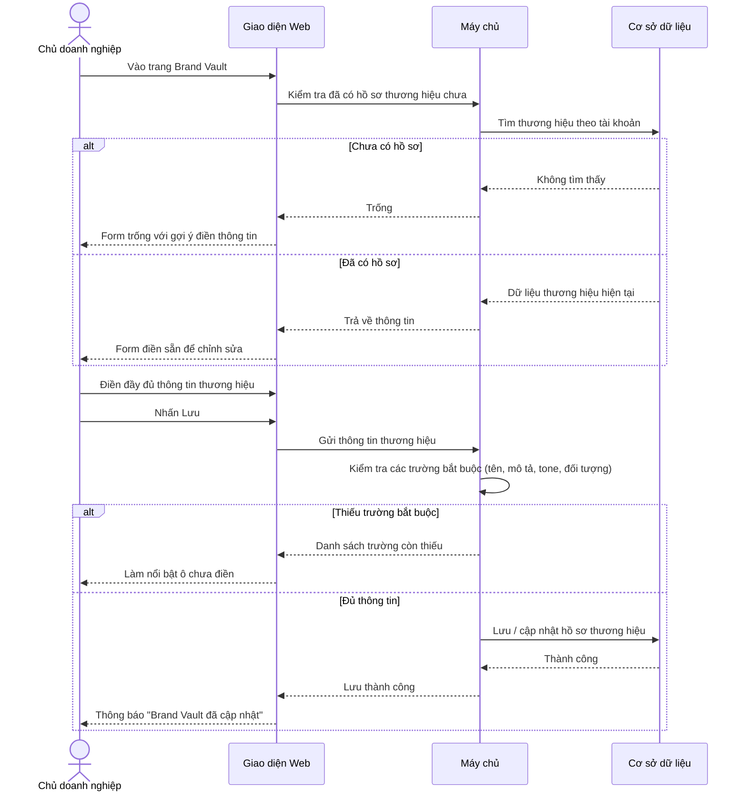
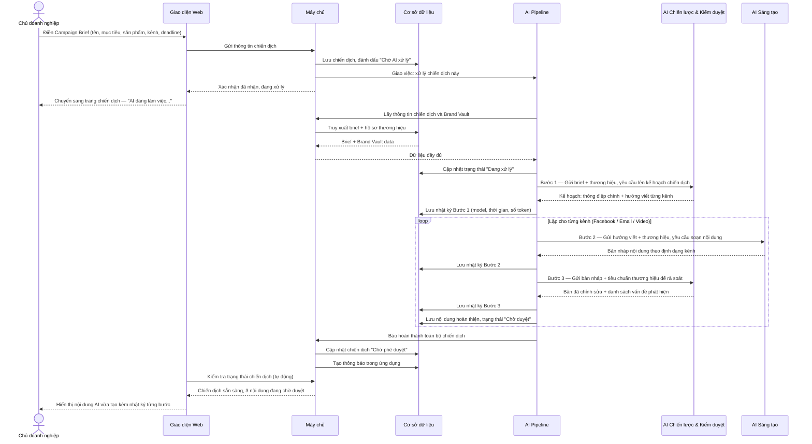
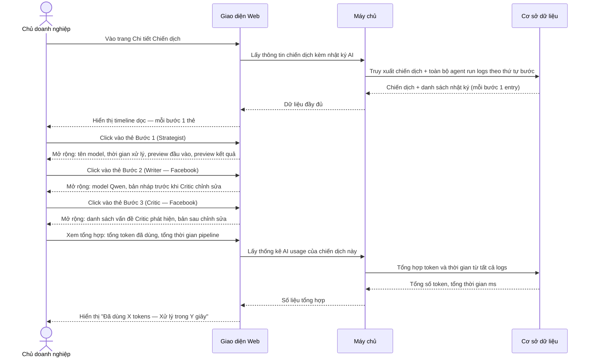
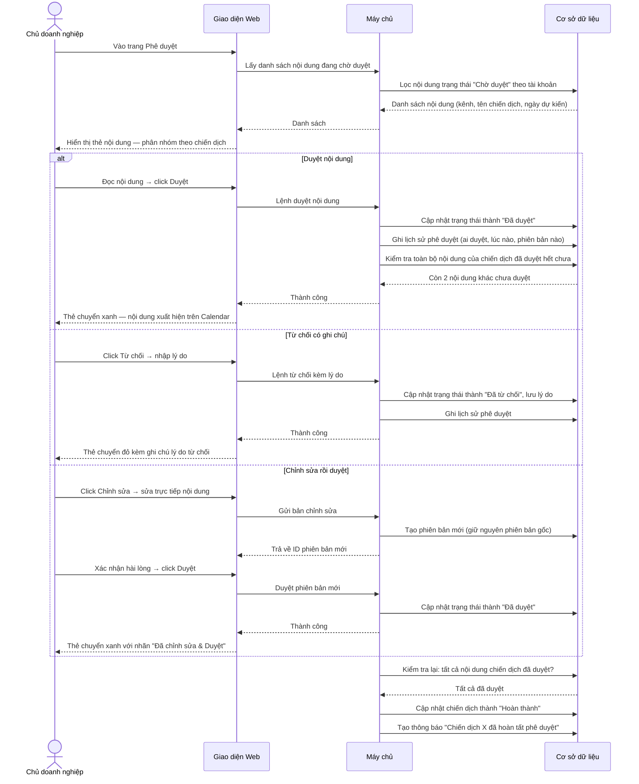
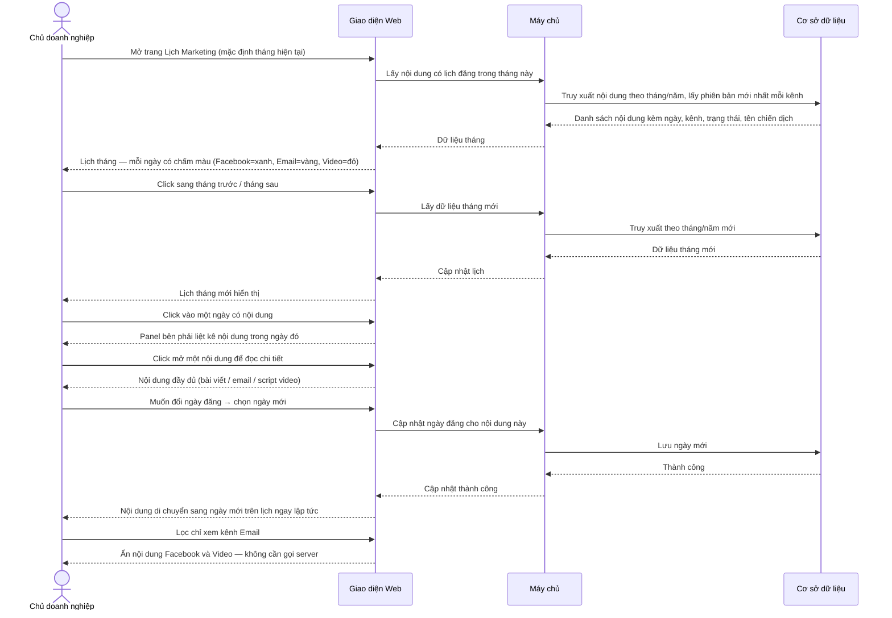
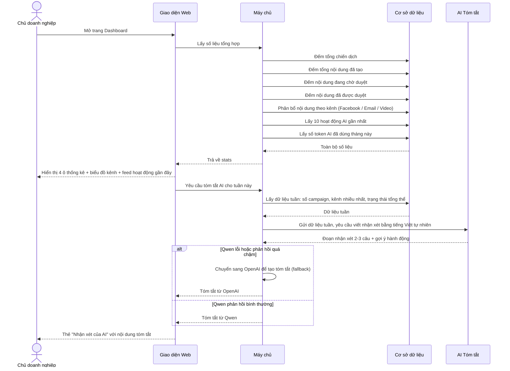
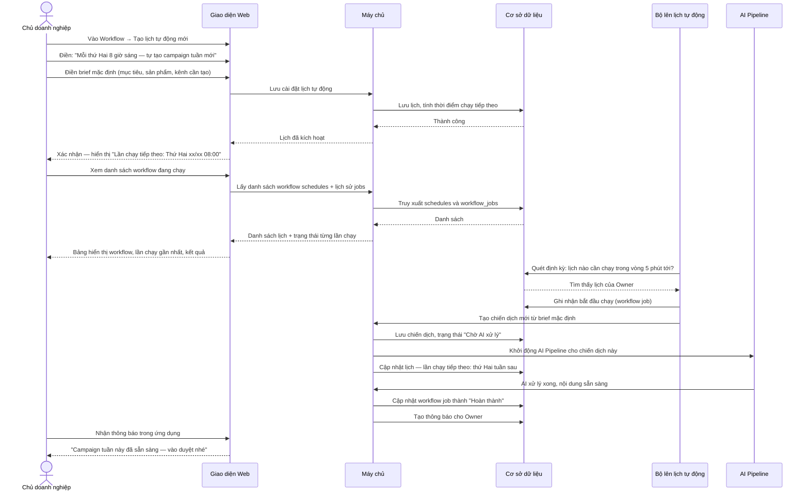
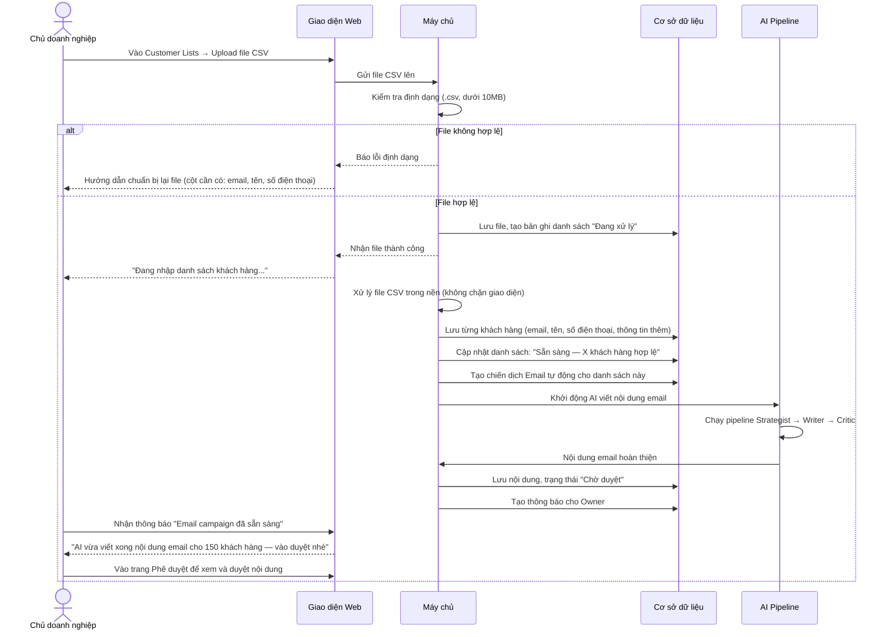
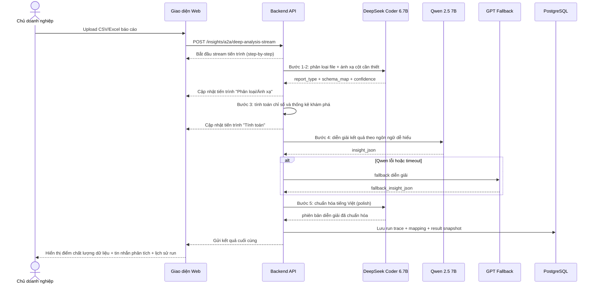

# Sequence Diagrams — AIMAP

**Luồng tương tác cho 9 tính năng chính của hệ thống**

> **Chú giải:**
> - **Người dùng** — Chủ doanh nghiệp/Marketing Assistant dùng trình duyệt
> - **Giao diện Web** — Trang web AIMAP (Next.js)
> - **Máy chủ** — Backend API xử lý nghiệp vụ (FastAPI)
> - **AI Pipeline** — Dịch vụ điều phối 3 AI agents
> - **Cơ sở dữ liệu** — PostgreSQL lưu trữ dữ liệu
> - **AI Chiến lược / AI Kiểm duyệt** — OpenAI GPT-4o-mini
> - **AI Sáng tạo / AI Tóm tắt** — Qwen 2.5 7B (self-hosted VPS)

---

## SD-01: Thiết lập Brand Vault (Hồ sơ Thương hiệu)

> Chủ doanh nghiệp điền một lần — thông tin thương hiệu được tự động đưa vào mọi chiến dịch AI về sau. Đây là bước bắt buộc trước khi tạo campaign.

---

## SD-02: Tạo Campaign Brief → AI Multi-Agent Tự động Viết Nội dung

> Người dùng chỉ mô tả mục tiêu. Ba AI agents sẽ tự làm phần còn lại: lên chiến lược → viết nội dung → kiểm duyệt chất lượng. Toàn bộ diễn ra trong nền, người dùng nhận kết quả khi hoàn thành.

---

## SD-03: Xem Nhật ký AI (Agent Run Logs)

> Sau khi AI xử lý xong, người dùng có thể xem lại từng bước AI đã làm gì, dùng model nào, mất bao lâu — minh bạch toàn bộ quá trình.

---

## SD-04: Phê duyệt Nội dung (Approve / Reject / Chỉnh sửa)

> Không có nội dung nào được đưa lên lịch mà không qua tay người dùng. Ba lựa chọn: duyệt ngay, từ chối với ghi chú, hoặc chỉnh sửa trực tiếp rồi duyệt.

---

## SD-05: Lịch Marketing — Xem & Điều chỉnh Lịch Đăng bài

> Người dùng nhìn tổng thể kế hoạch nội dung cả tháng. Mỗi ngày hiển thị chấm màu theo kênh. Click vào ngày để đọc nội dung, thay đổi ngày nếu cần điều chỉnh kế hoạch.

---

## SD-06: Dashboard & AI Tóm tắt Tuần

> Trang tổng quan hiển thị con số hoạt động marketing và một đoạn nhận xét ngắn do AI viết — giống như có trợ lý marketing báo cáo tình hình mỗi ngày.

---

## SD-07: Tạo & Kích hoạt Workflow Tự động

> Người dùng cài lịch một lần — từ đó mỗi tuần hệ thống tự tạo campaign và chạy AI mà không cần nhắc. Người dùng chỉ cần vào duyệt nội dung khi nhận thông báo.

---

## SD-08: Upload Danh sách Khách hàng (CSV) → Tự động tạo Email Campaign

> Người dùng upload file danh sách khách hàng. Hệ thống tự nhập dữ liệu, tự tạo email campaign phù hợp và chạy AI viết nội dung. Người dùng chỉ vào duyệt là xong — không cần làm gì thêm.

---

## SD-09: Insight Copilot Deep Analysis (có tiến trình theo bước)

