# Insight Copilot - Plan (Backend / Frontend / Database)

## 1) Kien truc tong the
Pipeline de giu "facts truoc, LLM sau":

1. Ingest service
2. Normalize service
3. Metric engine (deterministic)
4. Rule engine (business logic)
5. Qwen reasoner (giai thich + khuyen nghi)
6. Insight API + UI

```mermaid
flowchart LR
  sourceData[SourceData] --> ingestLayer[IngestLayer]
  ingestLayer --> normalizedStore[NormalizedStore]
  normalizedStore --> metricEngine[MetricEngine]
  metricEngine --> ruleEngine[RuleEngine]
  ruleEngine --> qwenReasoner[QwenReasoner]
  qwenReasoner --> insightApi[InsightAPI]
  insightApi --> copilotUi[CopilotUI]
  copilotUi --> feedbackLoop[FeedbackLoop]
```

## 2) Backend design
### 2.1 Services
- `api/services/insight_ingest_service.py`: nhan data POS/orders/ads/inbox/promotions.
- `api/services/insight_normalize_service.py`: doi ve schema chuan theo ngay/kenh/campaign.
- `api/services/metric_engine_service.py`: tinh metric theo cong thuc co dinh.
- `api/services/insight_rule_engine.py`: phat hien anomaly va co hoi.
- `api/services/qwen_insight_reasoner.py`: goi Qwen sinh narrative va action plan.
- `api/services/insight_feedback_service.py`: nhan feedback tu user de cai tien prompt/policy.

### 2.2 API endpoints (du kien)
- `POST /insights/ingest`
- `POST /insights/recompute`
- `GET /insights/cards?date=...&priority=...`
- `GET /insights/summary?window=7d`
- `POST /insights/feedback`
- `GET /insights/actions?status=open`

### 2.3 Processing schedule
- Batch theo ngay (01:00) de tao snapshot va cards.
- Recompute theo demand khi upload file moi hoac user bam "Lam moi ngay".

## 3) Database design
### 3.1 Bang du lieu
- `insight_data_sources`: metadata cho moi nguon du lieu.
- `insight_raw_snapshots`: luu raw da ingest.
- `insight_normalized_daily`: bang normalized theo ngay/kenh.
- `insight_metrics_daily`: metric da tinh.
- `insight_rule_hits`: ket qua bat quy tac anomaly/opportunity.
- `insight_cards`: output tong hop cho UI (title, reason, confidence, priority).
- `insight_actions`: hanh dong de xuat (owner, due_date, impact_estimate).
- `insight_feedback`: feedback user (helpful/not helpful, note).

### 3.2 Chi so quan trong
- Index theo `(workspace_id, metric_date)`.
- Index theo `(workspace_id, priority, status)` cho insight cards/actions.
- Unique key cho snapshot theo `(workspace_id, source_type, source_date, checksum)`.

## 4) Frontend design
### 4.1 Man hinh chinh
- `web/app/(app)/insights/page.tsx`: dashboard Top insights.
- `web/app/(app)/insights/actions/page.tsx`: action queue.
- `web/components/insights/InsightCard.tsx`: card gom evidence + recommendation.
- `web/components/insights/ConfidenceBadge.tsx`: hien confidence va data coverage.

### 4.2 UX principles
- Hien "Why this insight" ngay tren card.
- Moi action co effort estimate (S/M/L) + impact estimate.
- Co nut "Khong dung voi doanh nghiep toi" de gui feedback.

## 5) Lo trinh trien khai
### Phase 1 - Data foundation (1 sprint)
- Tao schema + migrations + ingest endpoint.
- Normalize + metric engine cho bo metric cot loi.

### Phase 2 - AI reasoning MVP (1 sprint)
- Rule engine + Qwen reasoner.
- Insight cards API + UI page dau tien.

### Phase 3 - Operational hardening (1 sprint)
- Feedback loop, confidence calibration, monitoring.
- Regression eval cho prompt va output contract.

## 6) Tieu chi thanh cong
- User nhan duoc insight co the hanh dong, khong chi mo ta.
- Mỗi insight card co evidence du lieu ro rang.
- Confidence score phan anh dung chat luong du lieu dau vao.
