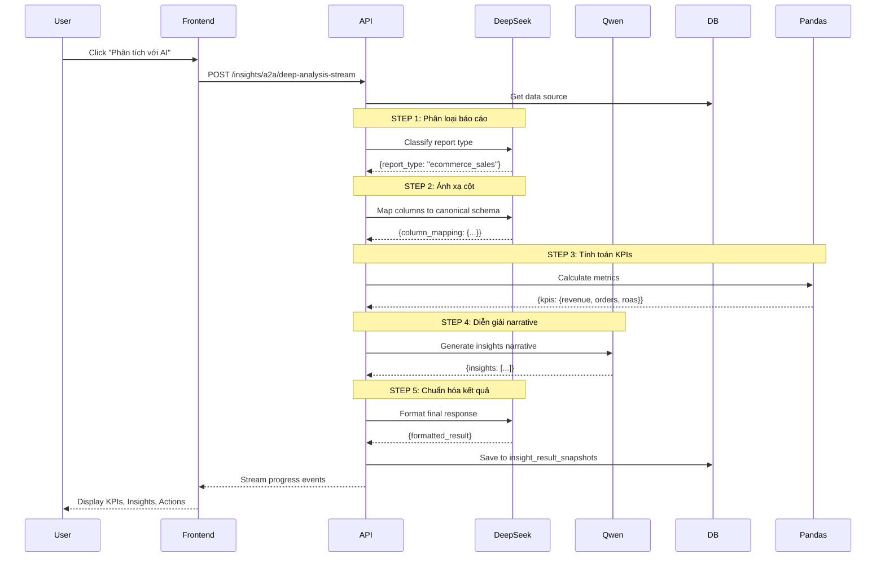
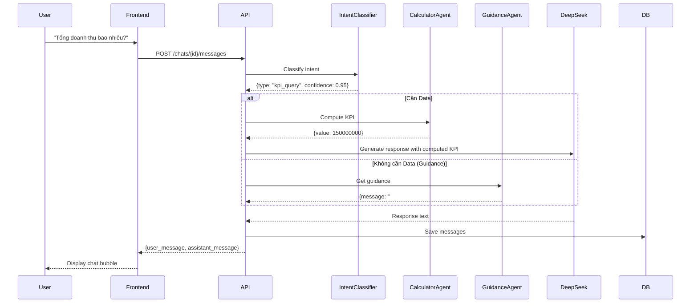
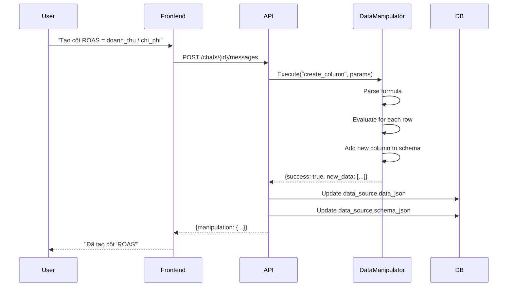

# Trang Phân tích dữ liệu (AI Analyst) - Tài liệu tổng hợp

> **URL:** `http://localhost:3000/insights`
> **File:** `web/app/(app)/insights/page.tsx`
> **API Router:** `api/routers/insights_chat.py`

---

## Mục lục

1. [Tổng quan tính năng](#1-tổng-quan-tính-năng)
2. [Luồng người dùng](#2-luồng-người-dùng)
3. [Chi tiết từng tính năng](#3-chi-tiết-từng-tính-năng)
4. [Mô hình AI sử dụng](#4-mô-hình-ai-sử-dụng)
5. [Sequence Diagram](#5-sequence-diagram)
6. [Data Flow](#6-data-flow)
7. [API Endpoints](#7-api-endpoints)

---

## 1. Tổng quan tính năng

Trang **AI Analyst** cho phép user phân tích dữ liệu bằng AI thông qua 3 cách nhập liệu và 1 chatbot thông minh:

| Tính năng | Mô tả | Input | Output |
|------------|--------|-------|--------|
| **Tạo bảng** | Tạo bảng thủ công | Tên cột, dữ liệu cells | Lưu vào DB |
| **Upload file** | Upload CSV/Excel | File .csv, .xlsx, .xls | Parse thành bảng |
| **Phân tích AI** | Deep analysis bằng AI | Dữ liệu bảng | KPIs, Insights, Actions |
| **Chatbot** | Hỏi đáp với AI | Câu hỏi text | Câu trả lời + Chart suggestions |

---

## 2. Luồng người dùng

```mermaid
flowchart TD
    A[User vào /insights] --> B{Có dữ liệu?}
    
    B -->|Không| C[Tạo bảng mới<br/>hoặc Upload file]
    
    B -->|Có| D[Chọn bảng đã lưu]
    
    C --> E[Nhập dữ liệu]
    E --> F[Nhấn "Phân tích với AI"]
    
    D --> G[AI phân tích dữ liệu]
    
    F --> G
    
    G --> H[Hiển thị KPIs<br/>Insights<br/>Actions]
    
    H --> I[Chat với AI Analyst]
    
    I --> J{Hỏi gì?}
    
    J -->|Tạo cột| K[Data Manipulation Agent<br/>Tạo cột mới]
    J -->|Phân tích| L[Calculator Agent<br/>Tính KPI, Trend]
    J -->|Gợi ý| M[Visualization Planner<br/>Đề xuất chart]
    J -->|Hướng dẫn| N[Guidance Agent<br/>Best practices]
    
    K --> O[Kết quả + Cập nhật DB]
    L --> O
    M --> O
    N --> O
    
    O --> P[User tiếp tục hỏi<br/>hoặc Tạo campaign]
```

---

## 3. Chi tiết từng tính năng

### 3.1 Tạo bảng (Manual Table Builder)

**Vị trí:** Tab "Tạo bảng" - Panel bên trái

**Tác dụng với user:**
- Tự tạo cấu trúc bảng với các cột tùy ý
- Nhập dữ liệu trực tiếp trên giao diện
- Không cần file, chỉ cần gõ tay

**Input của user:**
| Trường | Kiểu | Ví dụ |
|---------|------|-------|
| Tên bảng | Text | "Doanh thu Q1 2024" |
| Tên cột | Text | "Doanh_thu", "Ngay", "So_don" |
| Kiểu cột | Select | "text" \| "number" \| "date" |
| Dữ liệu cells | Text/Number | "5000000", "01/01/2024" |

**Các hành động:**
```typescript
// Thêm cột
onColumnsChange([...columns, newColumn])

// Sửa cột (rename)
updateColumn(id, { name: "Ten_moi" })

// Xóa cột
deleteColumn(id)

// Thêm dòng
onRowsChange([...rows, newRow])

// Sửa cell
updateCell(rowIndex, colName, value)

// Xóa dòng
deleteRow(index)
```

**Backend:** `POST /insights/data-sources`
```json
{
  "name": "Bảng dữ liệu mới",
  "source_type": "manual",
  "table_data": {
    "columns": [{"name": "Doanh_thu", "data_type": "number"}],
    "rows": [{"Doanh_thu": "5000000"}]
  }
}
```

---

### 3.2 Upload File (CSV/Excel)

**Vị trí:** Tab "Upload file" - Panel bên trái

**Tác dụng với user:**
- Upload file có sẵn từ Excel, Google Sheets, export từ phần mềm khác
- Hỗ trợ kéo thả hoặc click chọn file
- Tự động parse và hiển thị thành bảng

**Input của user:**
| Trường | Kiểu file | Ghi chú |
|---------|------------|----------|
| File | .csv | Parse bằng delimiter `,` hoặc `;` |
| File | .xlsx, .xls | Parse bằng thư viện `xlsx` |

**Xử lý tự động:**
```typescript
// Parse CSV
function parseCsvText(text: string) {
  const delimiter = text.includes(";") ? ";" : ",";
  const headers = lines[0].split(delimiter);
  const rows = lines.slice(1).map(line => split(delimiter));
}

// Detect column type
function detectColumnType(values: string[]) {
  if (all numeric) return "number";
  if (all dates) return "date";
  return "text";
}
```

**Backend:** Upload file → Parse ở frontend → `POST /insights/data-sources` với `table_data`

---

### 3.3 Phân tích AI (Deep Analysis)

**Vị trí:** Nút "Phân tích với AI" - Panel bên trái

**Tác dụng với user:**
- Nhận báo cáo KPIs tự động (Doanh thu, Đơn hàng, ROAS, AOV...)
- Nhận AI Insights về điểm bất thường, xu hướng
- Nhận Suggested Actions - hành động cụ thể để cải thiện

**Input của user:**
- Click button "Phân tích với AI"
- Không cần thêm input

**Output nhận được:**

```typescript
interface DeepAnalysisResult {
  kpis: {
    revenue: number;        // Doanh thu
    ad_spend: number;       // Chi phí quảng cáo
    orders: number;         // Số đơn hàng
    leads: number;          // Số leads
    roas: number;           // Return on Ad Spend
    conversion_rate: number; // Tỷ lệ chuyển đổi
    repeat_rate: number;    // Tỷ lệ khách quay lại
    aov: number;            // Giá trị đơn hàng trung bình
  };
  insights: Array<{
    title: string;          // "Doanh thu giảm 15%"
    severity: string;        // "high", "medium", "low"
    evidence: Record<string, number>;
    recommendation: string; // "Nên tăng chi phí ads cho..."
  }>;
  suggested_actions: Array<{
    id: string;
    title: string;          // "Chạy retargeting cho..."
    priority: string;       // "high", "medium", "low"
    target_segment: string;
    reason: string;
  }>;
  data_quality_score: number; // 0.0 - 1.0
}
```

**UI Components:**
- **KPI Cards:** Hiển thị số với format currency/percent
- **Quality Score Bar:** Thanh % chất lượng dữ liệu
- **Insights List:** Danh sách nhận định với severity badge
- **Actions List:** Cards hành động gợi ý

---

### 3.4 Chatbot AI Analyst

**Vị trí:** Panel bên phải - "Trò chuyện với AI"

**Tác dụng với user:**
- Hỏi đáp tự nhiên về dữ liệu
- Yêu cầu AI tạo cột mới, sửa dữ liệu
- Nhận gợi ý visualization
- Được hướng dẫn khi chưa có dữ liệu

**Input của user (ví dụ):**
| Câu hỏi | Intent | Action |
|----------|--------|--------|
| "Tổng doanh thu bao nhiêu?" | `kpi_query` | Tính KPI |
| "Xu hướng thế nào?" | `trend_analysis` | Phân tích trend |
| "Có dòng nào bất thường?" | `anomaly_detection` | Tìm outliers |
| "Tạo cột ROAS = doanh_thu / chi_phi" | `data_create_column` | Tạo cột mới |
| "Thêm file này vào cuối" | `csv_append` | Merge CSV |
| "Tôi nên bắt đầu từ đâu?" | `guidance_recommendation` | Guidance |

**Output nhận được:**
- Câu trả lời bằng tiếng Việt
- Computation results (KPI, Trend, Anomalies)
- Chart suggestions
- Action buttons để thực hiện tiếp

---

## 4. Mô hình AI sử dụng

### 4.1 DeepSeek (LLM chính)

**Mục đích:** Phân tích dữ liệu, sinh insights, trả lời chatbot

**Cấu hình:**
```python
# api/core/config.py
DEEPSEEK_BASE_URL = "https://api.deepseek.com"  # hoặc custom
DEEPSEEK_MODEL = "deepseek-chat"
```

**Sử dụng:**
1. **Deep Analysis Pipeline:** Phân loại report → Ánh xạ schema → Diễn giải
2. **Chatbot:** System prompt với context đầy đủ → Generate response

**System Prompt cho Chatbot:**
```
Bạn là AI Analyst chuyên phân tích dữ liệu kinh doanh.
Nhiệm vụ: trả lời câu hỏi về dữ liệu một cách chính xác và hữu ích.

## NGUỒN DỮ LIỆU:
- Tên: {data_source_name}
- Số dòng: {row_count}
- Cấu trúc cột: {columns}

## KPI ĐÃ PHÂN TÍCH:
- Doanh thu: {revenue} VND
...

## QUY TẮC TRẢ LỜI:
1. Luôn trích dẫn số liệu cụ thể
2. Dùng tiếng Việt có dấu
3. Đề xuất action tiếp theo
```

### 4.2 Qwen/GPT (Diễn giải kết quả)

**Mục đích:** Chuyển đổi kết quả tính toán thành ngôn ngữ tự nhiên

**Sử dụng:** Step 4 trong Deep Analysis Pipeline

### 4.3 Pandas (Tính toán số học)

**Mục đích:** Tính toán các chỉ số thống kê (sum, avg, max, min)

**Sử dụng:** Step 3 trong Deep Analysis Pipeline - `compute_metrics`

### 4.4 Local Agents (Intelligence Suite)

| Agent | Mục đích | Không cần LLM? |
|-------|----------|----------------|
| `IntentClassifier` | Phân loại intent | ✅ Pattern matching |
| `ReferenceResolver` | Resolve "dòng đó", "tháng trước" | ✅ Regex |
| `EntityLinker` | Map "doanh thu" → column | ✅ Heuristics |
| `CalculatorAgent` | Tính KPI, Trend, Anomaly | ✅ Statistics |
| `VisualizationPlanner` | Gợi ý chart | ✅ Rules |
| `DataManipulationAgent` | CRUD columns/rows | ✅ Logic |
| `GuidanceAgent` | Hướng dẫn user | ✅ Templates |

---

## 5. Sequence Diagram

### 5.1 Deep Analysis Pipeline



### 5.2 Chat Message Flow



### 5.3 Data Manipulation Flow



---

## 6. Data Flow

### 6.1 Data Sources Flow

```mermaid
flowchart LR
    A[User Input] --> B{Input Type}
    
    B -->|Manual| C[Table Builder<br/>columns + rows]
    B -->|File| D[CSV/Excel Parser]
    
    C --> E[POST /data-sources]
    D --> E
    
    E --> F[(PostgreSQL<br/>insight_data_sources)]
    
    F --> G[GET /chats/{id}]
    G --> H[Chat Session + Messages]
    
    H --> I[POST /messages]
    I --> J[Intelligence Agents]
    
    J --> K[DeepSeek LLM]
    J --> L[Calculator Agent]
    J --> M[Data Manipulation]
    
    K --> N[Response]
    L --> N
    M --> N
```

### 6.2 Database Schema

```
insight_data_sources
├── id (UUID, PK)
├── user_id (UUID, FK)
├── name (VARCHAR)
├── source_type (manual | csv_upload | xlsx_upload)
├── schema_json (JSONB) → {columns: [{name, data_type}]}
├── data_json (JSONB) → {rows: [{...}]}
└── created_at, updated_at

insight_chats
├── id (UUID, PK)
├── user_id (UUID, FK)
├── data_source_id (UUID, FK)
├── insight_run_id (UUID, FK, nullable)
├── title (VARCHAR)
├── status (active | archived)
└── created_at, updated_at

insight_chat_messages
├── id (UUID, PK)
├── chat_id (UUID, FK)
├── role (user | assistant)
├── content (TEXT)
├── message_context (JSONB) → {intent, manipulation, guidance}
└── created_at
```

---

## 7. API Endpoints

### 7.1 Data Sources

| Method | Endpoint | Mô tả |
|--------|----------|--------|
| `GET` | `/insights/data-sources` | List all data sources |
| `POST` | `/insights/data-sources` | Create data source |
| `GET` | `/insights/data-sources/{id}` | Get data source details |
| `DELETE` | `/insights/data-sources/{id}` | Delete data source |

### 7.2 Chat Sessions

| Method | Endpoint | Mô tả |
|--------|----------|--------|
| `GET` | `/insights/chats` | List chat sessions |
| `POST` | `/insights/chats` | Create chat session |
| `GET` | `/insights/chats/{id}` | Get chat with messages |
| `POST` | `/insights/chats/{id}/messages` | Send message (Enhanced) |
| `DELETE` | `/insights/chats/{id}` | Delete chat |

### 7.3 Analysis

| Method | Endpoint | Mô tả |
|--------|----------|--------|
| `POST` | `/insights/a2a/deep-analysis-stream` | Run deep analysis (NDJSON stream) |

---

## 8. Summary

### User nhận được gì?

| Tính năng | Kết quả |
|------------|---------|
| **Tạo bảng** | Bảng dữ liệu được lưu, có thể tái sử dụng |
| **Upload file** | File CSV/Excel được parse thành bảng editable |
| **Phân tích AI** | KPIs, Insights, Actions, Quality Score |
| **Chatbot** | Trả lời tự nhiên, tạo cột, gợi ý chart |

### User cần làm gì?

| Bước | Hành động |
|------|-----------|
| 1 | Tạo bảng mới HOẶC Upload file có sẵn |
| 2 | Click "Phân tích với AI" |
| 3 | Xem KPIs và Insights |
| 4 | Chat với AI để hỏi thêm, tạo cột, xem chart |

### Models được sử dụng

| Model | Vai trò |
|-------|---------|
| **DeepSeek** | LLM chính - phân tích, sinh response |
| **Qwen/GPT** | Diễn giải kết quả thành text |
| **Pandas** | Tính toán số học |
| **Local Agents** | Pattern matching, heuristics |

---

*Document generated: April 2026*
*Source: `web/app/(app)/insights/page.tsx`, `api/routers/insights_chat.py`*
